# h1 Viisikko

## x) Lue ja tiivistä.

1. Saltin asennus on Teron ohjeilla aika suoraviivainen prosessi, eikä se vaadi sen kummempia toimia onnistuakseen. Tuntemattomia tiedostoja muistutetaan varoa ja olla luottamatta liikaa niiden ulkonäköön.

2. Kaikista parhaiten Saltin käyttö tulee esiin master-slave -ympäristössä, jossa useiden koneiden hallinnasta saa myös automatisoitua.

3. Raporttien kirjoittamiseen on erilaisia ohjeita kuin sääntöjäkin jotka on hyvä pitää mielessä. Teron kursseilla tätä onneksi voi opetella viimeistään ristiinarvioinnin palautteita lukemalla ja niiden suosituksia hyödyntämällä.

## a) Trixie.
Tavoite: *Asenna Debian 13-Trixie virtuaalikoneeseen.*

1. Tämmöisiä löytyikin jo useampi valmiina, mutta valitaan näiden kotitehtävien ympäristöksi viimeisin Debian-labra.

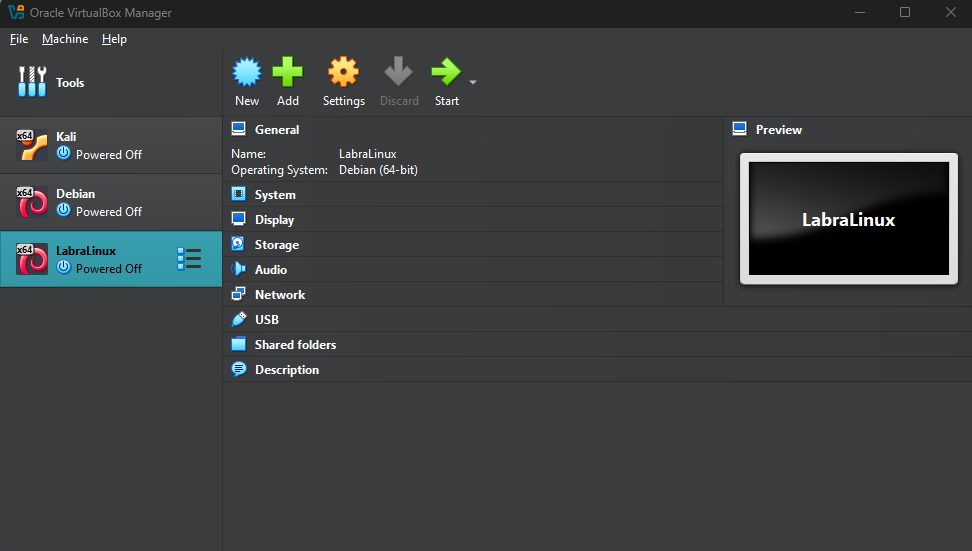

2. Tarkistetaan vielä kuitenkin, että käytetään varmasti Trixietä. Siltä näyttää!

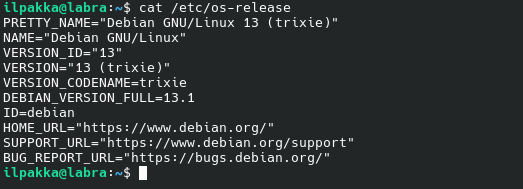

## b) Suola.
Tavoite: *Asenna salt-minion uuteen virtuaalikoneeseen.*

1. Päivitetään ihan alkuun listat ja softat komennolla *sudo apt update && sudo apt upgrade -y*.

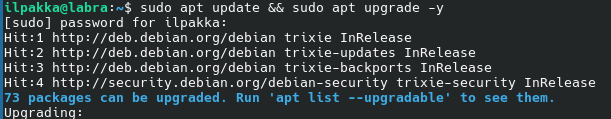

2. Seuraten Teron ohjeita luodaan ladattaville tiedostoille oma hakemisto. Molemmat saa kätevästi ladattua wgetillä.

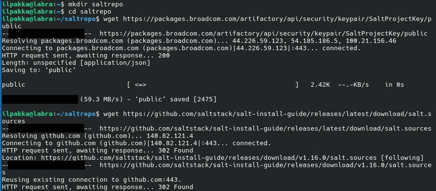

3. Luotto on kova, joten ei tarvitse kurkistaa sisältöön.

4. Kopioidaan ne oikeisiin hakemistoihin ja aloitetaan asennus komennolla *sudo apt install salt-minion salt-master*. Listat olisi kuitenkin kannattanut päivittää ennen

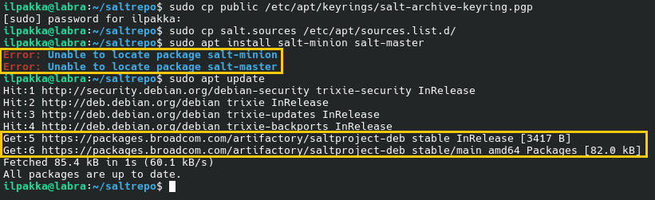

5. Pienen korjauksen jälkeen kaikki näyttää hyvältä ja asennus alkaa.

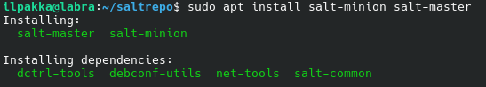

6. Versiotesti näyttää juuri siltä mitä pitääkin!

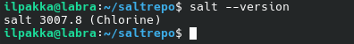

## c & d) Viisi tärkeintä + Idempotentti.
Tavoite 1: *Näytä Linuxissa esimerkit viidestä tärkeimmästä Saltin tilafunktiosta: pkg, file, service, user, cmd. Analysoi ja selitä tulokset.* 
Tavoite 2: *Anna esimerkki idempotenssista. Aja 'salt-call --local' komentoja, analysoi tulokset, selitä miten idempotenssi ilmenee.*

1. PKG, pkg.installed ja pkg.removed. Tällä voimme asentaa tai poistaa paketteja. Tree-ohjelmaa ei alkujaan löytynyt, joten sen asennus suoritettiin. Jos yritämme kuitenkin ajaa saman komennon uudestaan, eli asentaa samaa pakettia niin muutoksia ei tapahdu. Tässä on hyvä esimerkki idempotenssista, eli järjestelmän tila ei muutu saman komennon ajamisesta.

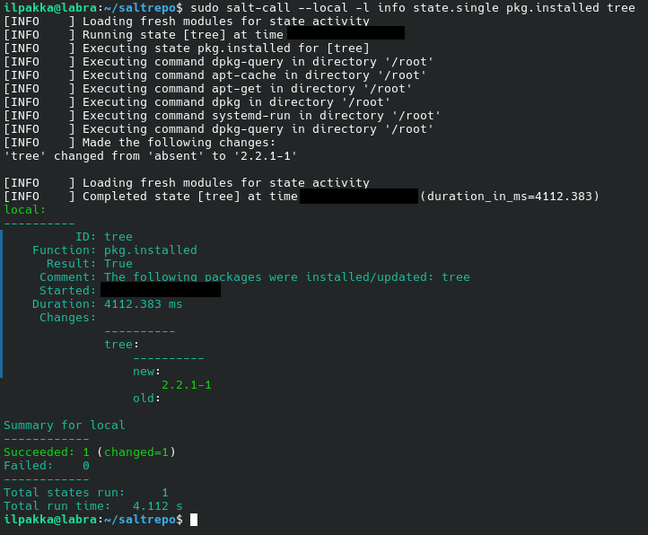

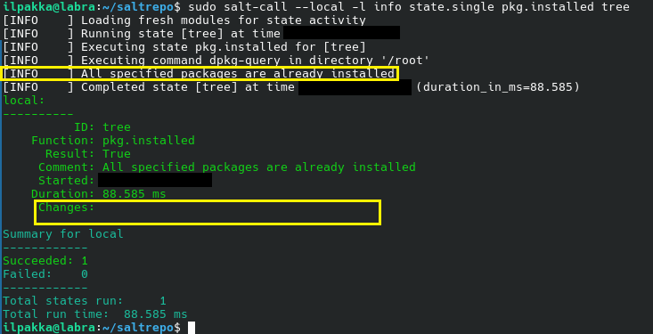

2. FILE, file.managed ja file.absent. Jep, se luo tiedostoja ja voimme myös hallita niitä.

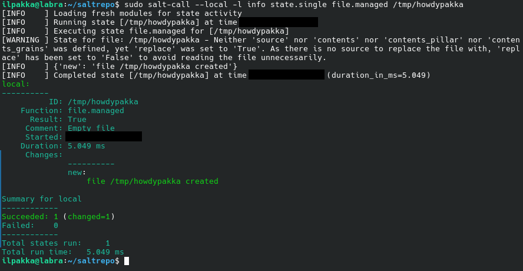

3. SERVICE, service.running ja service.dead. Demonien hallintaa. Ssh pyörii jo alkujaan, joten sen tila ei suolalla muutu. Kuitenkin komentoa muuttamalla järjestelmän tila muuttuu jälleen kerran.

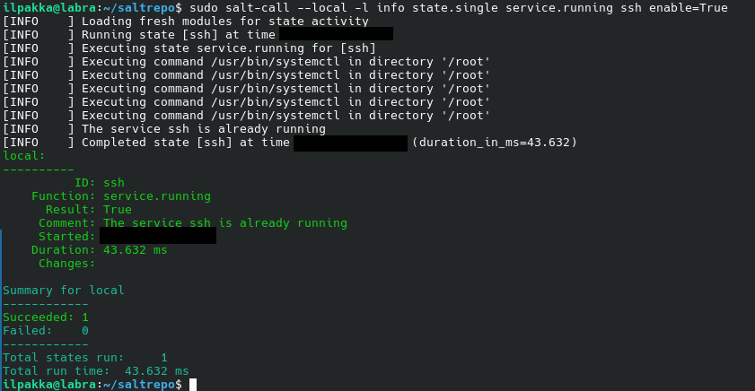

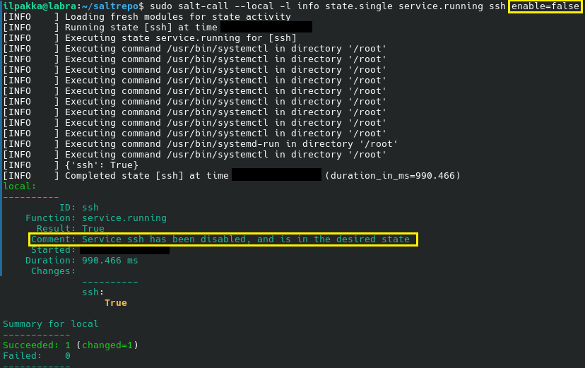

4. USER, user.present ja user.absent. Käyttäjien hallintaa, eli voimme vaikka luoda uusia käyttäjiä. Onneksi tarkistamamme fancy_bear01 ei tosiaan löydy tämän virtuaaliympäristön sisältä.

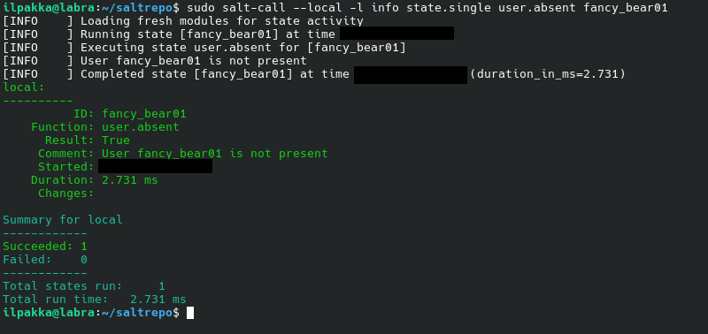

5. CMD, eli cmd.run. Suoraviivaista komentojen ajamista. Tällä kertaa ajettiin omaa versiotaan palauttava komento.

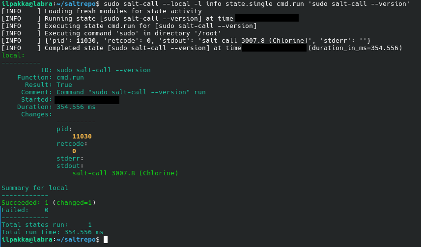

## Lähteet
- Tero Karvinen 2025. Palvelinten hallinta. Luettavissa: https://terokarvinen.com/palvelinten-hallinta/
- Tero Karvinen 2025: Install Salt on Debian 13 Trixie. Luettavissa: https://terokarvinen.com/install-salt-on-debian-13-trixie/
- Tero Karvinen 2023: Run Salt Command Locally. Luettavissa: https://terokarvinen.com/2021/salt-run-command-locally/
- Tero Karvinen 2018: Salt Quickstart – Salt Stack Master and Slave on Ubuntu Linux. Luettavissa: https://terokarvinen.com/2018/03/28/salt-quickstart-salt-stack-master-and-slave-on-ubuntu-linux/
- Tero Karvinen 2006: Raportin kirjoittaminen. Luettavissa: https://terokarvinen.com/2006/06/04/raportin-kirjoittaminen-4/