# h2 Infraa koodina

## x) Lue ja tiivistä.
Tavoite: *Tiivistämiseen riittää muutama ranskalainen viiva.*

1. Kuten viime viikon kirjoituksissa Tero kävikin jo vähän läpi, Salt on erinomainen tapa hallita useita koneita yhdellä koodilla. Tero käy läpi yksinkertaisen idempotenttiesimerkin ja selittää auki sen toimintaa.

2. YAML-osääntöjä ja rakennetta. Dokumentaatiossa tuodaan esiin muun muassa datastruktuuri, merkkikokoriippuvaisuus sekä kuinka indentaatio vaatii välilyöntejä, kahden ollen standardi.

3. Saltin top-filella voimme yhdistää ympäristön, koneet ja niillä ajattevat tilat. Villikorttina toimiva tähti (\*) nappaa joko itsekseen olevana kaikki listatut minionit tai osana toista nimeä (web*) kaikki sen sisältävät. 

## a) Hei infrakoodi! 
Tavoite: *Kokeile paikallisesti infraa koodina. Kirjota sls-tiedosto, joka tekee esimerkkitiedoston /tmp/ -kansioon.*

1. Aloitetaan oikeaoppisesti luomalla uusi hakemisto, jonka jälkeen siirrymme sinne tekemään tehtävää. Luodaan seuraavaksi myös sls-tiedosto. Kuvista huomaa tarkemmin, että sudon jättäminen pois palautti virheen.

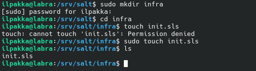

2. Mietitään millainen esimerkkitiedosto halutaan luoda /tmp/-hakemistoon ja muokataan äsken luotua sls-tiedostoa.

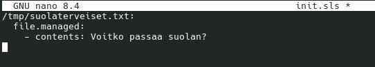

3. Kokeillaan, että toimiiko tuo nyt oikealla tavalla. Tämä testataan paikallisesti komennolla *sudo salt-call --local state.apply infra*.

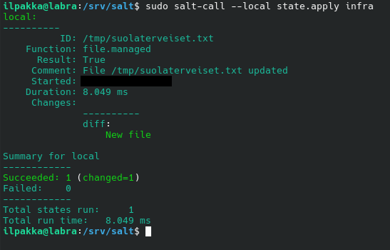

4. Hyvältä näyttää! Varmistetaan kuitenkin vielä manuaalisesti, että tuo tiedosto varmasti löytyy ja sen sisältö on mitä suola väittää.

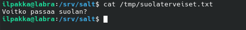

## b) Toppping. 
Tavoite: *Tee top-file, niin että kaikki omat tilasi ajetaan kerralla komennolla 'sudo salt-call --local state.apply'.*

1. Tähän olikin Tero ja muu luettu dokumentointi antanut jo kätevät ohjeet, eli luodaan uusi *top.sls*-tiedosto, jonka sisään pistetään villikorttina ajoon kaikki nykyiset tilat.

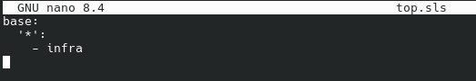

2. Tuo näyttää sen verran yksinäiseltä, että lisätään sinne kaveriksi mukaan muutama toinenkin.

3. Ajetaan kaikki komennolla *sudo salt-call --local state.apply* ja katsotaan mitä tapahtuu.

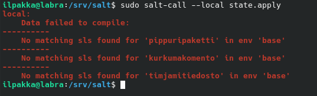

4. Tuo virhe oli odotettavissa, koska emme missään vaiheessa luoneet noille infran kavereille omia sls-tiedostoja.

5. Siirrytään kuitenkin seuraavaan tehtävään, koska siinä pääsemme korjaamaan tämän nykyisen tilanteen ja lopussa voidaan testata tätä vielä kerran uudestaan.

## c) Viisikko tiedostossa.
Tavoite: *Tee erilliset esimerkit kustakin viidestä tärkeimmästä tilafunktiosta pkg, file, service, user, cmd. Kirjoita esimerkit omiksi tiloikseen /srv/salt/ alle, esim /srv/salt/hellopkg/init.sls.*

1. Tällä hetkellä meiltä löytyy ainoastaan *infra*, joka luo tiedoston.

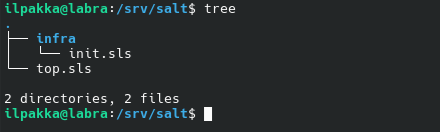

2. Seurataan edellisen tehtävän askelia ja luodaan nuo aikaisemmin nimetyt hakemistot tiedostoineen:

| Tila | Nimi | Selitys |
| ---- | ---- | ------- |
| pkg | Pippuripaketti | Asennetaan paketti nimeltä *oneko* |
| file | Timjamitiedosto | Luodaan tiedosto *timjami.bat* |
| service | Piparjuuripalvelu | Kytketään Apache pois päältä |
| user | Tillitili | Luodaan uusi käyttäjä nimeltä *Tilli* |
| cmd | Kurkumakomento | Tulostetaan vaikka päivämäärä ja kellonaika |

3. *Top.sls* on nyt ajan tasalla, mutta päivitetään kaikki tilafunktiot myös toimimaan oikein.

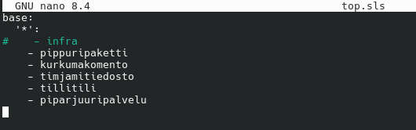

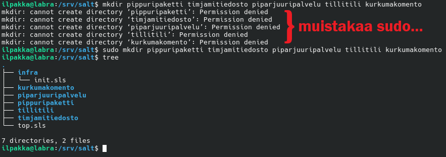

4. Jokaiseen omaan hakemistoon vielä nuo tiedostot kuntoon ja pienen urakoinnin jälkeen ne sieltä löytyvätkin. Toivottavasti ei tapahtunut virheitä..

5. Kokeillaan!

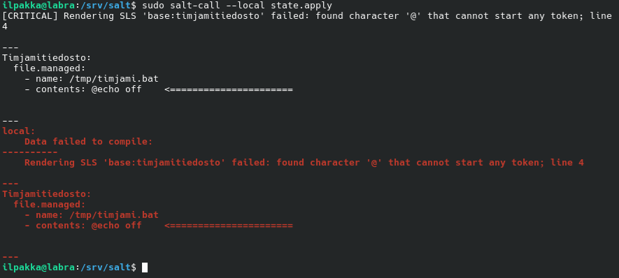

6. Mistäköhän lähtien ei battia sovi aloittaa miukumaukulla? Ennen kuin aloin googlettamaan vastausta niin tajusin, että Linuxissa tuo tiedostomuoto ei toimikaan ihan samanna tavalla kuin vanhoilla winukoilla.

7. Käydään korjaamassa se poistamalla koko sisältö.

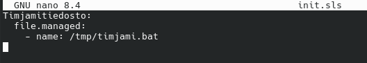

8. Uusi testi!

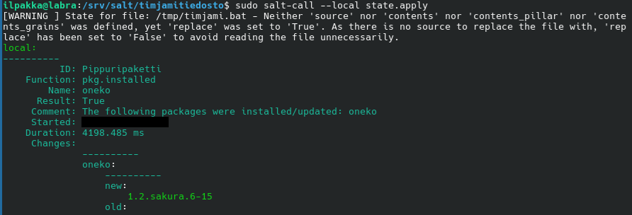

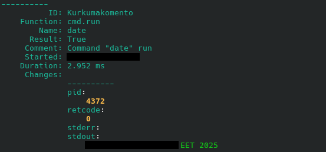

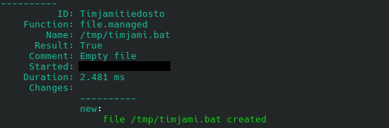

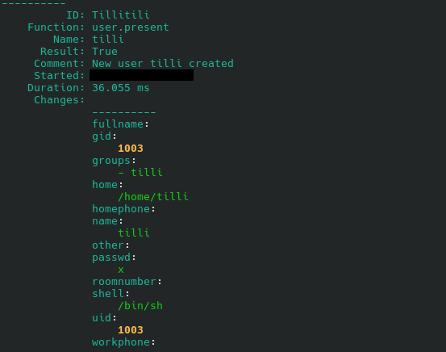

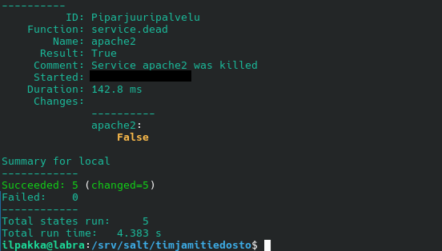

9. Tuo näytti aika hyvältä. Alun varoitus koski sisällötöntä .bat-tiedostoa, mutta sillä ei nyt olekaan väliä. Tärkeintä on se, että kaikki toimi.

## d) SLS
Tavoite: *Tee sls-tiedosto, joka käyttää vähintään kahta eri tilafunktiota näistä: package, file, service, user. Tarkista eri ohjelmalla, että lopputulos on oikea. Osoita useammalla ajolla, että sls-tiedostosi on idempotentti.*

1. Tehdään uusi hakemisto ja sinne oma sls-tiedosto, joka tarkastaa käyttäjätilin olemassaolon sekä pyöräyttää Apachen päälle. Tuo oli meillä aikaisemmassa tehtävässä kytketty pois, niin saadaan hyvä idempotenttitesti.

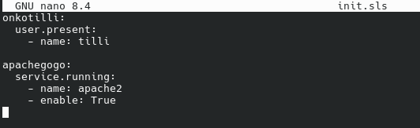

2. Testataan komennolla *sudo salt-call --local state.apply sls*.

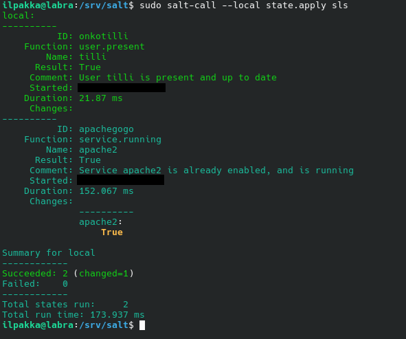

3. Hyvä homma! Ei tullu virheitä ja Apache on lähtenyt käyntiin. Kokeillaan nyt vielä toisella ajolla, että muuttuuko järjestelmän tila.

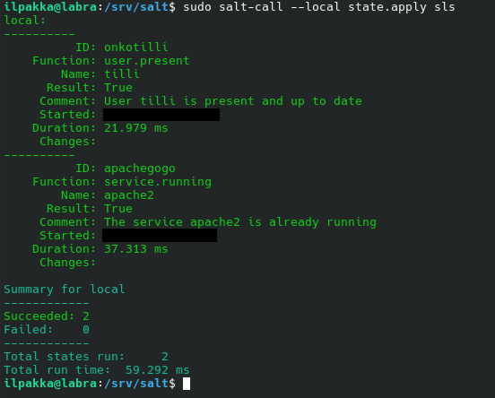

4. Muutoksia ei ole tapahtunut, eli idempotentti on läsnä.

## Lähteet
- Tero Karvinen 2025. Palvelinten hallinta. Luettavissa: https://terokarvinen.com/palvelinten-hallinta
- Tero Karvinen 2024. Hello Salt Infra-as-Code. Luettavissa: https://terokarvinen.com/2024/hello-salt-infra-as-code/
- Salt Project. Salt overview. Luettavissa: https://docs.saltproject.io/salt/user-guide/en/latest/topics/overview.html#rules-of-yaml
- Salt Project. The Top File. Luettavissa: https://docs.saltproject.io/en/latest/ref/states/top.html