# h3 E.T. Phone Home

## x) Lue ja tiivistä.

1. Tero Karvinen käy läpi virtuaalikoneiden konffauksen Vagrantilla ja VirtualBoxilla. Hän poikkeaa hieman Hashicorpin omasta Vagrantfilen mallista, mutta saa kaiken toimimaan ihan yhtä hyvin. Komennot, kuten *vagrant destroy* ja *vagrant up* tulee myös tutuksi.

2. Quickstartissa käydään läpi salt-master ja salt-minion -asennukset, mutta siitä puuttuu kokonaan listapäivitys ja muut nykyisin tarvittavat toimenpiteet.

3. Vagranttia ja Salttia voi yhdistellä, ja Tero näyttääkin esimerkkikomentoja herra-orja -arkkitehtuurin välillä.

## a) Hello Vagrant!
Tavoite: *Osoita jollain komennolla, että Vagrant on asennettu (esim tulostaa vagrantin versionumeron).*

1. Vagrant on jo asennettuna ja versiokin näyttää olevan viimeisin.


## b) Linux Vagrant.
Tavoite: *Tee Vagrantilla uusi Linux-virtuaalikone.*

1. Kävin ensiksi tutustumassa Vagrantin omaan matskuun ja heillä oli Linux-virtuaalikoneen pystyttämiselle hyvät ohjeet.

2. Seurataan Hashicorpin ohjeita ja luodaan siis hommalle oma hakemisto ja siirrytään sinne.

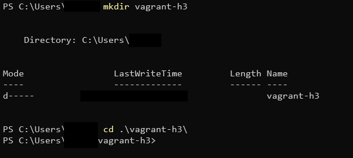

3. Alustetaan uusi Vagrant-ympäristö komennolla *vagrant init hashicorp-education/ubuntu-24-04 --box-version 0.1.0*. Tässä vaiheessa olisi voinut toki soveltaa muulla distrolla, mutta mennään ohjeiden mukaan.

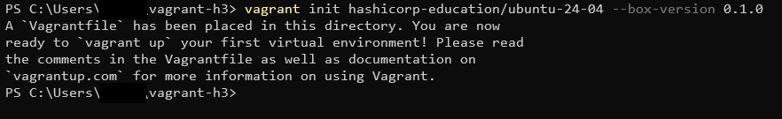

4. Pöyräytetään Vagrant päälle komennolla *vagrant up*. Tämä prosessi kestää hetken aikaa kun Vagrant tarkistaa konffaukseen tarvittavat tiedostot ja asetukset. Vagrant löysi VirtualBoxin ihan itse, joten kaikki näyttäisi olevan kunnossa koko ympäristön osalta.

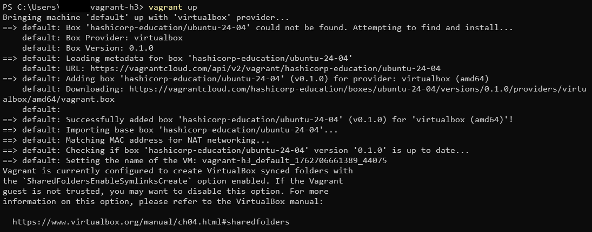

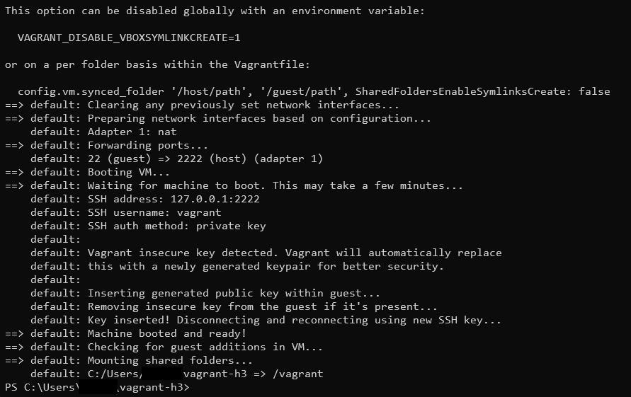

5. Katsotaan päästäänkö uudelle virtuaalikoneelle sisään, eli *vagrant ssh* käy käskyn. Ei tule virheilmoituksia, eli kaikki meni hyvin!

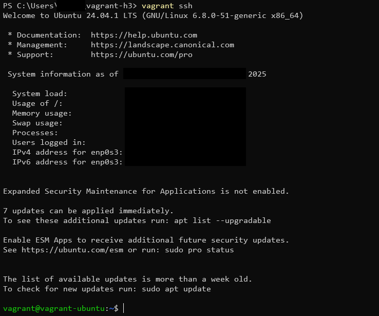

## c) Kaksin kaunihimpi.
Tavoite: *Tee kahden Linux-tietokoneen verkko Vagrantilla. Osoita, että koneet voivat pingata toisiaan.*

1. Tähän vaiheeseen nuo Hashicorpin ohjeet sisältävät jo aika paljon ylimääräistä säätöä, mutta niitä voi kuitenkin soveltaa aika hyvin.

2. Siirrytään takaisin hostiin komennolla *exit* ja luodaan uusi hakemisto.

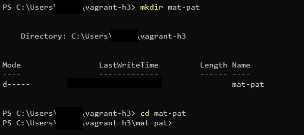

3. Luodaan uusi Vagrantfile ja sovelletaan Hashicorpin konffaustiedostoa saadaksemme ryhdikkään näkönen setti kasaan:

```bash
SERVICES = {
  'mat' => {
    ip: '192.168.56.10',
    ports: { 6379 => 6379 }
  },
  'pat' => {
    ip: '192.168.56.11',
    ports: { 8080 => 8080 }
  }
}

Vagrant.configure("2") do |config|
  config.vm.box = "hashicorp-education/ubuntu-24-04"

  config.vm.define "mat" do |m|
    m.vm.hostname = "mat"
    m.vm.network "private_network", ip: SERVICES['mat'][:ip]
    m.vm.provider "virtualbox" do |vb|
      vb.name = "vagrant-mat"
      vb.memory = 1024
      vb.cpus = 1
    end
  end

  config.vm.define "pat" do |p|
    p.vm.hostname = "pat"
    p.vm.network "private_network", ip: SERVICES['pat'][:ip]
    p.vm.provider "virtualbox" do |vb|
      vb.name = "vagrant-pat"
      vb.memory = 1024
      vb.cpus = 1
    end
  end
end
```

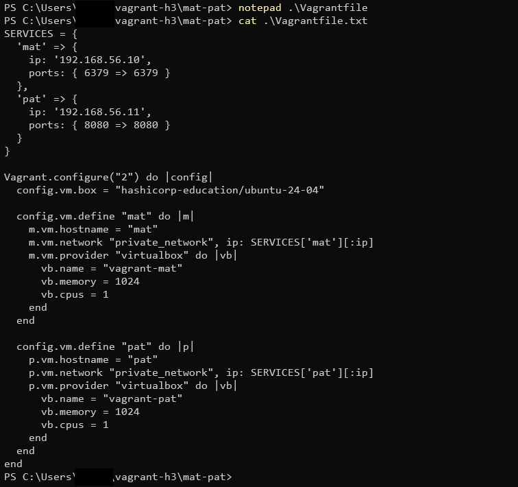

4. Kokeillaan, että toimiiko eli *vagrant up* jälleen kerran. Tämän jälkeen kirjaudutaan sisään molemmille koneille ja pingataan aina toista.

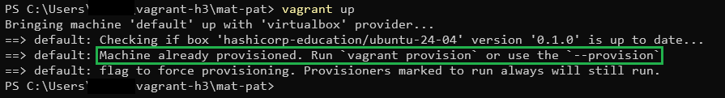

5. Ei onnistunut ja taitaa johtua siitä, että meillä oli jäänyt tuo ensimmäinen kone käyntiin oletusnimellä. Pelataan landi ja maksetaan 3 että saadaan tuo komennolla *vagrant destroy -f* ulos pelistä. Voidaan tämän jälkeen tarkastaa tila komennolla *vagrant status*.

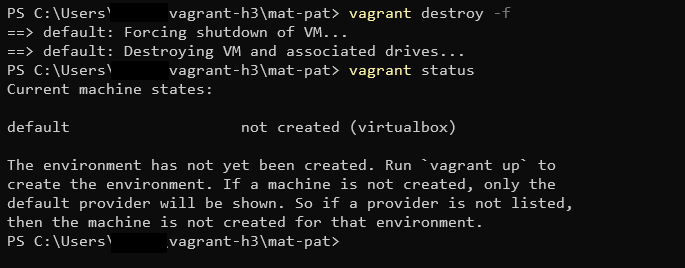

6. Kokeillaan taas, mutta paljastuukin uusi ongelma. Tuo tämän tehtävän Vagrantfile on tallennettu tiedostopäätteellä .txt ja tämä prosessi ei niitä tunnista. Se hyppääkin tästä syystä alustamaan hommaa aina tuon vagrant-h3 hakemiston kautta.


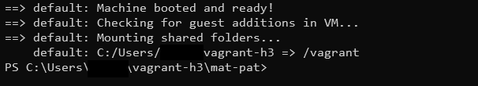

7. Korjataan ongelma nimeämällä mat-patin Vagrantfile oikeaan muotoon.

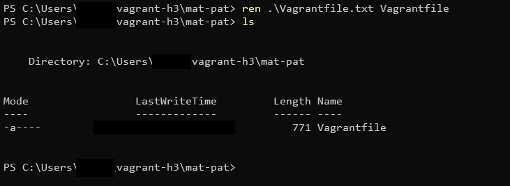

8. Jospa se nyt? Kyllä se nyt. Odotellaan, että alustus on valmis ja päästään testaamaan.

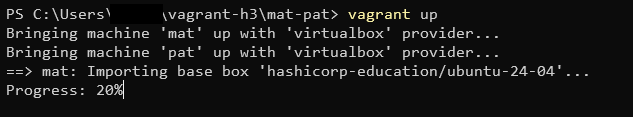

9. Lopputesti paljastaa, että koneet toimii ja kuulee toisensa.

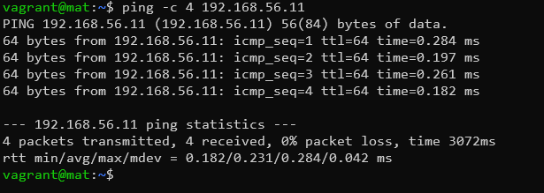

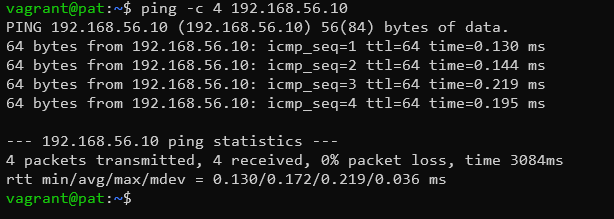

## d) Herra-orja verkossa.
Tavoite: *Demonstroi Salt herra-orja arkkitehtuurin toimintaa kahden Linux-koneen verkossa, jonka teit Vagrantilla. Asenna toiselle koneelle salt-master, toiselle salt-minion. Laita orjan /etc/salt/minion -tiedostoon masterin osoite. Hyväksy avain ja osoita, että herra voi komentaa orjakonetta.*

1. Nyt päätetään niin, että *mat* on herra ja *pat* on orja. Kirjaudutaan takaisin herralle ja päivitetään listat. Tuo salt-master ei tällä hetkellä löydy enää oletuksena, joten käydään virkistämässä muistia Salt Projectin sivuilta:

```bash
mkdir -p /etc/apt/keyrings
curl -fsSL https://packages.broadcom.com/artifactory/api/security/keypair/SaltProjectKey/public | sudo tee /etc/apt/keyrings/salt-archive-keyring.pgp
curl -fsSL https://github.com/saltstack/salt-install-guide/releases/latest/download/salt.sources | sudo tee /etc/apt/sources.list.d/salt.sources
```

2. Päivitetään listat uudestaan ja nyt voimme asentaa *salt-masterin*. Asennuksen jälkeen salt-masterin pitäisi olla heti päällä ja tarkistetaan se komennolla *sudo systemctl status salt-master*.

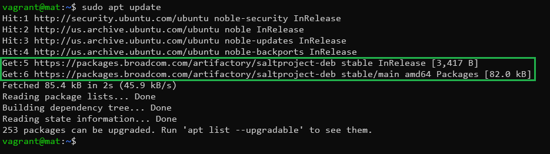

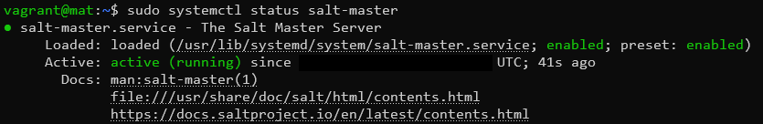

3. Sitten patin vuoro, eli käydään tekemässä samat toimet kuin äsken, mutta asennetaan lopuksi *salt-minion*

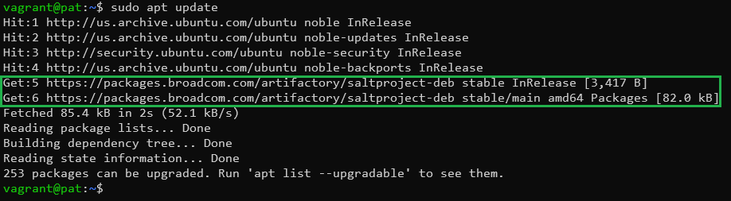

4. Määritetään herran ip hakemistoon */etc/salt/minion*, eli muutetaan master-riville arvo 192.168.56.10.

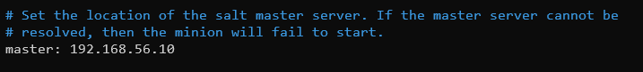

5. Ollaan fiksuja ja muistetaan vielä käynnistää salt-minion uudelleen niin ei pitäisi jäädä keskeneräiseksi. Muistin, että restartin sijaan kannatti mielummin käyttää stoppia ja starttia ja lopulta tuo näytti pyörivän oikein.

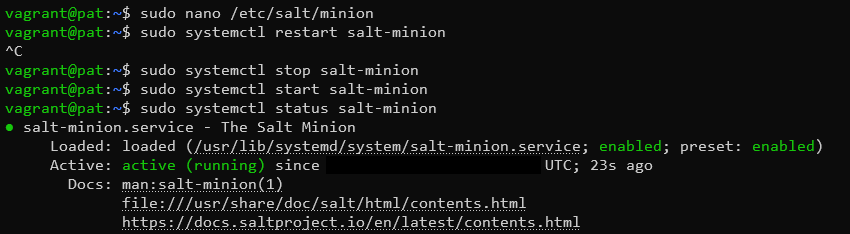

6. Palataan herrakoneeseen ja käydään kurkkaamassa avaimet. Pat löytyy, joten hyväksytään se.

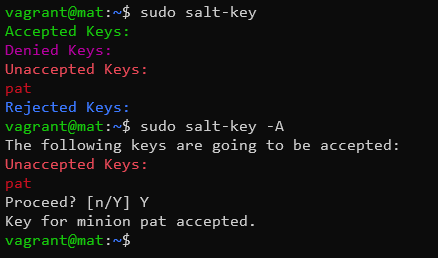

7. Nyt vielä testataan test.pingillä, että yhteys pelaa. Hyvä homma!


## e) Nimetön.
Tavoite: *Kokeile vähintään kahta tilaa verkon yli (viisikosta: pkg, file, service, user, cmd).*

1. Laitetaan pat asentamaan *cowsay*.

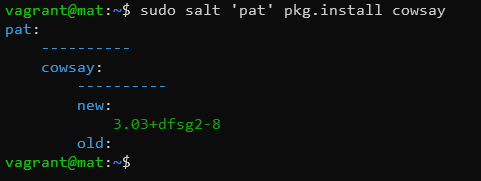

2. Laitetaan pat puhumaan *cowsaylla*.

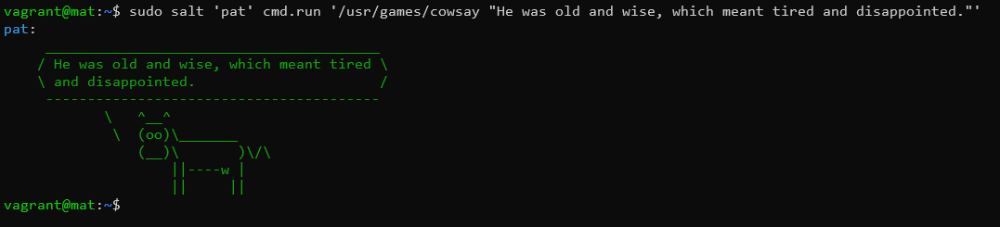

3. Lopuksi koneet suljetaan ja tuhotaan.

## Lähteet
- Tero Karvinen 2025. Palvelinten hallinta. Luettavissa: https://terokarvinen.com/palvelinten-hallinta
- Tero Karvinen 2021. Two Machine Virtual Network With Debian 11 Bullseye and Vagrant. Luettavissa: https://terokarvinen.com/2021/two-machine-virtual-network-with-debian-11-bullseye-and-vagrant/
- Tero Karvinen 2018. Salt Quickstart - Salt Stack Master and Slave on Ubuntu Linux. Luettavissa: https://terokarvinen.com/2018/salt-quickstart-salt-stack-master-and-slave-on-ubuntu-linux/
- Tero Karvinen 2023. Salt Vagrant - automatically provision one master and two slaves. Luettavissa: https://terokarvinen.com/2023/salt-vagrant/#infra-as-code---your-wishes-as-a-text-file
- Hashicorp. Set up your development environment. Luettavissa: https://developer.hashicorp.com/vagrant/tutorials/get-started/setup-project
- Hashicorp. Manage multi-machine environments. Luettavissa: https://developer.hashicorp.com/vagrant/tutorials/get-started/multi-machine
- Salt Project. Install Salt DEBs. Luettavissa: https://docs.saltproject.io/salt/install-guide/en/latest/topics/install-by-operating-system/linux-deb.html

