# h4 Pkg-file-service

## x) Lue ja tiivistä.

1. Kirjoituksessa näytetään Saltin toimintaa SSH-palvelimelle. Teron ohjeet ovat hyödyllisiä kotitehtävissä, vaikka niitä joutuukin soveltamaan hieman distron iän ja nimen perusteella.

## a) SSHouto. 
Tavoite 1: *Lisää uusi portti, jossa SSHD kuuntelee.*
Tavoite 2: *Ensin käsin: muista näyttää, että ensin teit ja testasit muutoksen käsin. Näytä, että tilasi korjaa puutteet. Voit esimerkiksi poistaa paketin tai tehdä virheen tiedostoon käsin, sitten ajaa tilasi.*

1. Kurkataan, että mitä portteja on ensin auki.

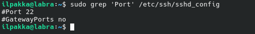

2. Lisätään uusi portti 1337, tallennetaan tiedosto ja käynnistetään SSH uudelleen komennolla *sudo systemctl restart ssh*.

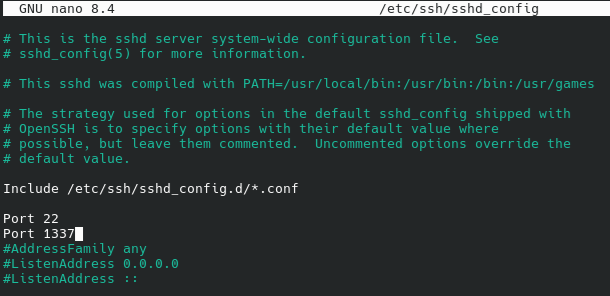

3. Luodaan tehtävälle uusi hakemisto ja kuljetaan sinne valmiiksi.

4. Rakennetaas init.sls -tiedosto soveltamalla Teron ohjeita:

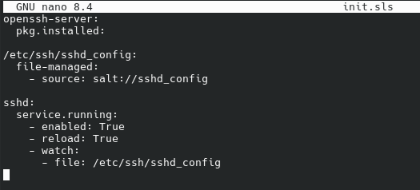

5. Pkg katsoo onko openssh-server jo asennettu, file valvoo konffitiedostoa ja servicen watchi käynnistää muutostilanteista uudelleen. Eikö niin?

6. Testataan!

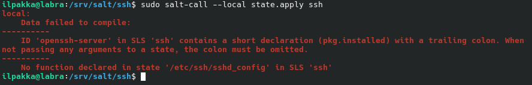

7. Liukastuttiin vahingossa parissa kohtaa! Nuo näkyivätkin selvästi virheilmoituksessa ja kurkkaamalla init.sls sisään on helppo löytää virheet. Pkg.installed odotti ennen jatkoa parametreille ja file.managed oli typottu muotoon file-managed. Korjataan!

8. Uusi testi paljasti pari muuta virhettä. Meiltä puuttuu tuo konffitiedosto oikeasta kohtaa, eli salttipuolelta. Myös file epäonnistui, koska aikaisempi kohta ei mennyt läpi.

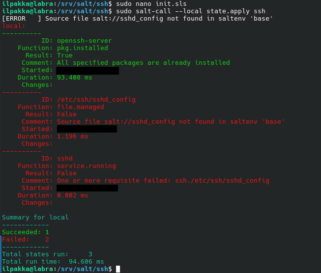

9. Kopioidaan konffitiedosto oikeaan paikkaan. Korjataan myös typo *enabled* oikeaan muotoon, eli *enable*.

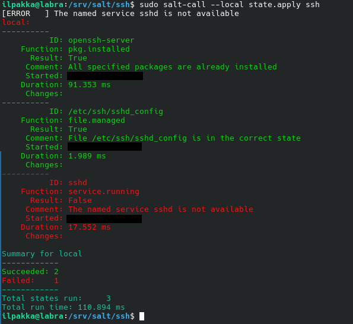

10. Jopas nyt on, näköjään sshd pitää vielä muuttaa muotoon ssh, jotta koko höskä toimii. Viimeinen testi?

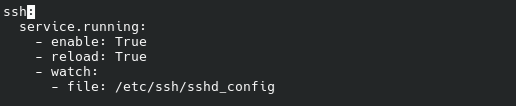

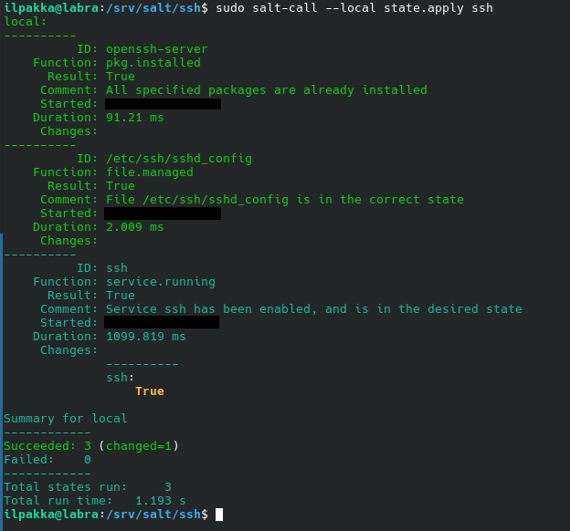

11. Hienosti pyörii! Nyt tehdään vielä toisen tavoitteen vaatima testi, eli poistetaan paketti ja ajetaan tila uudestaan.

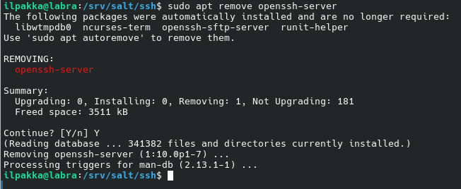

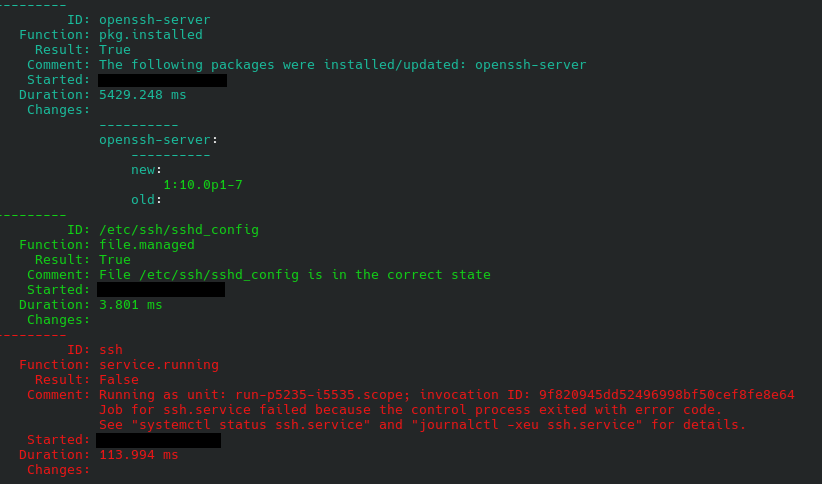

12. Jännä juttu. Paketin asennus onnistuu, mutta lopussa menee pieleen. Käydään katsomassa, että onko Saltin viesti totta ja saadaanko tästä jotain lisätietoja.

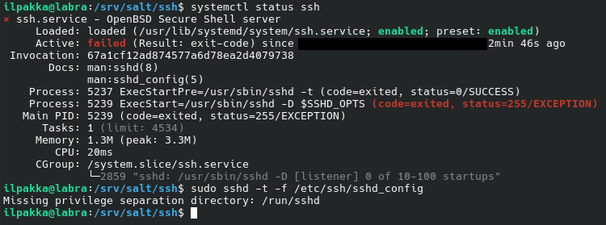

13. Aivan, eli tuossa on pyritty käyttämään hakemistoa /run/sshd/ jota ei kuitenkaan ole olemassa ja service.running feilaa. Luodaan se manuaalisesti ja samalla täydennetään init.sls -tiedostoon mukaan kaikki oleelliset uudistukset. Tapetaan myös vanha prosessi komennolla *sudo kill 2859*, jonka pid löytyi komennolla *ps aux | grep sshd*. Nyt meidän pitäisi välttyä ikäviltä yllätyksiltä.

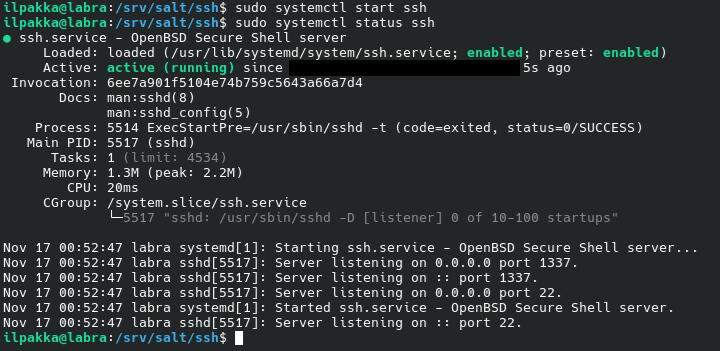

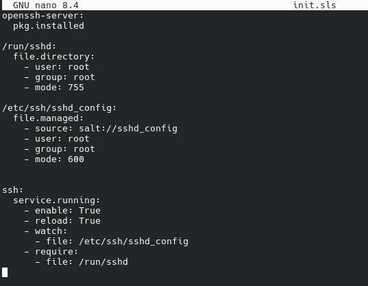

14. Sormet ristissä.

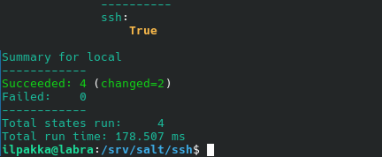

15. Poisto ja viimeinen testi heti perään niin voi olla asiasta varma.

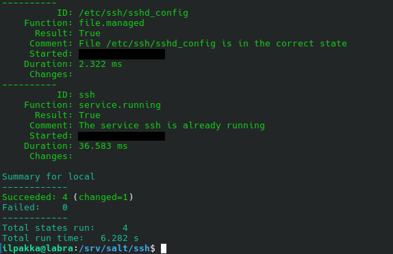

## Lähteet
- Tero Karvinen 2025. Palvelinten hallinta. Luettavissa: https://terokarvinen.com/palvelinten-hallinta
- Tero Karvinen 2018. Pkg-File-Service - Control Daemons with Salt - Change SSH Server Port. Luettavissa: https://terokarvinen.com/2018/04/03/pkg-file-service-control-daemons-with-salt-change-ssh-server-port/