# h5 Toimiva versio

## x) Lue ja tiivistä.

1. Kirjoituksessa käydään läpi Gitin toimintaa sekä turvaa. Tietojen eheys varmistetaan SHA-1 hasheilla kaikki toiminta tapahtuu kolmessa tilassa: modified, staged ja committed.

2. Git-komentoja:

| Komento | Selitys |
| :------ | ------- |
| git add . | Lisää nykyiset muutokset Gitin staged -tilaan. Ei vielä tallennu itse repoon. |
| git commit | Staged -tilan muutokset luodaan localiin. |
| git pull | Noutaa mahdolliset muutokset ja vertaa niitä localiin. Kertoo merge-konflikteista. |
| git push | Puskee, eli lähettää localin commitit itse repositioon. |

Kun käyttäjä syöttää komennon *git add . && git commit; git pull && git push* niin ne suoriutuvat järjestyksessä, jos mahdollista. Tuo *&&* on kätevä tapa yhdistää komentoja yhteen ja sitä käytetään usein sellaisissa tilanteissa, jotka eivät vaadi lisättyä turvaa tai huolellisuutta.

3. Teron suolax-repon lokihistoriasta näkyy esimerkki siitä, kuinka pienet muutokset on puskettu aina uudeksi versioksi. Kertaluontoiset massapuskut puuttuu, joka onkin koko Gitin idea.

## a) Online. 
Tavoite: *Tee uusi varasto GitHubiin. Varaston nimessä ja lyhyessä kuvauksessa tulee olla sana "snow". Aiemmin tehty varasto ei kelpaa. (Muista tehdä varastoon tiedostoja luomisvaiheessa, esim README.md ja GNU General Public License 3)*

1. Luodaan GitHubiin uusi repositio nimellä *snow-den*. Kirjoitetaan lyhyt kuvaus ja laitetaan README.md sekä GNU-lisenssi valmiiksi mukaan.

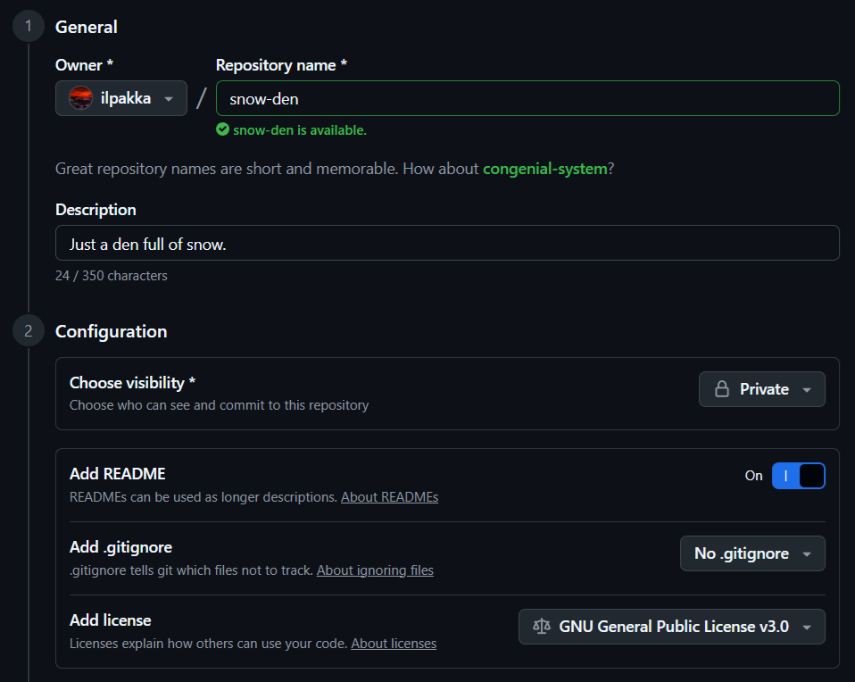

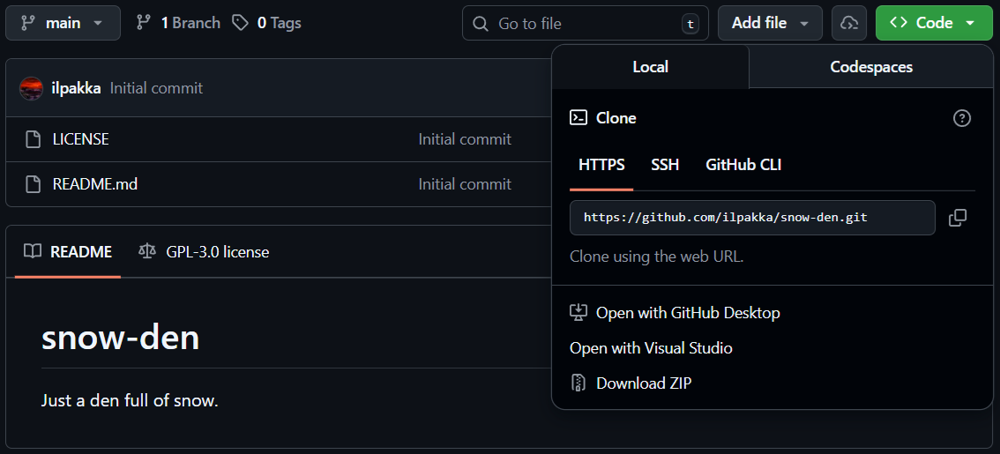

## b) Dolly. 
Tavoite: *Kloonaa edellisessä kohdassa tehty uusi varasto itsellesi, tee muutoksia omalla koneella, puske ne palvelimelle, ja näytä, että ne ilmestyvät weppiliittymään.*

1. Kloonataan tämä uusi repo koneelle.

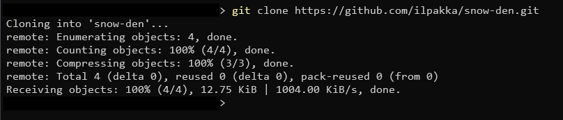

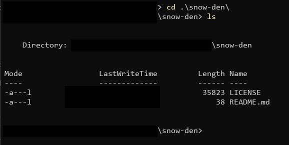

2. Muokataan tuota READMEa niin, että echotaan sinne pelkästään *"muutoksia"*.

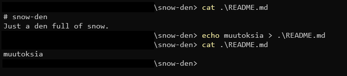

3. Seuraavaksi valmistetaan pusku lisäämällä muokattu README ja pieni kommentti mukaan. Pusketaan muutos ja käydään kurkkaamassa wepistä, että miltä siellä näyttää.

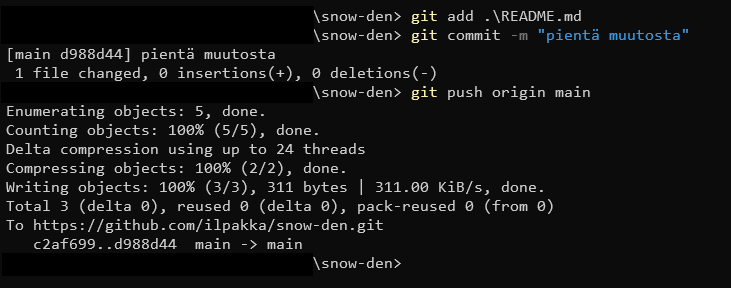

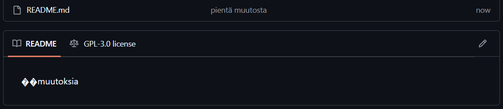

4. Hyvin onnistui ja päivittyi.

## c) Doh!
Tavoite: *Tee tyhmä muutos gittiin, älä tee commit:tia. Tuhoa huonot muutokset ‘git reset --hard’. Huomaa, että tässä toiminnossa ei ole peruutusnappia.*

1. Muokataas tuota READMEa taas. Echotaan *"ihan oikeea tekstiä" ja kurkataan git statuksella nykyinen tilanne.

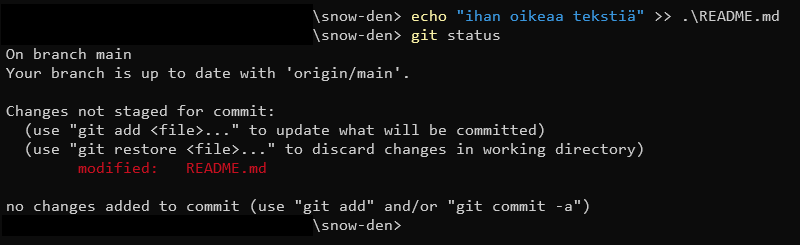

2. Jälkeenpäin alkoi heti kaduttamaan, joten poistetaan tämä "tyhmä muutos". Komento *git reset --hard* pitäisi olla oikein ja varmistetaan tilanne uudestaan git statuksella.

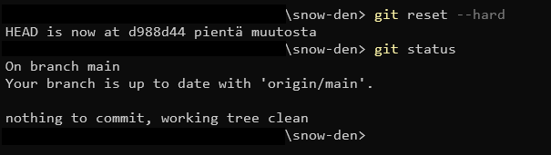

3. Ei muutoksia, hyvä homma!

## d) Tukki.
Tavoite: *Tarkastele ja selitä varastosi lokia. Tarkista, että nimesi ja sähköpostiosoitteesi näkyy haluamallasi tavalla ja korjaa tarvittaessa.*

1. Lokin tarkastaminen onnistuu kätevästi komennolla *git log*. Alimpana kuvassa näkyy reposition alustaminen, jossa sisällöksi oli jo luotu README.md sekä LICENSE. Ylempänä näkyy tuo meidän tekemä muutos README:hen.

2. Nimi ja sähköpostiosoite näkyvät haluamallani tavalla, joten niitä ei tarvitse muuttaa. Ei sitä(kään) nyt kuitenkaan muille tarvitse näyttää.

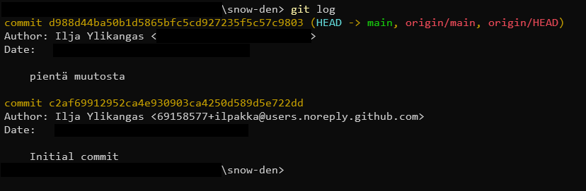

## e) Suolattu rakki. 
Tavoite: *Aja Salt-tiloja omasta varastostasi.*

1. Puskin repoon yksinkertaisen suolan, joka luo tiedoston nimeltä *lunta.txt*. On siellä myös sisältöäkin.

```bash
base:
  '*':
    - lumi
```

```bash
lumi:
  file.managed:
    - name: /tmp/lunta.txt
    - contents: |
      Lunta jouluksi!
```

2. Ajetaan se komennolla *sudo salt-call --local --file-root ./suola state.appy*.

3. Hyvin pyöri!

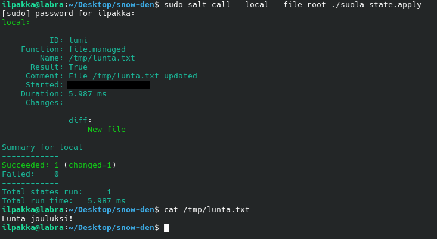

## Lähteet
- Tero Karvinen 2025. Palvelinten hallinta. Luettavissa: https://terokarvinen.com/palvelinten-hallinta
- Charon and Straub 2014. Pro Git: 1.3 Getting Started - What is Git? Luettavissa: https://git-scm.com/book/en/v2/Getting-Started-What-is-Git%3F
- Tero Karvinen 2024. Github. Suolax. https://github.com/terokarvinen/suolax/