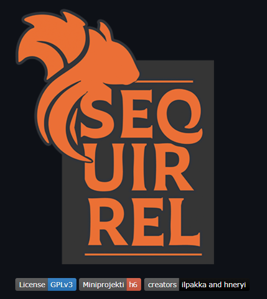

# h6 Miniprojekti

## a) Oma miniprojekti.
Tavoite: *Kurssin lopputyö parityönä.*

Kurssin loppu häämöttää ja tässä olikin seuraavaksi tarkoitus osoittaa kurssilla opittuja asioita sekä halutessaan tuoda esiin myös aikaisempaa osaamista mukaan lopputyöhön.

Pari oli helppo valita, sillä [Henryn](https://h.iskff.fi/ph/) kanssa tultiin toimeen jo aikaisemmilla kursseilla sekä hakkerikerho [H-T8:ssa](https://ht8.fi/). Pienen funtsimisen jälkeen päästiin yhteisymmärrykseen projektin luonteesta ja tavoitteesta.



Secuirrel, eli hassutellen siis "turvaorava", oli se mihin päädyttiin. Kyseessä on saltilla pyörivä tietoturvatyökalujen hallintajärjestelmä, jolla saa kätevästi uudet virtuaalikoneet kisa- ja harrastekuntoon. Oltiin molemmat samaa mieltä siitä, että kun näitä erilaisia työkaluja löytyy isot kasat erilaisiin kategorioihin ja käyttötarkoituksiin, niin luodaan tämmönen valmis yksi paketti. Secuirrel mahdollistaa vakiona laajan "oneshotin" tietoturvatyökaluasennuksille, mutta sitä voi myös ohjata eri suuntaan käyttäjäprofiileilla. Jos tekeekin mieli vaan skannailla portteja, niin turha täyttää konetta Ghidran javapölyllä.

Halusimme pitää huolta siitä, että projekti sopii kurssin lopputyön raameihin:
- Salt-pohjainen
- Versionhallittava ja läpinäkyvä
- Idempontentti
- Modulaarinen

Secuirrel on pistetty kasaan SaltStackilla, jossa *top.sls* kutsuu nykyistä *ctf_boxia*, jonka *init.sls* ohjaa lopuksi eri kategorioiden toiminnat:

```
salt/
├── top.sls
└── ctf_box/
    ├── init.sls
    ├── tools.sls
    │
    ├── cracking/
    │   ├── cracking.sls
    │   └── init.sls
    │
    ├── forensics/
    │   ├── binwalk.sls
    │   ├── forensics.sls
    │   └── init.sls
    │
    ├── reverse/
    │   ├── ghidra.sls
    │   ├── init.sls
    │   └── pwndbg.sls
    │
    ├── web/
    │   ├── init.sls
    │   └── web.sls
    │
    └── users/
        └── user.sls
```

| Kategoria | Mitä se sisältää ja jokin asennettava työkalu |
| --------- | --------- |
| Cracking | Salasanojen purkausta, John |
| Forensics | Digianalyysit, Binwalk v2 & v3 |
| Reverse | Käänteismallintamista, Ghidra |
| Web | Porttiskannausta, nmap |

Asennettavia työkaluja on tällä hetkellä rajoitetusti, sillä vielä testausvaiheessa oli turha ottaa heti parin gigan pyöritystä. Tarkoituksena on tosiaan laajentaa sekä kategorioiden että työkalujen valikoimaa.

## b) Etusivu.
Tavoite: *Laita projektisi etusivulle tärkeimmät tiedot.*

Projekti löytyy GitHubista: https://github.com/ilpakka/secuirrel

Etusivulta löytyy englanninkieliset ohjeet asennukseen ja käyttöön, tulevaisuuden kehityssuuntia sekä kutsu kontribuoida projektiin! myös itse!

## Lähteet
- Tero Karvinen 2025. Palvelinten hallinta. Luettavissa: https://terokarvinen.com/palvelinten-hallinta
- Ilja Ylikangas, Henry Isakoff. Secuirrel. GitHub. https://github.com/ilpakka/secuirrel