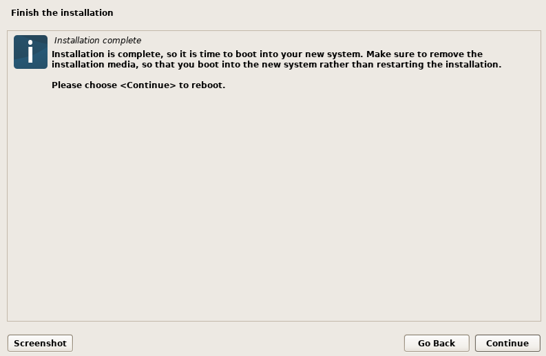

# **Oma Linux**

## **1. Raportin kirjoittaminen tiivistettynä**
Hyvä raportti kertoo täsmällisesti sen mitä on tehty ja miten. Jotta raportista tulee mahdollisimman kattava, on tärkeää työstää sitä koko tekemisen ajan.

Raportointi helpottaa myös oman työn seuraamista ja se edesauttaa uusien asioiden oppimista kuten myös jo vanhojen asioiden kertaamisessa.

Hyvän raportoinnin perusperiaatteita ovat muun muassa:
- **Täsmällisyys**
    - Kirjataan komennot, kellonajat, muut tärkeät merkit ja tarvittaessa myös raakalokit. Otetaan ylös mahdolliset virheet, odottamattomat tulokset sekä toteutetut toimenpiteet.
- **Toistettavuus**
    - Raporttista löytyy selkeät askeleet joilla tulokset on saatu näkyviin. Testit voi siis toistaa ilman erillisiä pähkäilyjä. On tärkeää, että kirjataan ylös alkuperäinen ympäristö, kuten *käyttöjärjestelmä* ja *työkaluversiot*.
- **Selkeys**
    - Teksti on kirjoitettu sellaiseen tapaan, joka täsmää tehtävänantoa eikä derailaa turhiin yksityiskohtiin. Helppolukuisuuteen kuuluu myös tarvittaessa erillisiä osioita, kuten kuvapaakkaukset ja pienet tiivistelmät tai kuvaukset käsiteltävästä asiasta.

## **2. Linuxin asentaminen virtuaalikoneeseen:**

### **Toteutusympäristö**

| Käyttöjärjestelmä | Versio | Ajankohta | Lisätiedot |
| :- | - | - | :-: |
| Windows 11 | 24H2 | 22.8.2025 | - |

### 1. Alkutoimet

1. Voit tarkastella Debianin näköistiedostoja [täältä](https://cdimage.debian.org/debian-cd/13.0.0-live/amd64/iso-hybrid/). Tässä esimerkissä lataamme tiedoston *debian-live-13.0.0-amd64-kde.iso*. Löydät tiedoston skrollaamalla sivua hieman alas.

> Varmista, että lataat oikean tiedoston. Käyttämämme näköistiedosto päättyy amd64-kde.iso.

2. Seuraavaksi lataa VirtualBox [täältä](https://www.virtualbox.org/wiki/Downloads) ja valitse oma pääkäyttöjärjestelmäsi. Valitsemme Windows hostin, koska tässä esimerkissä käytämme Windowsia.

3. Asenna VirtualBox asennusohjelman ohjeiden mukaisesti.

### 2. VirtualBox

1. Käynnistä VirtualBox ja lisää uusi virtuaaliympäristö navigoimalla *Machine -> New...*

2. Kirjoita kohteelle **Nimi** ja lisää **ISO Image** kohtaan lataamasi Debianin näköistiedosto etsimällä se **Other...** kohdan kautta, ellei VirtualBox tarjoa sitä sinulle automaattisesti. Huomioi, että käyttämämme versio on **Debian (64-bit)** ja ruksaamme kohdan **Skip Unattended Installation**.

3. Siirry kohtaan **Hardware** ja nosta keskusmuistin määrä vastaamaan **4096 MB**. Prosessorien määräksi asetetaan **4**. Otamme tässä esimerkissä myös EFI:n käyttöön.

4. Siirry kohtaan **Hard Disk** ja merkitse muistin määräksi **50 GB**. Huomioi, että **Pre-allocate Full Size** ei ole päällä.

5. Tallenna asetukset painamalla **Finish**.

### 3. Debian osa 1

1. Tuplaklikkaa Debianin kuvaketta käynnistääksesi sen. Tämä avaa uuden ikkunan, jossa voimme nyt jatkaa Debianin asentamista. Valitse näkyvillä olevista vaihtoehdoista **Start installer**.

2. Seuraava kuvasarja sisältää kaikki valinnat, joita tarvitsemme tässä asennuksessa. Erikoiskohdissa, kuten käyttäjänimen valinnassa, voit valita itse oman asetuksesi. Jatka aina seuraavaan painamalla **Continue**.

3. Seuraava vaihe voi kestää hetken. Odota kunnes se on valmis.

4. Jatka seuraavia vaiheita.

5. Päätä vahva salasana rootille.

6. Valitse haluamasi nimet.

7. Päätä vahva salasana omalle käyttäjällesi.

8. Tämä vaihe voi taas kestää hetken. Odota kunnes se on valmis.

9. Jatka seuraavia vaiheita.

10. Huomioi, että joudut erikseen valitsemaan kuvassa esitetyn asetuksen.

11. Tämä vaihe kestää yleensä pisimpään.

12. Asennus on nyt valmis ja voit käynnistää Debianin uudelleen painamalla **Continue**.

### 4. Debian osa 2

1. Uudelleenkäynnistyksen jälkeen odotat hetken aikaa kunnes Debian ohjautuu itsestään. Debianin käynnistyttyä virheettömästi pääset kirjautumisnäkymään.

2. Kirjaudu sisään tunnuksellasi. Voit ohittaa näkyviisi ilmestyvän viestin klikkaamalla **Skip**.

3. Seuraavaksi muutamme hieman asetuksia ja päivitämme järjestelmän. Avaa komentoliittymä näppäinyhdistelmällä *Ctrl+Alt+T* (Windows).

4. Kirjaudu rootilla syöttämällä komento *su -*, jonka jälkeen syötät rootin salasanan. Tämän jälkeen nosta peruskäyttäjän oikeutesi komennolla *usermod -aG sudo [nimesi]* .

5. Avaa uusi komentoliittymä ja varmuuskopioi Debianin lähdeluettelo komennolla *sudo cp /etc/apt/sources.list /etc/apt/sources.list.bak* .

6. Kommentoi kaikki cdrom-rivin kohdat komennolla *sudo sed -Ei 's/^deb cdrom:/# &/'* , jotta voimme päivittää oikeaa verkkovarastoa. Apt yrittää muuten etsiä paketteja .iso -tiedostoltamme.

7. Avaa lähdeluettelo muokkaustilaan komennolla *sudo tee /etc/apt/sources.list >/dev/null <<'EOF'* . Lisää samat rivit jotka näkyvät kuvassa, painamalla *Enter* jokaisen rivin päätteeksi ja lopuksi lopettamalla tilan komennolla *EOF* .

8. Nyt voimme vihdoin viimeistellä Debianin päivitykset komennolla *sudo apt update && sudo apt upgrade -y* , joka tarkistaa ensin päivitystilan ja siirtyy siitä suoraan uusien päivitysten asentamiseen.

9. Debian on nyt päivitetty ja valmiina käyttöön.

## **Vapaaehtoinen bonus: suosikkiohjelmani Linuxilla.**

Suosikkiohjelmani Linuxilla on [Neofetch](https://github.com/dylanaraps/neofetch).

## **Lähteet**:
- Karvinen, Tero. Raportin kirjoittaminen. https://terokarvinen.com/2006/raportin-kirjoittaminen-4/
- Karvinen, Tero. Linux palvelimet. https://terokarvinen.com/linux-palvelimet/