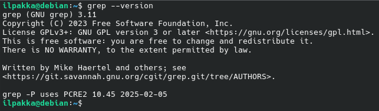

# Komentaja Pingviini

## x)

Linuxin käyttö ja toiminta voi näyttää aika pelottavalta, mutta se on hyvin kätevä taito handlata. Komentorivillä on helppo navigoida ja automatisoida erilaisia toimia.
<br>

Komentorivillä näkyy yleisimmin kaksi erilaista promptin lopetusmerkkiä:
- *$* joka kuvastaa tavallisen käyttäjän syötettä.
- *#* joka kuvastaa root-käyttäjän syötettä.

### 1. Navigointi

On vaarallista kulkea yksin! Ota nämä.

| Komento | Kuvaus | Esimerkki |
| :------ | ------ | --------- |
| pwd | Näyttää nykyisen osoitteen | pwd |
| cd | Liiku hakemistoon | cd paikka1 |
| ls | Listaa sisältö. | ls -f |
| less | Lue tiedoston sisältö | less teksti2.txt |

Nuolinäppäimillä pääsee takaisin selailemaan aikaisempia komentoja.

### 2. Käsittely

Linuxille löytyy erilaisia komentoja tiedostojen ja hakemistojen käsittelyyn.

| Komento | Kuvaus | Esimerkki |
| :------ | ------ | --------- |
| nano | Editori, jolla muokata tekstiä | nano common.txt |
| mkdir | Luo uuden hakemiston | mkdir UusiKansio |
| mv | Siirrä tai nimeä uudelleen | mv vanhasta uuteen |
| cp | Kopioi | cp ./A/test_flag.txt ./B |
| rm | Poista | rm bloat.xlsx |

### 3. SSH

SSH eli Secure Shell on alkuisin suomalaista kädenjäljen tulosta, turvallisen etäyhteyden saavuttamiseksi. SSH-yhteydellä voimme siis hallita ulkopuolisia tietokoneita.

| Komento | Kuvaus | Esimerkki |
| :------ | ------ | --------- |
| ssh | Avaa SSH-yhteys | ssh ilpakka@100.0.0.0 |
| exit | Sulje SSH-yhteys | exit |

### 4. Myynnin ja Kumisielun välissä

Joskus voi jäädä jumiin tai olla eksyksissä. Tämmöseen tilanteeseen soveltuvat erilaiset apukomennot.

| Komento | Kuvaus | Esimerkki |
| :------ | ------ | --------- |
| man | Komennon manuaali | man ls |
| help | Pikaohjeet | ls --help |

### 5. Historia

| Komento | Kuvaus | Esimerkki |
| :------ | ------ | --------- |
| history | Näytä aikaisemmat komennot | history |

### 6. Hakemistot

Tässä muutamia tärkeitä hakemistoja.

| Dir | Kuvaus |
| :-- | ------- |
| / | Juuri. Täältä se kaikki alkaa. |
| /home/ | Käyttäjien kodit. |
| /home/ilpakka/ | Täältä löytyy mun paikka ja tavarat. |
| /etc/ | Konffit ja asetukset |
| /media/ | Irrotettavien laitteiden, kuten USB-tikkujen tai kovojen hengailu.  |
| /var/log/ | Lokitiedostot löytyy täältä. |

### 7. Hallinta

Joskus tarvitsemme korkeampia oikeuksia ja tällöin komento aloitetaan *sudolla*. Tälläisiä hallintatoimia ovat esimerkiksi ohjelmien asennus tai käyttäjien oikeuksien muokkaaminen.
<br>
Pakettihallinta on kätevä tapa asennella ohjelmia. Komennot vaihtelevat Linuxin distrojen välillä, mutta tässä käyn läpi muutamia *Debianin* esimerkkejä.

- Listojen päivittäminen
    ```bash
    sudo apt update
    ```
- Asennettujen pakettien päivittäminen
    ```bash
    sudo apt upgrade
    ```
- Ohjelman asentaminen
    ```bash
    sudo apt install [ohjelma]
    ```
- Ohjelman poistaminen
    ```bash
    sudo apt purge [ohjelma] # Tai 'remove' jos haluaa jättää jälkitiedostoja talteen
    ```

## a) Micro

Asennetaan micro-editori komennolla *sudo apt install micro* ja vahvistetaan toiminto.


Micro saadaan ajettua komennolla *micro*. Tehdään pieni testi!


## b) Just Meet Me At The

Tehtävänä oli asentaa kolme uutta komentoriviohjelmaa. Tähän valittiin lyhyen harkinnan jälkeen cowsay, sl sekä cmatrix.
<br>
Bonuksena asennetaan nämä kolme ohjelmaa kerralla syöttämällä *sudo apt install cowsay sl cmatrix*.


1. Cowsay - ASCII-lehmä puhuu annetun tekstin.


2. sl - Steam Locomotive, komentorivillä puskuttava ASCII-juna.


3. cmatrix - Vain oikeille hakkereille.


## c) FHS

Tässä kohti esitellään ne kansiot, jotka oli listattu aikaisemmin tärkeiden hakemistojen kohdalla.

1. /


2. /home/


3. /home/ilpakka/


4. /etc/


5. /media/


6. /var/log/


## d) The Friendly M

Seuraavaksi 2 kuvaavaa esimerkkiä grep-komennon käytöstä. Kolmas esimerkki löytyy e-osiosta.




## e) The Pipes, The Pipes Are Calling

Tähän saatiin mukaan kolmas grep-komento, jossa hyödynnetään putkea, pipeä, paiplainia jne.


## f) Rauta

Tietoja saatiin näkyviin komennolla *sudo lshw -short -sanitize*, joka listaa laitteen speksejä tiivistetysti ( *-short* ) ja piilottamalla arkaluonteisimmat tiedot ( *-sanitize* ).
<br>

Tulostuksesta näkee, että alusta pyörii virtuaalisesti ja muistia on varattuna 4GB. Emuloitu näytönohjain, Intelin äänikortti, syöttölaitteet ja sillat on listattu ja kuvailtu selkeästi.
<br>


## g) Vapaaehtoinen Lokki

Tarkastellessamme *dpkg.log.ykkösen* häntää huomataan, että sieltä löytyy *mailcapin* sekä *hicolor-icon-themen* lokia ja asennusta kirjattuina.
<br>

*status half-configured* tarkoittaa asennuksen pyörimistä ja *status installed* on yksiselitteisesti onnistuneen asennuksen tiedote.


## h) Vapaaehtoinen Gotham

Päätin ladata *gotham-colors* -nimisen plugarin, joka sai editorin näyttämään vähän pelottavammalta.


Lyhyt pätkä koodia ja ulos.


## Lähteet
- Tero Karvinen. https://terokarvinen.com/2020/command-line-basics-revisited/?fromSearch=command%20line%20basics%20revisited
- Micro. https://micro-editor.github.io/
- Thomas Le Roux. https://github.com/novln/micro-gotham-colors