# Hello Web Server

## x) Tiivistys

### Virtuaalipalvelimien vertailua

| Name-based | IP-based |
| ---------- | -------- |
| Verkkotunnukset voivat jakaa saman IP-osoitteen | Jokaisella hostilla oma IP-osoite |
| Palvelin valitsee Host-headerin perusteella | Palvelin valitsee IP-osoitteen perusteella |
| Helpompi hallita | Selkeämpi erottelu |

### Valintaprosessi ja Käytännöt

- Etsitään paras IP-osoitteen ja portin yhdistelmä.
- Jos tulee useampi vastaus niin valitaan *ServerName*- ja *ServerAlias*-määritysten perusteella.
- Jos *ServerName* puuttuu niin Apache valitsee järjestelmän hostnamen.
- Jos ei löydy nimeä niin ensimmäinen listattu virtuaalipalvelin siirtyy automaattisesti oletukseen.

 

- Määritä *ServerName* aina jokaiselle virtuaalipalvelimelle.
- Laita *default virtual host* käsittelemään määrittelemättömiä pyyntöjä.
- Virtuaalipalvelimet käsitellään konfiguraation listausjärjestyksessä.
- Apache-direktiivit määritetään *&lt;VirtualHost&gt;* sisällä.

## a) Web Test 1 2 1 2

Tavoite: *Testaa, että weppipalvelimesi vastaa localhost-osoitteesta. Asenna Apache-weppipalvelin, jos se ei ole jo asennettuna.*

Apache-webbipalvelin on jo asennettu. Testataan, että se vastaa localhost-osoitteesta.

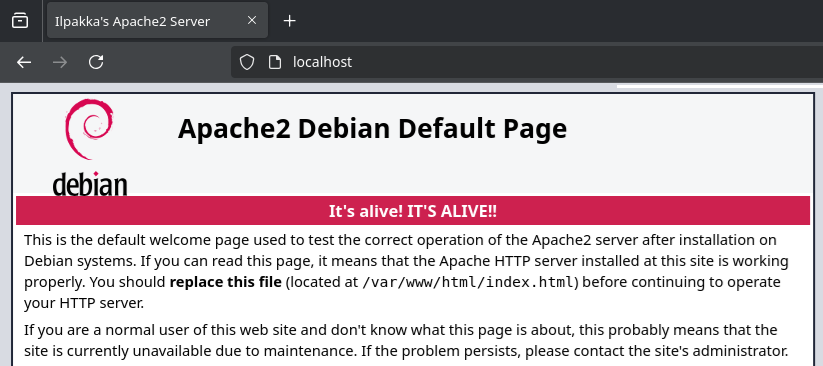

## b) Lokki

Tavoite: *Etsi lokista rivit, jotka syntyvät, kun lataat omalta palvelimeltasi yhden sivun. Analysoi rivit*

Seuraavat lokit tallentuivat localhostin avaamisesta selaimella:

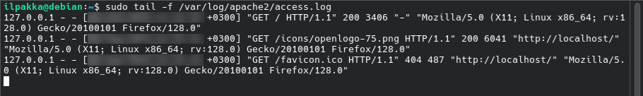

1. Pääpyyntö
>127.0.0.1 - - [PÄIVÄMÄÄRÄ JA AIKA] "GET / HTTP/1.1" 200 3406 "-" "Mozilla/5.0 (X11; Linux x86_64; rv:128.0) Gecko/20100101 Firefox/128.0"

2. Apache-logon lataus
>127.0.0.1 - - [PÄIVÄMÄÄRÄ JA AIKA] "GET /icons/openlogo-75.png HTTP/1.1" 200 6041 "http://localhost/" "Mozilla/5.0 (X11; Linux x86_64; rv:128.0) Gecko/20100101 Firefox/128.0"

3. Faviconin pyyntö
>127.0.0.1 - - [PÄIVÄMÄÄRÄ JA AIKA] "GET /favicon.ico HTTP/1.1" 404 487 "http://localhost/" "Mozilla/5.0 (X11; Linux x86_64; rv:128.0) Gecko/20100101 Firefox/128.0"

| Kenttä | Selitys |
| :----- | ------- |
| 127.0.0.1 | IP-osoite. |
| - | Ident-kenttä ("käyttäjätunnus"), joka on nykyään lähes poikkeuksetta tietoturvasyistä tyhjä. |
| - | Autentikointikenttä, joka on tyhjä, koska sivulla ei ole käyttäjätunnuksia ja salasanoja. |
| [PÄIVÄMÄÄRÄ JA AIKA] | Päivämäärä, aika sekä aikavyöhyke. |
| "GET / HTTP/1.1"  | HTTP-pyyntö (versio 1.1), jossa *GET* pyytää sisältöä kohteesta */* eli juuresta/etusivulta. |
| "GET /icons/openlogo-75.png HTTP/1.1" | HTTP-pyyntö (versio 1.1), jossa *GET* pyytää Apache-logon. |
| "GET /favicon.ico HTTP/1.1" | HTTP-pyyntö (versio 1.1), jossa *GET* pyytää Favicon-ikonin. |
| 200, 404 | HTTP-koodi onnistuneelle pyynnölle (200 OK), sekä tyhjälle (404 Not Found). |
| 3406, 6051, 487 | Haettu koko tavuina. |
| "-", "http://localhost/" | Referer-kenttä, joka kertoo miltä sivulta tähän on siirrytty. Aluksi tyhjä, koska sivu avattiin suoraan selaimella,. Myöhemmin *localhost*, koska kuvat haettiin etusivulta. |
| "Mozilla/5.0 (X11; Linux x86_64; rv:128.0) Gecko/20100101 Firefox/128.0" | Kertoo mikä ja kuka teki pyynnön. Näyttää tiedot selaimesta, sen versiosta sekä käyttöjärjestelmästä. |

## c) Etusivu Pro Plus

Tavoite: *Tee uusi name based virtual host. Sivun tulee näkyä suoraan palvelimen etusivulla http://localhost/. Sivua pitää pystyä muokkaamaan normaalina käyttäjänä, ilman sudoa. Tee uusi, laita vanhat pois päältä. Uusi sivu on hattu.example.com, ja tämän pitää näkyä: asetustiedoston nimessä, asetustiedoston ServerName-muuttujassa sekä etusivun sisällössä*

1. Aloitetaan lisäämällä hatut *hosts*-tiedostoon komennolla *sudo nano /etc/hosts*.

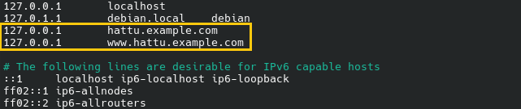

2. Luodaan uusi konfiguraatiotiedosto komennolla *sudoedit /etc/apache2/sites-available/hattu.example.com.conf* ja lisätään tarvittavat tiedot:

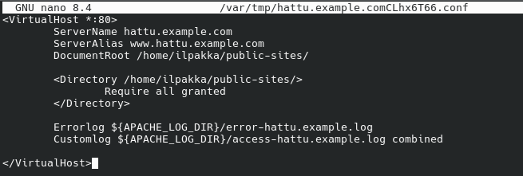

3. Luodaan uusi *public-sites*-hakemisto komennolla *mkdir -p /home/ilpakka/public-sites/* ja luomme tänne tiedoston komennolla *touch index.html*. Muokataan tiedostoa niin, että se näyttää tehtävään sopivan html-sivun.

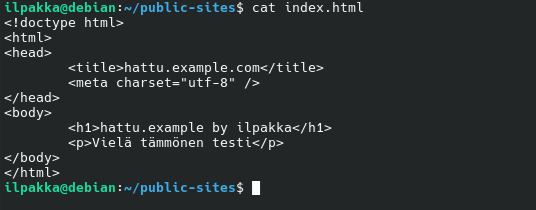

4. Seuraavaksi meidän täytyy asettaa oikeudet, jotta Apache kykenee lukemaan ja näyttämään sivuja. Oikeudet näkyvät Linuxissa muodossa *- rwx rwx rwx*, jossa ensin näytetään tiedoston tyyppi *- (tiedosto), l (symlink), d (hakemisto)* ja seuraavat kolmen kirjaimen yhdistelmät *r (read / luku), w (write / muokkaus), x (execute / aja)* osoittavat järjestyksessä käyttäjän, ryhmän ja lopuksi muiden oikeudet. Esimerkissä *-r--r--r--* kaikilla on oikeus lukea, mutta ei muuta.

Tarvitsemamme oikeudet:
- Tiedosto *index.html*: muilla täytyy olla oikeus lukea (r).
- Hakemisto *public-sites*: muilla täytyy olla oikeus ajaa (x).
- Hakemisto *ilpakka*: muilla täytyy olla oikeus ajaa (x).
- Hakemisto */home*: muilla täytyy olla oikeus ajaa (x).

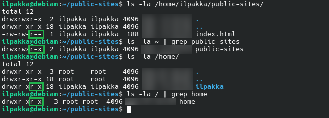

Kaikki näyttäisi olevan kunnossa, joten meidän ei tarvitse muuttaa oikeuksia ja voimme siirtyä seuraavaan vaiheeseen.

5. Otetaan sivu käyttöön komennolla *sudo a2ensite hattu.example.com.conf*, jonka jälkeen käynnistämme Apachen uudelleen komennolla *sudo systemctl reload apache2*.

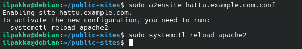

6. Kokeillaan avata etusivu selaimella ja siellähän se näkyy ja toimii!

## e) Validi HTML5

Tavoite: *W3C ei anna mitään virheitä.*

1. Tehdään alustava tarkistus *index.html*-tiedostollemme ja sieltä näyttäisi tulevan muutama ilmoitus.

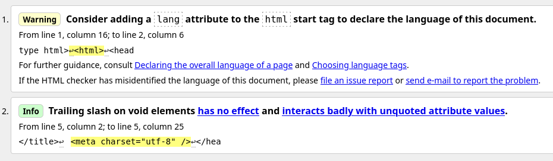

2. Korjataan molemmat virheet lisäämällä tiedostoon *lang*-attribuutti sekä muokkaamalla *metan* sulkua.

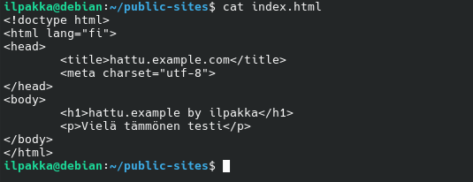

3. Testataan uudestaan ja nyt kaikki näyttäisi olevan kunnossa!

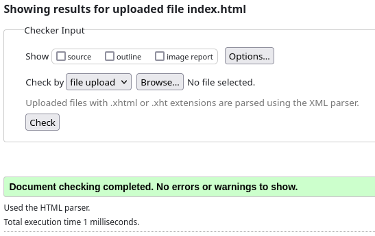

## f) It's ya boy cURL from Sweden

Tavoite: *Anna esimerkit 'curl -I' ja 'curl' -komennoista. Selitä 'curl -I' muutamasta näyttämästä otsakkeesta (response header), mitä ne tarkoittavat.*

1. Esimerkki komennosta *curl -I*, joka palauttaa HTTP-ostakkeet ilman sivun sisältöä:

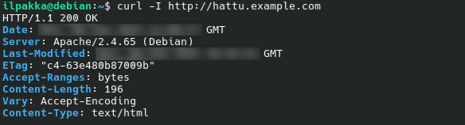

- *HTTP/1.1 200 OK*: Pyyntö onnistui HTTP-versiolla 1.1.
- *KELLONAIKA*: Palvelimen kellonaika ilmoitettuna GMT-ajassa.
- *Server: Apache/2.4.65 (Debian)*: Kertoo mikä vastaa pyyntöön, eli tässä tapauksessa Debianin Apachen versio 2.4.65.
- *Last-Modified*: Näyttää viimeisen muokkausajan GMT-ajassa.
- *ETag*: Entity Tag eli yksilöllinen tunniste sivulle.
- *Accept-Ranges: bytes*: Palvelin antaa käyttäjän ladata sivua osittain.
- *Content-Length: 196*: HTML-sivun sisältö, tässä tapauksessa 196 tavua.
- *Vary: Accept-Encoding*: Palvelin hyväksyy erilaiset pakkausmuodot.
- *Content-Type: text/html*: Kertoo sivun sisältötyypeistä.

2. Esimerkki komennosta *curl*, joka taas palauttaa HTML-sivun koodin.

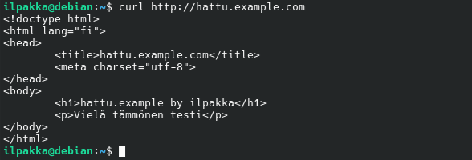

## m) Vapaaehtoinen: GitHub Education

Tavoite: *Hanki GitHub Education -paketti.*

Miksipä ei.

## o) Vapaaehtoinen: Meitä on kaksi, kammottavaksi.

Tavoite: *Laita sama tietokone vastaamaan kahdellla eri sivulla kahdesta eri nimestä.*

1. Aloitetaan täysin samalla tavalla kuin ennenkun, eli lisätään nimet */etc/hosts*-tiedostoon.

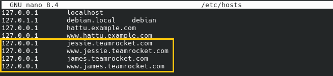

2. Luodaan uudet konfiguraatiotiedostot ja lisätään molemmille tarvittavat tiedot.

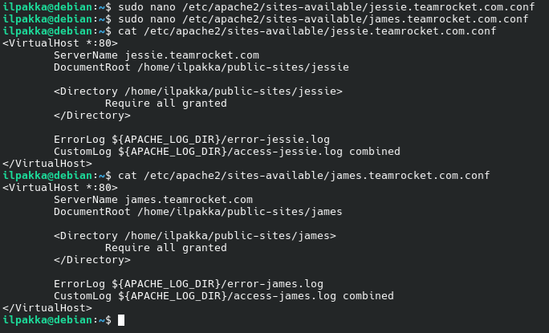

3. Luodaan kansiot ja tehdään hyvin yksinkertaiset etusivut molemmille.

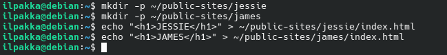

4. Tarkistetaan molempien oikeudet.

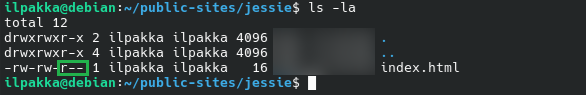

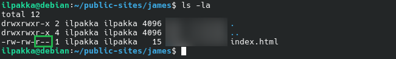

5. Otetaan molemmat sivut käyttöön ja pyöräytetään Apache uudelleen käyntiin.

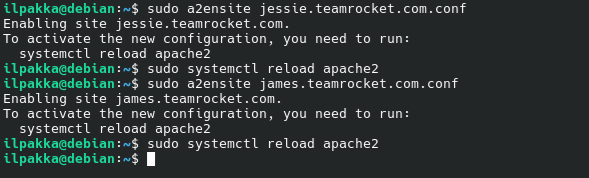

6. Suoritetaan konfiguraatiolle nopea sanity test ja siellä ne näyttäisi olevan tallessa.

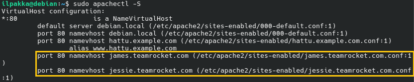

7. Kurkataan selaimella, että näkyykö sivut oikein ja näin on. Palvelimme yhdellä IP-osoitteella kaksi verkkosivua.

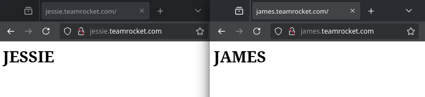

## Lähteet
- Apache. Name-based Virtual Host Support. https://httpd.apache.org/docs/2.4/vhosts/name-based.html
- Tero Karvinen. Name Based Virtual Hosts on Apache - Multiple Websites to Single IP Address. https://terokarvinen.com/2018/04/10/name-based-virtual-hosts-on-apache-multiple-websites-to-single-ip-address/
- Johanna Heinonen. GitHub. https://github.com/johannaheinonen/johanna-test-repo/blob/main/linux-03092025.md