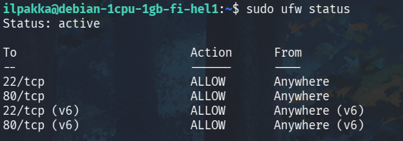

# h4 Maailma kuulee

## x) Tiivistys

- Karvisen kirjoituksessa käydään läpi VPS:n vuokraamista ja konfigurointia. Ympäristönä on toiminut Ubuntu 16.04 LTS ja palveluntarjoajana DigitalOcean. Kirjoituksessa käydään läpi erilaisia komentoja muun muassa palomuurin, käyttäjänhallinan sekä päivittämisen yhteydessä.
- Lehdon kirjoituksessa "Teoriasta käytäntöön pilvipalvelimen avulla" hän näyttää kaikki tarvittavat askeleet oman pilvipalvelimen käyttöönotossa. Komentoja tulee vielä tiheämpään tahtiin ja konfiguroinnit on avattu yksityiskohtaisemmin.

## a) Vuokraus

Tavoite: *Vuokraa oma virtuaalipalvelin haluamaltasi palveluntarjoajalta.*

1. Ensimmäisenä täytyy valita palveluntarjoaja ja luennon esimerkissä käytetty UpCloud valitaan nyt tähänkin tehtävään.

2. Tehdään käyttäjä, vahvistetaan sähköposti ja varmennetaan vielä korttitiedot niin päästään valitsemaan virtuaalikonetta kohdasta *Deploy now -> Server*.

3. Sijainti valitaan omassa käytössä mahdollisimman läheltä, joten mukaan napataan *FI-HEL1*. Muita vaihtoehtoja olisivat olleet esimerkiksi *FI-HEL2* sekä *SE-STO1*.

4. Plääniksi valitaan *Developer*, koska se sopii tämmöiseen testaustarkoitukseen parhaiten. Valitaan myös kaikista yksinkertaisin alavaihtoehto, koska turha maksaa turhasta.

5. Tallennustilaa ei tarvitse säätää eikä palvelimelle tarvita automatisoituja varmuuskopiointeja. Käyttöjärjestelmäksi on kuitenkin hyvä ottaa *Debian GNU/Linux 13 (Trixie)*. Pysytään Trixiessä, koska sillä on tulevaisuuden kannalta pisin käyttöikä.

6. Skrollaillaan alas kunnes tullaan *Login Method* -kohtaan. Tässä vaiheessa on tärkeää luoda oma *SSH Key*. Komennolla *ssh-keygen -t ed25519 -C "säpö_tänne_tai_joku_muu_kommentti_"* generoidaan avainpari. Varmistetaan myös, että käytetään vahvaa salasanaa!

7. Avaimet on nyt valmiina ja käydään nappaamassa *.pub*-päättyisen avaimen tiedot ja pastetaan ne sivun kohtaan *Add new*. Tallennetaan avain nimella *public* ja siirrytään eteenpäin.

8. Alhaalla ollaankin lopussa ja seuraava askel on ottaa palvelin käyttöön painamalla *Deploy*.

## b) Alkutoimet

Tavoite: *Tee alkutoimet omalla virtuaalipalvelimellasi: tulimuuri päälle, root-tunnus kiinni, ohjelmien päivitys.*

1. Shellataan ensin rootilla palvelimelle sisään komennolla *ssh root@ip.on.täs.näin* Koska tämä on ensimmäinen kerta kyseiseen osoitteeseen, niin pitää varmistaa, että haluamme jatkaa yhdistämistä. Palvelimen IP:n löytää palveluntarjoajan sivuilta.

2. Syötetään aikaisemmin luomamme salasana ja nyt olemme kirjautuneena rootilla.

3. Seuraavaksi on tärkeää tehdä tcp-reikä palomuuriin, ennen kuin laitetaan se päälle. Palvelimelle ei ollut *ufw* vielä asennettuna, joten päätin päivittää ja asentaa kaikki vehjeet ajan tasalla komennolla *sudo apt update && sudo apt upgrade -y*. Tämän jälkeen asennetaan *ufw* ja ajetaan aikaisempi komento uudestaan. Kun saamme vahvistuksen niin voimme pistää palomuurin päälle.

4. Luodaan seuraavaksi peruskäyttäjä komennolla *sudo adduser ilpakka*. Täytyy ensin kuitenkin luoda taas oma vahva salasana, joten tarkkana! Muita tietoja ei ole pakko antaa.

5. Siirretään tämä peruskäyttäjä seuraavaksi sudo-ryhmään komennolla *sudo adduser ilpakka sudo*. Ennen kuin tällä käyttäjällä voidaan shellata palvelimelle, niin täytyy varmistaa, että käyttäjän tiedoissa on tarvittu avain.

6. Luodaan roottinäkymässä uusi hakemisto */home/ilpakka/.shh* ja vahvistetaan oikeat oikeudet komennolla *chmod 700 /home/ilpakka/.shh*. Tehdään avaintiedosto nimellä *authorized_keys*, muokataan oikeudet ja täytetään se rootin hakemiston vastaavalla. Lopuksi vielä varmistetaan, että tämän uuden käyttäjän hakemiston oikeudet ovat oikein.

7. Nyt shellaaminen omalla käyttäjällä pitäisi onnistua. Kokeillaan syöttämällä oikea salasana ja sisällä ollaan!

8. Nyt teljetään roottikirjautuminen lukitsemalla salasana sekä ottamalla rootin ssh-kirjautuminen kokonaan pois päältä. Lukitus onnistuu komennolla *sudo usermod --lock root* ja kirjautumisen voimme estää muokkaamalla *sshd_configin* sisältöä. Käydään muuttamassa *PermitRootLogin* kohtaan arvo *no*. Lopuksi päivitetään SSH komennolla *sudo systemctl reload ssh*. Jos rootilla yrittää nyt shellata sisään, niin pitäisi tulla estettä.

## c) Asennus

Tavoite: *Asenna weppipalvelin omalle virtuaalipalvelimellesi. Korvaa testisivu. Kokeile, että se näkyy julkisesti. Kokeile myös eri koneelta, esim kännykältä.*

1. Asennetaan Apache komennolla *sudo apt install apache2 -y* ja avataan tarvittava portti 80 komennolla *sudo ufw allow 80/tcp*. Voimme varmistaa palomuurin tiedot komennolla *sudo ufw status*, joka näyttää nyt täysin toimivalta.

2. Kurkataan että pyöriikö palvelin jo ennaltaan komennolla *sudo systemctl status apache2*. Tässä tapauksessa kyllä, joten siirrytään etusivun muokkaamiseen.

3. Käydään poistamassa tuo Debianin oletussivu ja laitetaan tilalle jotain parempaa. Etusivu löytyy hakemistosta */var/www/html/index.html*. Tallennetaan muutokset ja käydään kurkkaamassa sivua!

4. Tehdään vielä pikainen testi mobiililla ja hyvältä näyttää!

## Lähteet:
- Karvinen, T. https://terokarvinen.com/2017/first-steps-on-a-new-virtual-private-server-an-example-on-digitalocean/
- Lehto, S. https://susannalehto.fi/2022/teoriasta-kaytantoon-pilvipalvelimen-avulla-h4/
- Karvinen, Tero. Linux palvelimet. https://terokarvinen.com/linux-palvelimet/