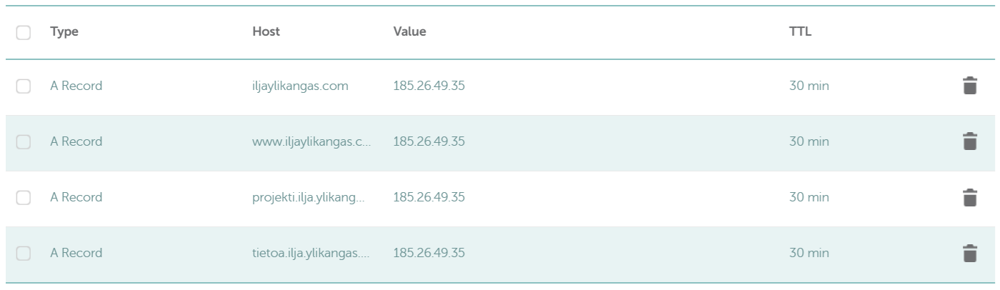

# Nimekäs

## a) Nimi

Tavoite: *Laita julkinen nimi osoittamaan omaan koneeseesi.*

1. Käydään kurkkaamassa Namecheapin tarjontaa. Oma nimeni näyttäisi olevan vapaana, joten napataan se nyt tässä sitten käyttöön!

2. UpCloudin VPS piti käydä laittamassa Trialin jälkeen takaisin päälle ja se vaatikin pienen lahjoituksen tekemistä. Ei hätää, helppo homma ja jatketaan.

3. Siirrytään Namecheapin dashboardissa *Domain List -> *Advanced DNS*. Muokataan täällä A-tietueet näyttämään oikeaan paikkaan.

## b) Alidomain

Tavoite: *Tee kaksi uutta alidomainia, jotka osoittava omaan koneeseesi.*

1. Olemme edelleen tuolla Namecheapin *Advanced DNS* näkymässä, joten lisätään sinne kaksi uutta alidomainia.

2. DNS-päivityksessä menee yleensä tovi, mutta toivottavasti emme joudu tällä kertaa odottelemaan jopa vuorokautta. Voidaan testata tietuetta pingaamalla vaikka *ping iljaylikangas.com*. Tajusin myös tässä vaiheessa, että Hostin tiedot oli laitettu hätiköiden vähän väärin, joten korjataan ne tässä samalla oikeaan muotoon.

3. Pingit toimii, joten tietueet näyttää nyt olevan päivittyneet.

4. Käydään vielä kurkkaamassa, että miltä kaikki näyttää selaimella. Pääosoite kuten alidomaini näyttää toimivan oikein mainiosti.

## c) DNS

Tavoite: *Tutki jonkin nimen DNS-tietoja 'host' ja 'dig' -komennoilla. Käytä kumpaakin komentoa kaikkiin nimiin ja vertaa tuloksia.*

Tutkittavat nimet: *Oma domain-nimesi*, *Jonkin pikkuyrityksen, kerhon tai yksittäisen henkilön weppisivut* sekä *Jonkin suuren ja kaikkien tunteman palvelun tiedot*.

1. Kaivetaan ensin oma domaini komennoilla *dig iljaylikangas.com* sekä *host iljaylikangas*.

2. Seuraavaksi napataan Hyppösen sivut komennolla *dig mikko.com*.

3. Viimeisenä vielä kaikkien tuntema Kela komennolla *dig kela.fi*.

4. Oma domain on hyvin yksinkertainen eikä sieltä löydy esimerkiksi IPv6-osoitetta. Myös tuo *mail is handled by* viittaa Namecheapin oletuspalvelimiin, koska en ole lisäillyt itselleni mitään sähköpostipalvelimia. Hyppöseltä löytyy IPv6 ja Hostingerin palvelimet sähköpostille. Kelalla ei ole näkyvissä kauheasti tietoa, eikä edes IPv6-osoitettakaan. Oma sähköpostipalvelin heiltä tosin löytyy. Yksi syy tietojen puutteellisuudelle voi olla myös se, että isojen organisaatioiden tietoja voi olla peruskyselyissä piilossa. TTL eli Time To Live oli itselläni ja Kelalla noin parikymmentä minuuttia (1366s & 1124s) kun taas Hyppösellä vedettiin muutamaa minuuttia (194s) vaille nollat. Lyhyesti TTL merkitsee siis sitä, kuinka nopeasti DNS-päivitykset levittäytyvät. Pienemmät arvot kuormittamat palvelinta enemmän, mutta suuremmat arvot kuormitushelpotuksesta huolimatta tekevät muutoksia hitaammin.

## Lähteet
- Namecheap. https://www.namecheap.com/
- UpCloud. https://upcloud.com/
- Karvinen, T. https://terokarvinen.com/linux-palvelimet/
- Cloudfare. https://www.cloudflare.com/learning/dns/dns-records/dns-a-record/