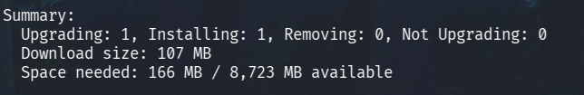

# Salataampa

## x) Lue ja tiivistä. 

Tavoite: *Tiivistelmäksi riittää muutama ranskalainen viiva per artikkeli.*

Materiaalit:
- *Let's Encrypt 2024: How It Works*
- *The Apache Software Foundation 2025: Apache HTTP Server Version 2.4 [Official] Documentation: SSL/TLS Strong Encryption: How-To: Basic Configuration Example*

Let's Encrypt on ilmainen ja avoin CA, eli Certificate Authority, jotka vastaavat digitaalisten sertifikaattien jakamisesta ja hallinnoimisesta. Nämä sertifikaatit ovat voimassa 90 päivää, mutta niiden uusinta on automaattista muun muassa Certbotin avulla. Jotta voimme käyttää HTTPS:ää, Apache tarvitsee SSL-moduulin sekä palvelimen täytyy kuunnella porttia 443. Jokaiselle HTTPS-sivulle täytyy määritellä erilaisia konfiguraatiota, kuten SSLCertificateFile (varmenne) sekä SSLCertificateKeyFile (yksityinen avain). Let's Encryptin suosittelema Certbot suorittaa nämä konfiguraatiot automaattisesti, joka tekee elämästä yksinkertaisempaa.

## a) Let's.

Tavoite: *Hanki ja asenna palvelimellesi ilmainen TLS-sertifikaatti Let's Encryptilta. Osoita, että se toimii.*

1. Kokeillaan ensimmäisenä pingata omaa domainia niin nähdään sen toimivuus. Kaikki näyttäisi olevan kunnossa!

2. Shellataan sisään virtuaalipalvelimelle ja tehdään rutiinipäivitykset komennolla *sudo apt update && sudo apt upgrade -y*, jonka jälkeen pääsemme TLS-sertifikaatin hankintaan.

3. Navigoidaan Let's Encryptin sivuille ja skrollataan hieman alas päästäksemme ottamaan selvää TLS-sertifikaateista. Sivujen ohjeita lukiessa paljastuu, että palvelimelle tarvitaan tässä tapauksessa erillinen työkalu nimeltä *Certbot ACME*. Mitä tämä oikein tekee ja mihin sitä tarvitaan? *Certbot ACME* mahdollistaa automaattisen TLS-sertifikaatin hallinnan Let's Encryptin omilta palvelimilta sen sijaan, että joutuisimme konfiguroida kaikkea aina itse. *ACME*, eli *Automatic Certificate Management Environment* on siis tässä toiminnassa käytetty protokolla.

4. Asennetaan *Certbot ACME* virtuaalipalvelimelle komennolla *sudo apt install certbot*.

5. Nyt meillä on virtuaalipalvelimella työkalu TLS-sertifikaatin hankkimiseen. Miten se sitten saadaan? Varmistamalla vielä Certbotin omien sivujen kautta oikea komento sertifikaatille on Apachen puolelle *sudo certbot --apache -d iljaylikangas.com -d www.iljaylikangas.com*.

6. Ei onnistunutkaan, mutta miksi? Ilmoitus viittaa vahvasti siihen, että olimme unohtaneet ottaa *Certbotin* asennuksen yhteydessä mukaan Apachen plugarin. Jos kurkistamme alkuperäistä asennuskuvaa, niin siinä oli jopa suositeltu tämän sisällyttämistä. Käydään siis nappaamassa se erikseen mukaan komennolla *sudo apt install python3-certbot-apache*.

7. Nyt pitäisi löytyä kaikki, eli kokeillaan aikaisempaa serttikomentoa uudestaan. Sähköpostiosoitetteen luovuttamisen sekä käyttöehtojen varman lukemisen jälkeen meille napsahtaa virheilmoitus. Mikäs nyt?

8. Saamamme JWT-virheilmoitus koskee *ACME:ssa* käytettäviä *JSON Web Tokeneita*, jotka ovat webbivarmentamiseen liittyviä digitaalisia allekirjoituksia. Tässä tapauksessa on kuitenkin todennäköisempää, että meillä on palvelimella jotain häikkää ajan ja kellon kanssa, koska se on hyvin yleinen syy kyseiselle virheilmoitukselle. Kurkataan miltä kaikki näyttää komennolla *timedatectl status*.

9. Tuo *NTP*, eli *Network Time Protocol* on se, mikä täytyy pakottaa päälle. *N/A* viittaa nyt siihen, että allekirjoituksien kellonajat heittelee miten sattuu, koska mikään ei ole synkassa. Meillä ei kuitenkaan ole valmiiksi asennettuna mitään työkalua tälle, joten käydään nappaamassa *systemd-timesyncd* komennolla *sudo apt install systemd-timesyncd*.

10. Synkataan aika komennolla *sudo systemctl enable systemd-timesyncd --now* ja pusketaan NTP käyttöön komennolla *sudo timedatectl set-ntp true*. Nyt tuo NTP Service näyttää pyörivän oikein. Kokeillaan TLS-sertifikaatin hankkimista.. uudestaan.

11. Mennään samaa tietä kuin aikaisemminkin, mutta eteen tulee taas kerran virhettä. Tällä kertaa ilmoitetaan, että koko käyttäjän luonti ja näin ollen koko TLS-sertifikaatin hankinta ei ole mahdollista.

12. Tässä vaiheessa oli fiksua käydä tarkistamassa Let's Encryptin tila, sillä heillä näyttäisi tosiaan olevan tämä tarvitsemamme palvelu alhaalla. Kertakaikkiaan huono ajoitus, mutta sille ei nyt voi mitään. Jos jotain positiivista pitää saada irti, niin ainakin vältyttiin pidemmältä virhetilajahdilta.

13. Tehtävän ratkaisemiseen voisi varmaan tässä tilanteessa käyttää jotain muuta palvelua tai yrittää saada homma kasaan staginsissä, mutta ehkä parempi on odottaa tilanteen paranemista. Kokeillaan uudestaan siis myöhemmin!

14. Palvelun pitäisi nyt toimia, joten kokeillaan tuota TLS-sertifikaatin hankintaa taas kerran. Tällä kertaa päästään loppuun asti!

15. Käydään vielä varmistamassa selaimella, että tuo todellakin löytyy.

## b) A-rating. 

Tavoite: *Testaa oma sivusi TLS jollain yleisellä laadunvarmistustyökalulla, esim. SSLLabs (Käytä vain tavanomaisia tarkistustyökaluja, ei tunkeutumistestausta eikä siihen liittyviä työkaluja)*

1. Surffataan SSLLabsin sivuille testaamaan oman sivun laatua. Syötetään domaini kenttään ja odotellaan tuloksia.

2. Hetken odottelun jälkeen arvosanaksi on annettu *A*. Alas skrollatessa voi käydä vielä kurkkaamassa, että mitä kaikkea on mahdollisesti mennyt pieleen tai jäänyt vajavaiseksi. Tässä tapauksessa voidaan kuitenkin puhua ihan laatusivusta! Jos tuo A+ haluttaisiin ehdottomasti talteen, niin sivustolle täytyisi muun muassa määrittää HSTS-otsake.

## Lähteet
- Let's Encrypt. How It Works. https://letsencrypt.org/how-it-works/
- Apache. SSL/TLS Strong Encryption: How-To. https://httpd.apache.org/docs/2.4/ssl/ssl_howto.html#configexample
- Let's Encrypt. Status. https://letsencrypt.status.io/
- Qualys SSL Labs. SSL Server Test. https://www.ssllabs.com/ssltest/
