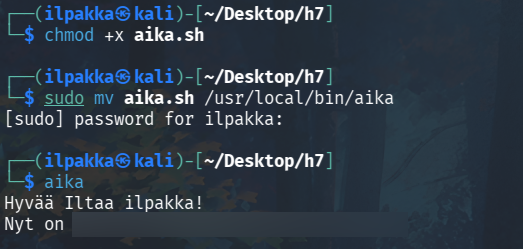
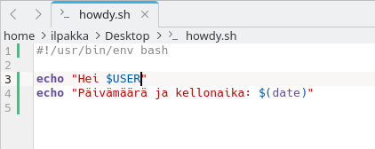

# Maalisuora

## a) "Hei maailma" kolmella kielellä

1. Valitaan kieliksi C, C++ ja Python. Aloitetaan ensin ceellä!

```c
#include <stdio.h>

int main()
{
    printf("Hello world in C!");
    return 0;
}
```

2. Luodaan ja ajetaan ohjelma. Toimii hyvin!


3. Seuraavana vuorossa C++, joka onkin aika samanlainen! Muutetaan muutamia kohtia ja saadaan aikaiseksi toivottavasti toimiva pätkä.

```cpp
#include <iostream>

int main()
{
    std::cout << "Hello world in C++!";
    return 0;
}
```

4. Hyvin näyttäisi toimivan tämäkin!


5. Lopuksi kolmantena meillä oli Python, jonka kirjoittaminen onkin näistä yksinkertaisin. Toivottavasti ei tule typoja..

```python
print("Hello world in Python!")
```

6. Kaikki toimii! Pythoniin olisi toki myös voinut lisätä klassisen "if \_\_name\_\_ == "\_\_main\_\_" mutta ei tällä kertaa.


## b) Lähdeviitteet

Osioiden h1-h6 lähdeviittaukset tarkistettiin ja päivitettiin puuttuvien tai muuten virheellisten viittauksien osalta.

## c) Oma komento

1. Ajattelin luoda jonkin yksinkertaisen bash-skriptin ja päädyin lopulta sellaiseen, joka näyttää kutsujalle senhetkiset ajan sekä päivämäärän. Mielestäni hauska lisäys on myös se, että käyttäjää tervehditään ajan mukaan.

2. Nopea muistitarkistus bashin operaattoreista (ge ja lt) varmisti sen, että voimme siirtyä koko skriptin kirjoittamiseen. Alussa selvitämme tuntien perusteella, että mikä tervehdys sopii parhaiten:

| Tervehdys | Aikaikkuna |
| :-------- | ---------- |
| Huomenta | klo 6 - 10 |
| Päivää | klo 10 - 18 |
| Iltaa | klo 18 - 23 |
| Yömyöhää | klo 23 - 6 |

```bash
tunti=$(date +%H)

if [ "$tunti" -ge 6 ] && [ "$tunti" -lt 10 ]; then 
	n="Huomenta"
elif [ "$tunti" -ge 10 ] && [ "$tunti" -lt 18 ]; then
	n="Päivää"
elif [ "$tunti" -ge 18 ] && [ "$tunti" -lt 23 ]; then
	n="Iltaa"
else
	n="Yömyöhää"
fi
```

3. Seuraavaksi meidän pitää antaa kaikille oikeus ajaa tämä ohjelma sekä siirtää se hakemistoon */usr/local/bin/aika*.



4. Näyttää toimivan! Voisimme varmasti löytää keinoja muokata tulostusta hieman nätimmäksi, mutta tähän hätään se tekee tehtävänsä!

## d) Laboratorioharjoitus

Valitsin sovellettavaksi laboratorioharjoitukseksi *"Final Lab for Linux Palvelimet 2024 Spring"*.

Säännöt: *Testaamatta == tekemättä*, *saa käyttää julkisista lähteistä löytyvää materiaalia* ja *aloitus tyhjästä Linux-virtuaalikoneesta*.

1. Luodaan uusi Linux-virtuaalikone. Näköistiedostoksi valitsin tällä kertaa *debian-live-13.0.0-amd64-kde.iso*.

2. Virtuaalikoneen asetukset kuntoon.


3. Seuraavaksi siirrytään Debianin asentamiseen uuteen ympäristöön.


4. Kun asennus on valmis, niin bootataan virtuaalikone takaisin päälle.


5. Normaalisti tässä vaiheessa luotaisiin raportti kotihakemistoon nimellä *report/index.md*, mutta tässä labraversiossa jätämme osan soveltaessa pois, sillä ne eivät ole oleellisia tehtävän palautuksen kannalta.

a) Taustatiedot<br>
Oma nimi: Ilja Ylikangas<br>
Opiskelijanumero:<br>
[Linkki omaan kotitehtävärepoon](https://github.com/ilpakka/linuxlax/tree/main/palvelimet)

b) Tiivistelmä

- Toimii: komennot, työkalut, skriptit ja omat ratkaisut.
- Ei vielä toimi: Django-osioita ei ole vielä tehty loppuun.


c) Ei kolmea sekoseiskaa
Tavoite: *Suojaa raportti Linux-oikeuksilla niin, että vain oma käyttäjäsi pystyy katselemaan raporttia*

1. Luomme raportin kotihakemistoon nimellä *report/index.md*. Esimerkkiraporttimme sisältö on tällä hetkellä "Labraraportti".


2. Seuraavaksi suojaamme raportin oikeuksilla niin, että vain oma käyttäjä voi sitä kurkistella. Pidetään polku ennen raporttia *711* ja itse raportti *600*.


3. Testataan uudella käyttäjällä, että pystyykö tämä näkemään raportin sisältöä. Ensin täytyy kuitenkin lisätä itsemme sudoersiin. Muistetaan myös rebootata!


4. Kurkkaaja ei näytä pääsevän lukemaan raportin sisältöä. Hyvä homma!


d) 'howdy'
Tavoite: *Tee kaikkien käyttäjien käyttöön komento 'howdy', jossa pelkkä "hei maailma" ei riitä.*

1. Kirjoitetaan yksinkertainen, päivämäärän näyttävä skripti.



2. Päivitetään skriptin oikeudet ja kokeillaan ensin, että se toimii normaalisti.


3. Nyt kun olemme varmistaneet sen toiminnan, niin siirretään se kaikkien käyttöön hakemistoon */usr/local/bin/howdy*. Testataan sitä myös molemmilla käyttäjillä ja hyvältä näyttää!


e) Etusivu uusiksi
Tavoite: *Asenna Apache-webbipalvelin, tee yritykselle "AI Kakone" kotisivu joka näkyy koneen IP-osoitteella ja jota pitää päästä muokkaamaan normaalin käyttäjin oikeuksin.*

1. Nykyiseltään tämä Debian pyörii vielä CD-ROMina, joten meidän pitää ihan ensimmäisenä päivittää listat. Kommentoidaan siis nuo lähteet ensin. Typo *dep* korjattiin myös nopeasti pois sudoeditillä niin päivityksen pelaa.


2. Päivitetään koko hössäkkä ja asennetaan sen jälkeen Apache. Päivittäminen itsessään kestää hetken.


3. Päivittelyn jälkeen mukaan lähtee Apache ja sen jälkeen laitetaan se päälle.


4. Luodaan yksinkertaiset sivut yritukselle *AI Kakone*.


5. Siirretään *index.html* oikeaan paikkaan ja muokataan oikeuksia.


6. Testataan kotisivuja syöttämällä koneen IP-osoite selaimeen. Hyvältä näyttää!


g) Salattua hallintaa
Tavoite: *Asenna ssh-palvelin, tee uusi käyttäjä omalla nimelläsi ja automatisoi ssh-kirjautuminen julkisen avaimen menetelmällä.*

1. Asennetaan ssh-palvelin komennolla *sudo apt install openssh-server*. Laitetaan se asentamisen jälkeen päälle.


2. Luodaan uusi käyttäjä omalla nimellä.


3. Luodaan avainpari omalle käyttäjälle ja kopioidaan julkinen avain uuteen käyttäjään.


4. Tehdään nopeat testi että kaikki toimii!


h) Djangon lahjat
Tavoite: *Asenna Django-kehitysympäristö, tee tietokantaan lista tekoälyistä joissa tietyt ominaisuudet.*

h) Tuotantopropelli
Tavoite: *Tee tuotantotyyppinen asennus Djangosta. Laita Django-lahjatietokanta tuotantotyyppiseen asennukseen.*

## Lähteet
- W3Schools. Bash Operators. https://www.w3schools.com/bash/bash_operators.php
- Karvinen, Tero. Arvioitava Laboratorioharjoitus 2024 Linux Palvelimet. https://terokarvinen.com/2024/arvioitava-laboratorioharjoitus-2024-linux-palvelimet/
- Karvinen, Tero. Linux Palvelimet. https://terokarvinen.com/linux-palvelimet