# h2 Swiper, no swiping!

## x) Lue/katso/kuuntele ja tiivistä.

1. Buurin luentomateriaalia TIBER-FI:stä, miten TLPT-projekteja hallitaan ja kuinka eri sidosryhmät pyörivät siinä mukana. Testauksen eri vaiheet ja aikataulut käydään perusteellisesti läpi, jättäen kuitenkin lukijalle myös varaa ihmetellä lisää. Kyse ei olekaan ihan tavallisesta penauksesta enää.

2. Eurooppatekstissä pääsi lukemaan finanssisektorin asetuksesta. Artikloissa 26 ja 27 käydään läpi muun muassa TLPT-testien aikataulun selkeää mitottamista ja kuinka näiden pitää kohdistua varsinkin kriittisen infran oikeaan tuotantoympäristöön. Testaajille on selvät luottoraamit, eikä muuallakaan anneta paljo varaa sooloilla.

3. Punatiimiä ja lisää guidelinea. Kohta 5.4 Suomen Pankin TIBER-FI -pinosta korostaa suunnitelman laatimista ja aktiivista, jatkuvaa testausprosessia. Leg-uppeja käytetään kun pitää päästä oppimaan lisää, ilman että riskeerataan liikaa.

## a) Asenna Metasploitable 2 virtuaalikoneeseen.

1. Metasploitable 2 pitää ensin ladata ja parhaiten se onnistuu [rapid7:n](https://www.rapid7.com/products/metasploit/metasploitable/) luota.

2. Puretaan paketti ja sisältä löytyy *Metaspoitable.vmdk*, jota tulemme seuraavaksi käyttämään uuden boksin tekemisessä.

3. *Hard Diskissa* käydään etsimässä tuo sama *.vmdk* ja liitetään se kiinni.

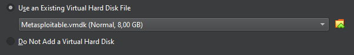

4. Käydään muuttamassa jo heti valmiiksi yhteydet poikki, niin ei tapahdu hassutteluja. *Settings -> Network -> Enable Network Adapter untsekki*.

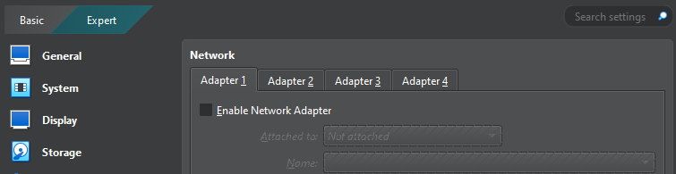

5. Bootataan kone, kaikki näyttää *OK*. Kirjautuminen on aika simppeliä, *msfadmin:msfadmin*.

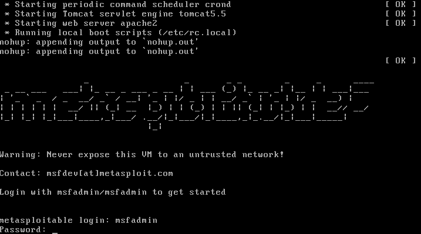

6. Kirjautuminen hyväksytään ja kaikki näyttää olevan kunnossa. 

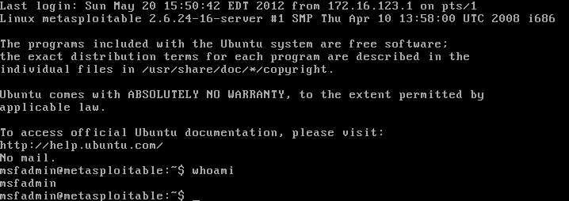

## b) Tee Kalin ja Metasploitablen välille virtuaaliverkko. Jos säätelet VirtualBoxista: a) Kali saa yhteyden Internettiin, mutta sen voi laittaa pois päältä. b) Kalin ja Metasploitablen välillä on host-only network.
1. Sammutetaan tuo Metaspoitablen kone hetkeksi *sudo poweroff* ja muutetaan hieman niitä verkkoasetuksia.

2. *Ctrl+H* tai *File -> Tools -> Network Manager* ja siellä näkyisi olevan valmis setti. Tärkeintä tosiaan, että se on virtuaalinen.

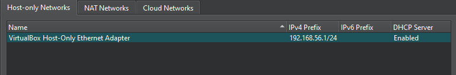

3. Käydään nyt laittamassa Kalin ja Metaspoitablen välille yhteys niin, että puhutaan vaan toisille. Molemmissa tärkeää, että verkkoasetukset ovat *Host-only Adapter*, eikä muualla asetuksissa ole *NATteja* jne.

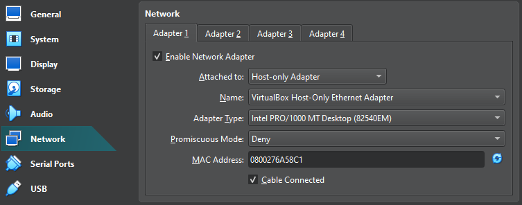

> Myöhempi huomio: tehtävässä näköjään piti sittenkin päästää Kali ulos, mutta tässä on tehty molemmille host-only network. Hups.

## c) Harjoittelemme omassa virtuaaliverkossa, jossa on Kali ja Metaspoitable. Osoita testein, että 1) koneet eivät saa yhteyttä Internetiin 2) Koneet saavat yhteyden toisiinsa.

1. Noniin. Seuraavaksi avataan koneet, käydään tökkimässä *pingillä* ja ajamassa *ifconfig*.

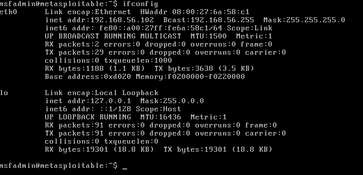

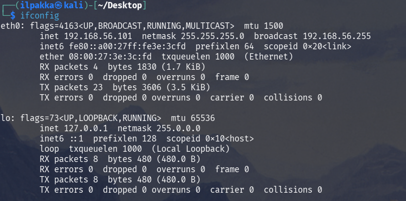

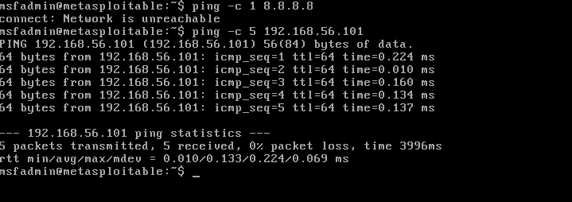

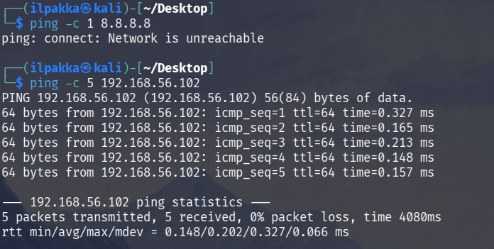

2. Koneet eivät siis saa yhteyttä ulos, mutta kuulevat toisensa ja keskustelevat keskenään.

## d) Etsi Metasploitable porttiskannaamalla (nmap -sn). Tarkista selaimella, että löysit oikean IP:n - Metasploitablen weppipalvelimen etusivulla lukee Metasploitable.

1. Ajetaan Kalilla komento *sudo nmap -sn 192.168.56.0/24*.

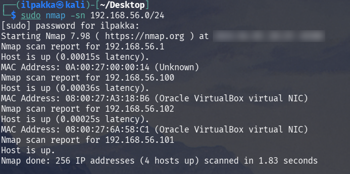

2. Hyvältä näyttää, joten kurkataan vielä suoraan, että näkyyhän selaimella Metaspoitablen oletussivu. Browseriin osoite ja menoks.

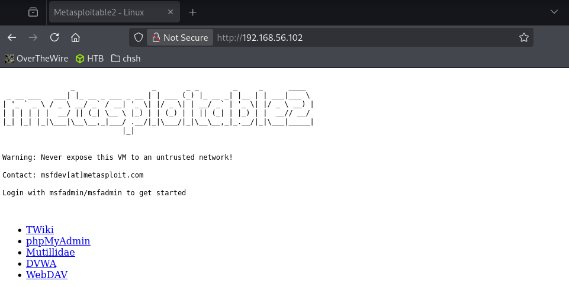

3. Toimii!

## e) Porttiskannaa Metasploitable huolellisesti ja kaikki portit (nmap -A -T4 -p-). Poimi 2-3 hyökkääjälle kiinnostavinta porttia. Analysoi ja selitä tulokset näiden porttien osalta. Voit hakea analyysin tueksi tietoa verkosta, muista merkitä lähteet.

1. Viimeinen kohta ja ajetaan tehtävänannossa esitetty komento muodossa *sudo nmap -A -T4 -p- 192.168.56.102*.

2. Mielenkiintoisia löytöjä oli useampi, mutta tässä näytän 3 silmiinpistävintä ensivilauksella:

```bash
Nmap scan report for 192.168.56.102
Host is up (0.00014s latency).
Not shown: 65505 closed tcp ports (reset)
PORT      STATE SERVICE     VERSION
21/tcp    open  ftp         vsftpd 2.3.4                                # Kiva löytö, kun siellä on FTP avoinna.
| ftp-syst:                                                             # vsftpd 2.3.4 on vielä erikseen haavoittuvainen
|   STAT:                                                               # muun muassa 6200/tcp-troijalaiseen (CVE-2011-2523)

...

514/tcp   open  shell       Netkit rshd
1099/tcp  open  java-rmi    GNU Classpath grmiregistry
1524/tcp  open  bindshell   Metasploitable root shell                   # Vanha ingreslock ja suora shelli, aikamoinen mörkö. Ollaan jo vähänniinku sisällä.
2049/tcp  open  nfs         2-4 (RPC #100003)
2121/tcp  open  ftp         ProFTPD 1.3.1

...

6000/tcp  open  X11         (access denied)
6667/tcp  open  irc         UnrealIRCd                                  # Toinen backdoori, josta löytyy mielenkiintoista keskustelua
6697/tcp  open  irc         UnrealIRCd                                  # esimerkiksi UnrealIRCd:n foorumeilla
8009/tcp  open  ajp13       Apache Jserv (Protocol v1.3)

...

TRACEROUTE
HOP RTT     ADDRESS
1   0.14 ms 192.168.56.102

OS and Service detection performed. Please report any incorrect results at https://nmap.org/submit/ .
Nmap done: 1 IP address (1 host up) scanned in 138.92 seconds
```

3. Löytöjä on vaikka mitä, mutta kaiken läpikäymiseen ei ihan riitäkään aika. Tässä nyt nähtiin kuitenkin ensimakua. Ehkä myöhemmin lisää?

## Lähteet
- Tero Karvinen 2026. Tunkeutumistestaus. Luettavissa: https://terokarvinen.com/tunkeutumistestaus/. Luettu: 4.4.2026.
- Buuri, M. 2026. DORA and TLPT testing. Lecture for Haaga-Helia on 31 March 2026. Luettavissa: https://terokarvinen.com/buuri-2026-dora-and-threat-lead-penetration-testing/buuri-2026-dora-and-threat-lead-penetration-testing--teros-pentest-course.pdf. Luettu: 4.4.2026.
- Euroopan parlamentin ja neuvoston direktiivi (EU) 2022/2554, annettu 14 päivänä joulukuuta 2022, digitaalisesta operatiivisesta resielienssistä finanssisektorilla sekä asetusten (EY) No 1060/2009, (EU) No 648/2012, (EU) No 600/2014, (EU) 909/2014 ja (EU) 2016/1011 muuttamisesta. Artiklat 26 ja 27. Luettavissa: https://eur-lex.europa.eu/eli/reg/2022/2554/oj/eng#. Luettu 4.4.2026.
- TIBER-FI Cyber Team. 2025. TIBER-FI. Procedures and Guidelines, kohta 5.4. Suomen Pankki. Helsinki. Luettavissa: https://www.suomenpankki.fi/globalassets/bof/en/money-and-payments/the-bank-of-finland-as-catalyst-payments-council/tiber-fi/tiber-fi-2.0-procedures-and-guidelines.pdf. Luettu: 5.4.2026.
- Rapid7. Metaspoitable. Luettavissa: https://www.rapid7.com/products/metasploit/metasploitable/. Luettu: 5.4.2026.
- NIST. 2019. CVE-2011-2523. Luettavissa: https://nvd.nist.gov/vuln/detail/CVE-2011-2523. Luettu: 5.4.2026.
- UnrealIRCd Forums. 12.6.2010. Some versions of Unreal3.2.8.1.tar.gz contain a backdoor. Luettavissa: https://forums.unrealircd.org/viewtopic.php?t=6562. Luettu: 5.4.2026.