# h4 Täysin Laillinen Sertifikaatti

## x) Lue/katso ja tiivistä.

### A01:2021 – Broken Access Control

1. Broken Access Control meinaa käyttäjien oikeuksien rajoituspuutteita, joita hyökkääjä voi käyttää hyväkseen päästäkseen käsiin uhrin tietoihin tai toimintoihin.

2. IDOR ja Path Traversal kuuluvat tähän kategoriaan. Broken Access Control löytyykin OWASPin vuoden 2021 listan kärjestä.

### PortSwigger Academy (IDOR, Path Traversal, XSS)

1. IDOR, eli insecure direct object reference on haavoittuvuusmuoto, missä esimerkiksi webbisovellus palauttaa tietoa ilman kunnon tarkistuksia.

2. Path traversalissa hyökkääjä manipuloi tiedostopolkua päästäkseen käsiin heikosti suojattuun materiaaliin. Klassisesti tämä tapahtuu rakentamalla hakemistopolkua `../`-osilla ylöspäin.

3. XSS, eli cross-site scripting on JavaScriptin hyödyntämistä haitallisen koodin ajamisessa toisen käyttäjän selaimeen. XSS-muotoja on kolmea tyyppiä: reflected, stored ja DOM. Suojautuminen tapahtuu esimerkiksi suodattamalla syötettä.

## a) Totally Legit Sertificate. Asenna OWASP ZAP, generoi CA-sertifikaatti ja asenna se selaimeesi. Laita ZAP proxyksi selaimeesi. Laita ZAP sieppaamaan myös kuvat, niitä tarvitaan tämän kerran kotitehtävissä. Osoita, että hakupyynnöt ilmestyvät ZAP:n käyttöliittymään.

1. Aloitetaan asentamalla zappi komennolla `sudo apt install zaproxy`. Tässä tapauksessa se näyttikin olevan jo valmiiksi laitteella.

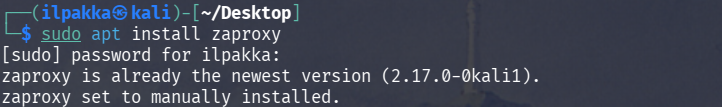

2. Avataan ZAP ajamalla `zaproxy` ja kurkataan mitä sisältä löytyy. Laitetaan se myös tallentamaan sessiotiedot ottamalla ylin vaihtoehto `Yes` eteen hypänneestä ilmoituksesta.

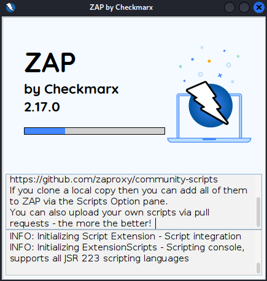

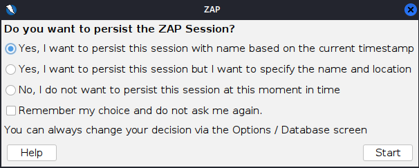

3. Varmistetaan, että proxytiedot on kunnossa. Navigoidaan `Tools -> Options -> Network -> Local Servers/Proxies` niin saadaan oikea näkymä.

4. Pidetään osoitteessa `localhost` ja porttina `8080`.

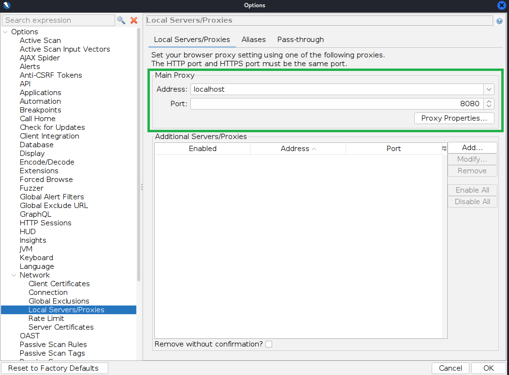

5. Sitten tallentamaan CA-serttiä. Tuon paikka löytyy samasta paikkaa kahta riviä alempaa kohdasta `Server Certificates`.

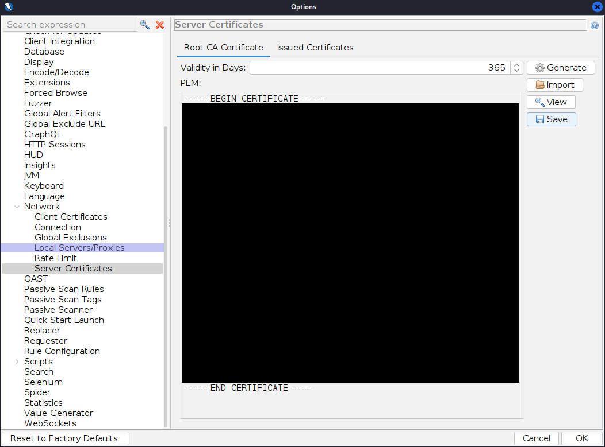

6. Tallennetaan CA-sertti painamalla `Save` ja valitaan haluttu hakemisto. Tiedoston nimeä ei ole syytä muuttaa, kunhan tuo pysyy `.cer`-tiedostona.

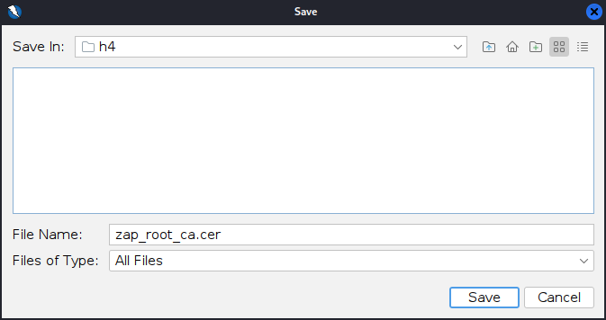

7. Tulikettua herättelemään ja käydään siirtämässä tuo CA-sertti selaimen omaan varastoon. Navigoidaan `Settings -> Privacy & Security -> Certificates -> View Certificates`.

8. Kohdassa `Authorities` valitaan `Import` ja nakataan sisään aikaisemmin tallennettu `.cer`-tiedosto.

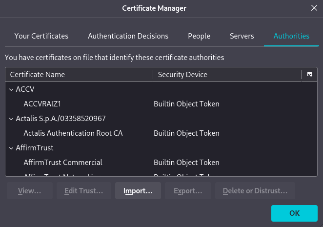

9. Merkataan seuraavista vaihtoehdoista vain ylempi, eli luotetaan varmenteeseen verkkosivujen tunnistamisessa. Mitään meilejä ei nyt katella.

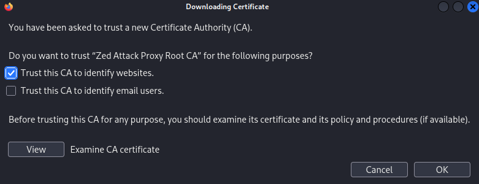

10. Seuraavaksi asetetaan selaimessa vielä proxyasetukset kuntoon. Mennään `Settings -> General -> Network Settings -> Settings`.

11. Kohtaan `Manual proxy configuration` asetetaan osoitteeseen `localhost` ja porttiin `8080`. Ruksataan myös kohta `Also use this proxy for HTTPS`.

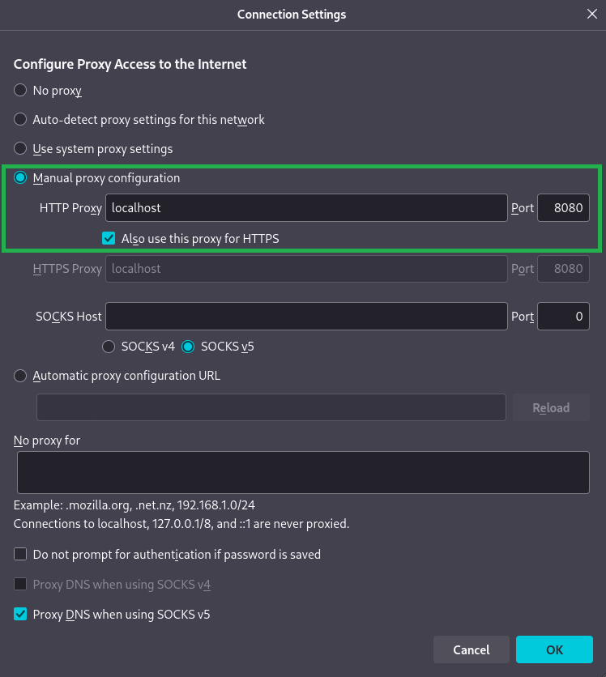

12. Kuten Tero jo heti vinkkien alussa kertoikin, käydään vielä laittamassa `network.proxy.allow_hijacking_localhost` arvoksi `true`. URLiin kun kirjoittaa `about:config`, etsii haluttua asetusta ja lopuksi vielä klikkaa tuota monkey jutsu -signia niin kaikki on kondiksessa.

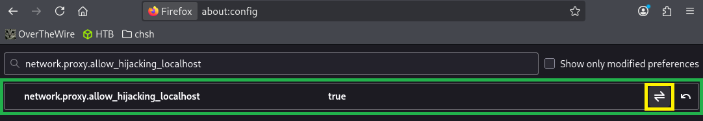

13. Sitten vielä kuvat näkyviin. Mennään takaisin ZAPPIIN ja navigoidaan `Tools -> Options -> Display`.

14. Useampi kohta ruksia, mutta oikea paikka on `Process images in the HTTP requests/responses`. Tuo kun on päällä niin pitäisi toimia.

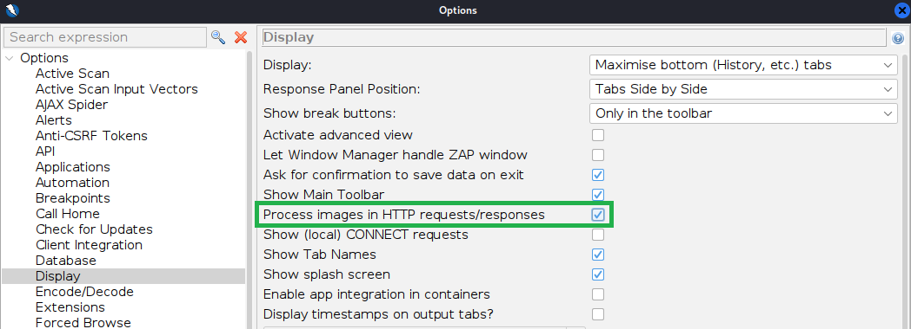

15. No toimiiko? Ainakin renderöi kun käy Teron kotisivuilla.

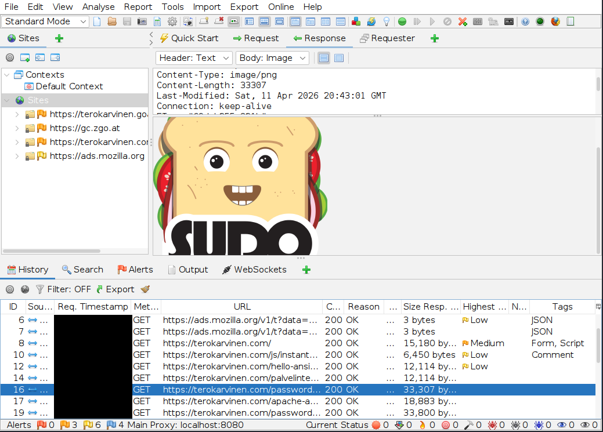


## b) Kettumaista. Asenna "FoxyProxy Standard" Firefox Addon, ja lisää ZAP proxyksi siihen. Käytä FoxyProxyn "Patterns" -toimintoa, niin että vain valitsemasi weppisivut ohjataan Proxyyn.

1. Asennetaan `FoxyProxy Standard`. Itse kävin kirjoittamassa tuon nimen selaimen `abount:addons`in yläbörsän hakukenttään. Sivuohjauksella löytyikin tuo oikea versio. Asennetaan!

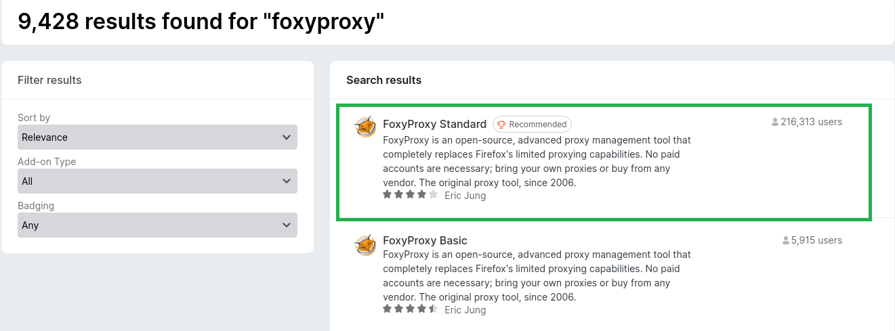

2. `Add to Firefox` asentaa addonin, mutta eteen tulee vielä muutama kysely. Ensimmäisessä ei tarvitse nyt ainakaan kotitehtävien ajaksi säätää muuta, mutta toisessa on ihan hyvä idea pinnata kuvake näkyviin.

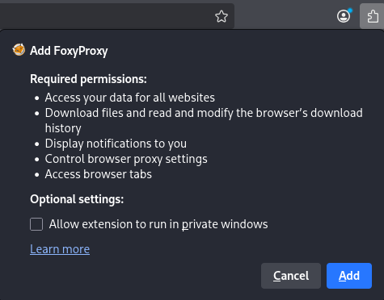

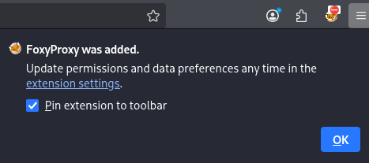

3. Käydään laittamassa myös asetukset kuntoon. FoxyProxyn kuvakkeen `Options -> Proxies` ja sieltä taas kerran `localhost` porttia `8080`.

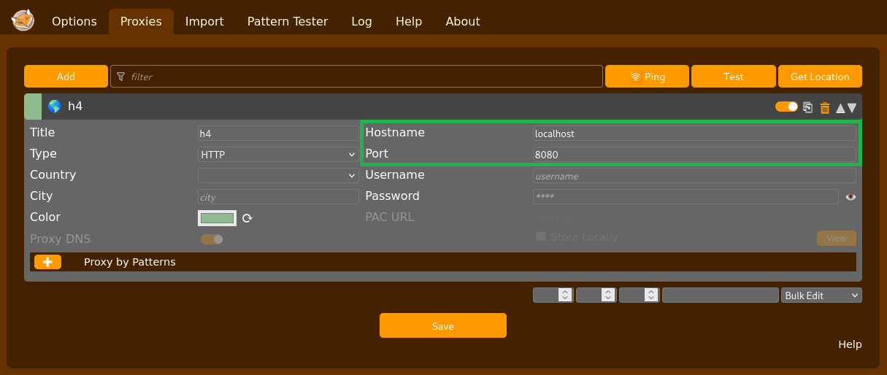

4. Tallennetaan ja tuolta se näyttää nyt.

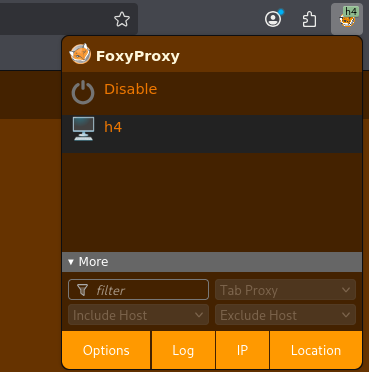

5. Seuraavaksi otetaan tuo `Patterns` käyttöön, eli ohjataan vain haluttua liikennettä. Mennään takaisin selaimen asetuksiin kohdista `Settings -> Network Settings -> Settings` ja vaihdetaan manuaalisesta `No proxy`.

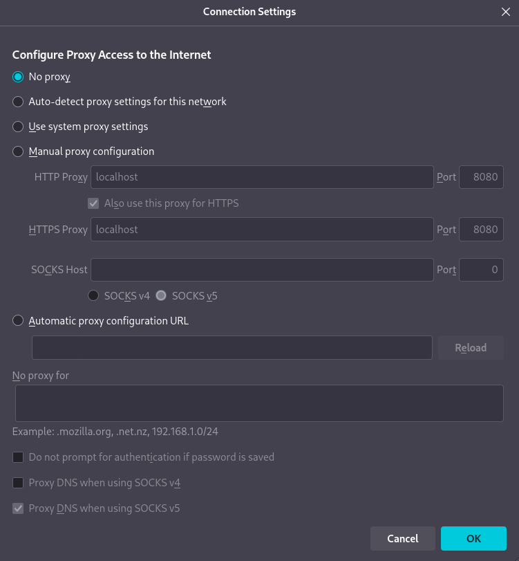

6. Sitten FoxyProxyn sisältä avataan tuo aikasempi `h4` ja lisätään uusi `Proxy by Patterns`.

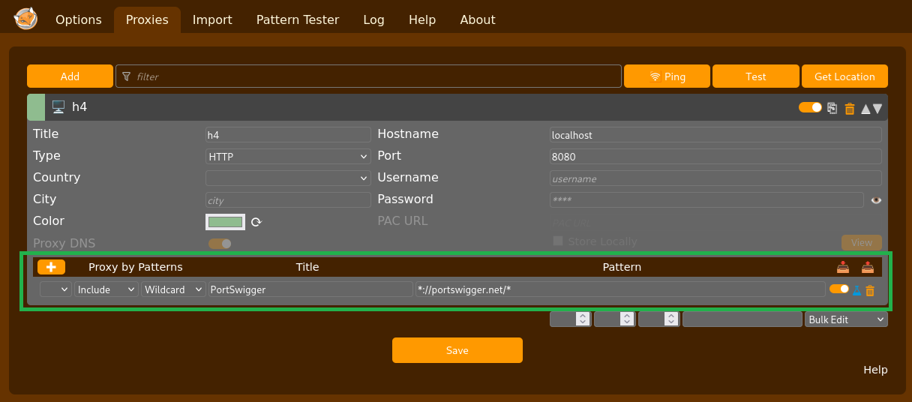

7. Tuolla asetuksella ZAP näyttää nyt vain PortSwiggerin sivuja ja muut kulkevat normaalisti. Muistetaan kuitenkin ottaa se päällä pikkupainikkeesta.

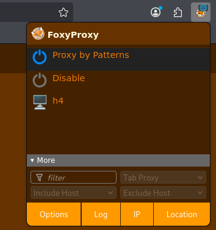


# PortSwigger Labs. Ratkaise tehtävät. Selitä ratkaisusi.

## c) Reflected XSS into HTML context with nothing encoded

```
This lab contains a simple reflected cross-site scripting vulnerability in the search functionality.
To solve the lab, perform a cross-site scripting attack that calls the alert function.
```

1. Näyttääkin siltä, että tämä oli jo ennastaan tehtynä aikaisemmin.

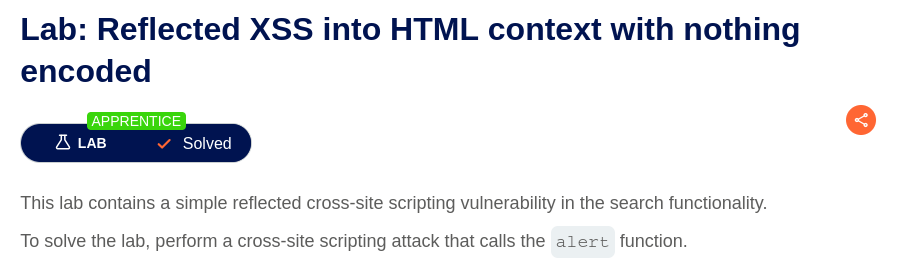

## d) Stored XSS into HTML context with nothing encoded

```
This lab contains a stored cross-site scripting vulnerability in the comment functionality.
To solve this lab, submit a comment that calls the alert function when the blog post is viewed.
```

1. Heti kuvauksessa käykin ilmi se, että mitä tässä tehtävässä täytyy tehdä. Käydään kurkkaamassa, että minne saisi laitettua kommenttia.

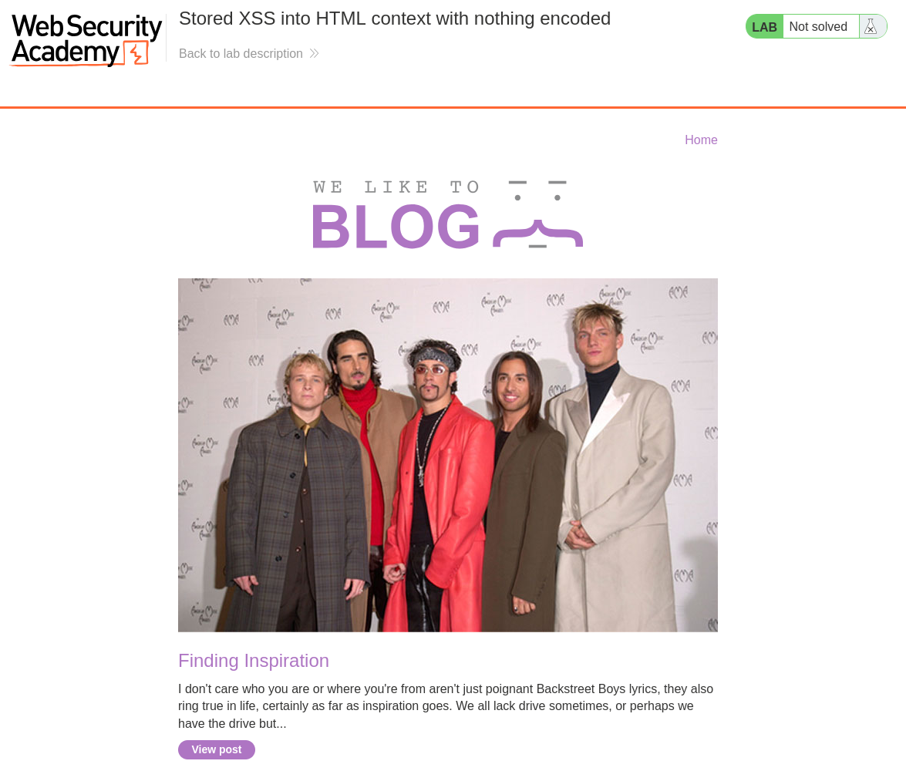

2. Heti ensimmäistä blogipostausta klikatessa näkyykin hieno kommenttiosio. Kirjoitetaan sinne alerttiskripti ja täytetään muutkin tiedot ihan muodon vuoksi.

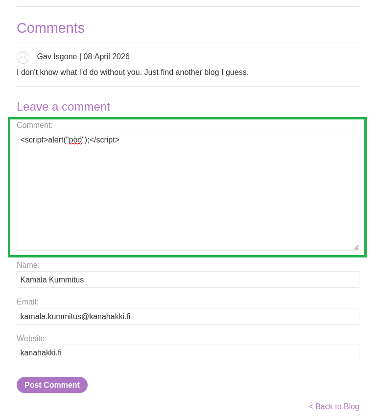

3. Skripti toimi ja tehtävä näyttää hyväksyttyä. Hieno homma!

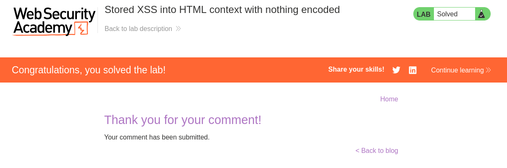

## e) Selitä esimerkin avulla, mitä hyökkääjä hyötyy XSS-hyökkäyksestä.

1. Yksinkertainen alertti näyttää, että JavaScriptiä pyörii sivulla. Tämä kuitenkin mahdollistaa sen, että hyökkääjä voi naamioitua uhrikseen ja päästä käsiksi kaikennäköiseen dataan manipuloimalla sivuston rakennetta tai tilaa.

2. Tätä kutsutaan XSS-haavoittuvuudeksi, eli englanniksi cross-site scripting. Itse tykkään yleensä aloittaa testaamalla `"><svg/onload=confirm(1)>`. Kun oikea haavoittuvuuskulma löytyy, alkaakin se käytännön hakkerointi.

## f) File path traversal, simple case. Laita tarvittaessa Zapissa kuvien sieppaus päälle.

```
This lab contains a path traversal vulnerability in the display of product images.
To solve the lab, retrieve the contents of the /etc/passwd file.
```

1. Noniin, klassista path traversalia. Seurataan tehtävänannon ohjeita ja käytään kurkkaamassa, että miten noita kuvia säilytetään.

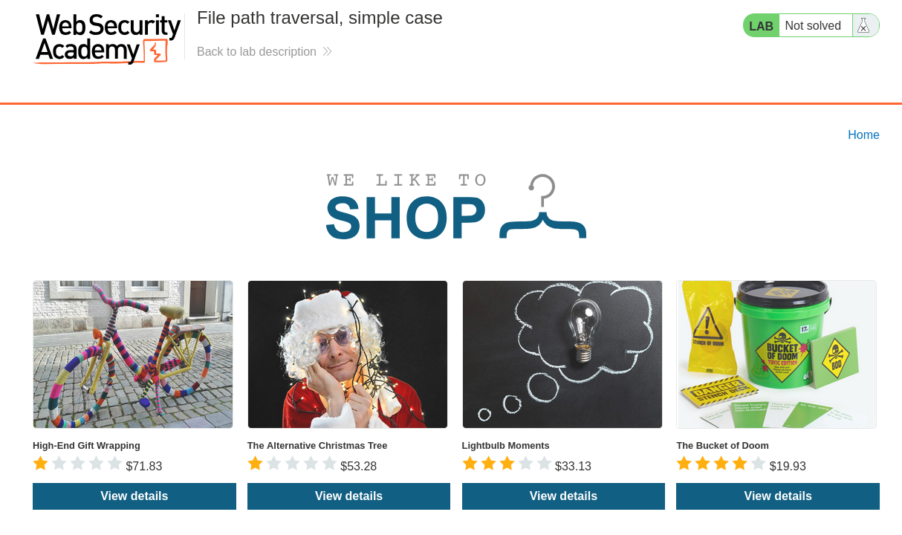

2. Yksi tapa on avata kuva omalle välilehdelle ja katsoa mistä se tulee. Tässä tapauksessa:

```
https://....web-security-academy.net/image?filename=53.jpg
```

3. `/etc/passwd` on se mitä haetaan. Lähetään siis testaamaan eri pituuksilla jatkamalla aikaisempaa näin:

```
https://.....web-security-academy.net/image?filename=../../../etc/passwd
```

4. Lopulta sivusto näyttää, että kuvassa on ongelma. Samalla pääsivulle tulee ilmoitus, että tehtävä on ratkaistu.

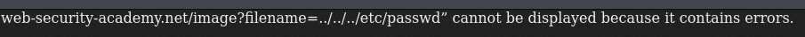

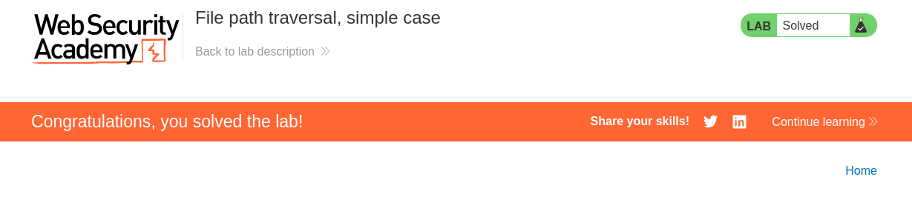

5. Kuvanäkymässä ei tietenkään mitään näy, mutta jos käydään kurkkaamassa mitä ZAP näyttää.. Ensin piti toki käydä lisäämässä myös `*://*.web-security-academy.net/*` tuonne villikortteipatterneihin, jotta hommat näkyy.

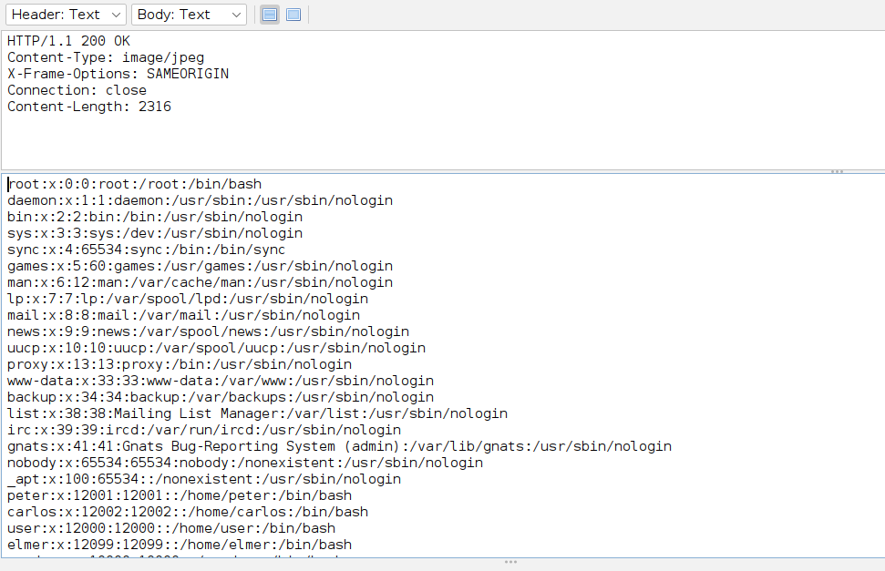

6. Siellähän niitä oli!

## g) File path traversal, traversal sequences blocked with absolute path bypass

```
This lab contains a path traversal vulnerability in the display of product images.
The application blocks traversal sequences but treats the supplied filename as being relative to a default working directory.
To solve the lab, retrieve the contents of the /etc/passwd file.
```

1. Aika samantyyppinen tehtävä kuin aikaisempi, mutta pienellä twistillä. Jo tehtävänannosta selviää, että travelsali toimii hieman eri tavalla.


2. Tehdään sama kuin aikaisemmin, eli napataan kuvan lähde:

```
https://....web-security-academy.net/image?filename=44.jpg
```

3. Tällä kertaa ei lisäillä osia hakemistoon vaan kirjoitetaan suoraan:

```
https://....web-security-academy.net/image?filename=/etc/passwd
```

4. `400 Bad Request` eli ei toiminut. Kokeillaan jotain muuta!

5. Tähän väliin oli kulunutkin jo hieman aikaa ja kummallisesti labi tai ZAP eivät suostuneet paljastamaan mitään polkua.

6. Päätin säästääkseni lopulta aikaa katsoa, että mitä kautta tämä tehtävä pitäisi ratkaista. Sen olisi pitänyt mennä ihan oikein tuolla aikaisemmalla tavalla jota kokeilin joten minkäs voi.

## h) File path traversal, traversal sequences stripped non-recursively

```
This lab contains a path traversal vulnerability in the display of product images.
The application strips path traversal sequences from the user-supplied filename before using it.
To solve the lab, retrieve the contents of the /etc/passwd file.
```

1. Katsotaan jos tämä toimisi. Kun pysytään selvästi vielä teemassa, niin tässä näyttäisi olevan juju vain saada traversali toimimaan oikein.


2. Samat stepit kuin aikaisemmin, eli käydään nappaamassa lähde kuvalle:

```
https://....web-security-academy.net/image?filename=47.jpg
```

3. Ohitetaan stripit laittamalla kaikki tuplana, eli normaalista `../`-osasta tulee siis `....//`. Kurkataan miten toimii.

```
https://....web-security-academy.net/image?filename=....//....//....//....//etc/passwd
```

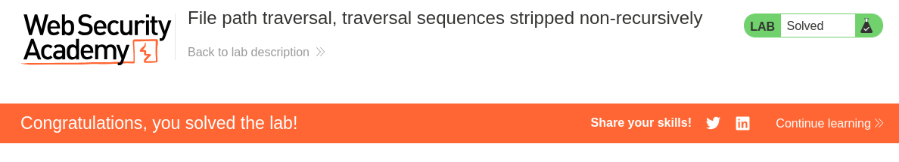

4. Tuon pitäisi tällä kertaa näkyä ZAPin kautta myös ihan normaalisti ja siellähän se oli.

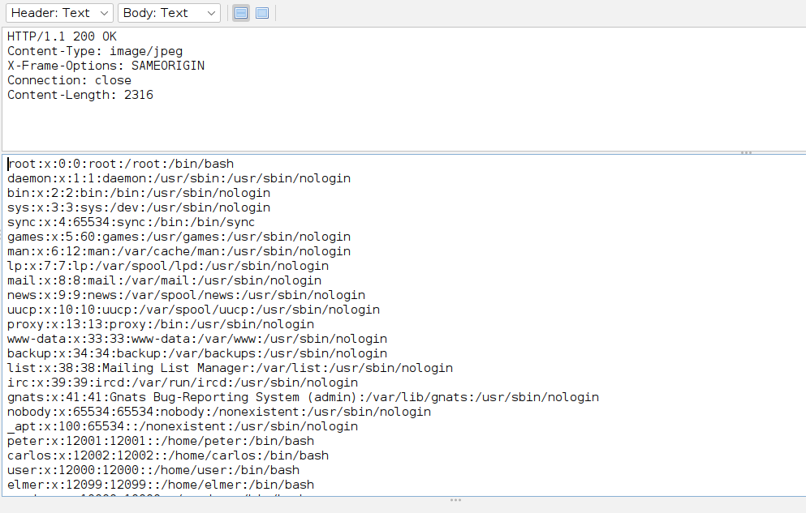

## i) Insecure direct object references

```
This lab stores user chat logs directly on the server's file system, and retrieves them using static URLs.
Solve the lab by finding the password for the user carlos, and logging into their account.
```

1. Viimeistä viedään ja IDORia luvassa. Tuleekohan tämä olemaan niinkin helppo kun pelkän numeron vaihtaminen.

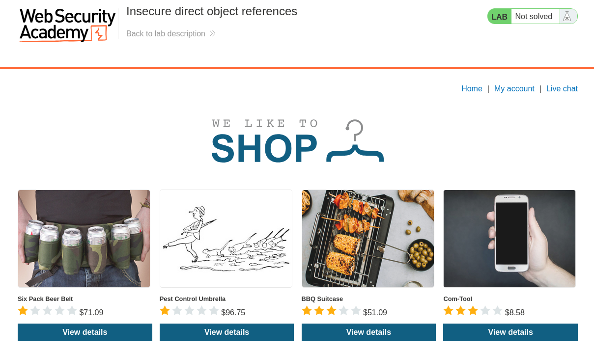

2. Sivuilla on aika tyhjää. `My account`in loginiin ei löydy heti mitään viivaa ja ainoa järkevältä näyttävä paikka on `Live chat`.

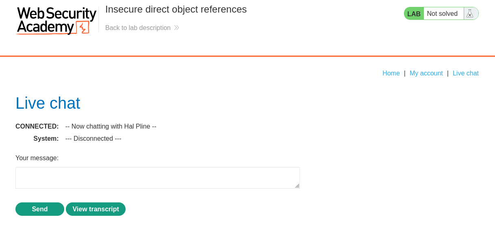

3. Testataan vähän miten tuo toimii. Chattiin höpöttelyn jälkeen `View transcript`iä painaessa näkyy vihdoinkin jotain jännää:

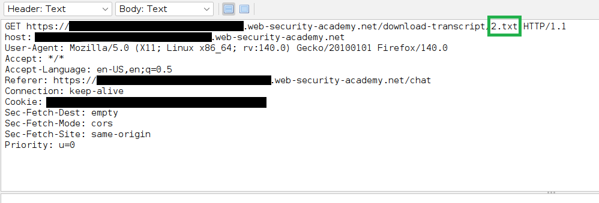

4. Laitetaan toi Repeateriin ja tosiaan katsotaan, että oliko klassinen yhteen suuntaan:

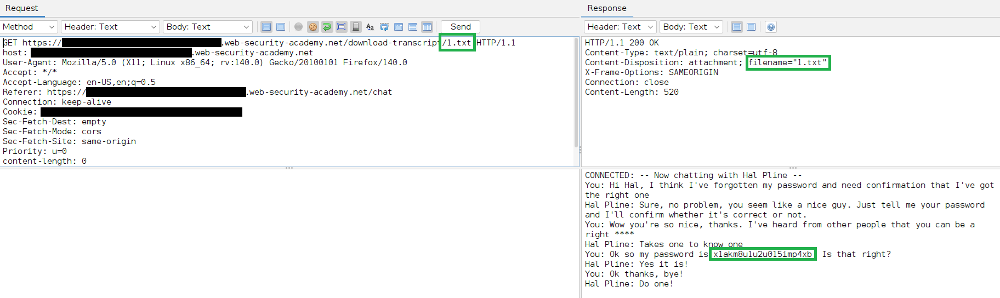

5. Kyllähän se oli. Mennään takasin tuonne `My account` ja kirjaudutaan tunnareilla `carlos:x1akm8u1u2u015imp4xb`.

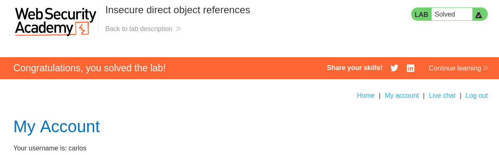

6. Ei ollu mahoton, mutta hauskoja testejä!

## Lähteet
- Tero Karvinen 2026. Tunkeutumistestaus. Luettavissa: https://terokarvinen.com/tunkeutumistestaus/. Luettu: 18.4.2026.
- OWASP 2021. OWASP Top 10:2021 - Broken Access Control. Luettavissa: https://owasp.org/Top10/2021/A01_2021-Broken_Access_Control/index.html. Luettu: 18.4.2026.
- PortSwigger. Web Security Academy. Insecure direct object references (IDOR). Luettavissa: https://portswigger.net/web-security/access-control/idor. Luettu: 18.4.2026.
- PortSwigger. Web Security Academy. Path traversal. Luettavissa: https://portswigger.net/web-security/file-path-traversal. Luettu: 18.4.2026.
- PortSwigger. Web Security Academy. Cross-site scripting. Luettavissa: https://portswigger.net/web-security/cross-site-scripting. Luettu: 18.4.2026.
- ZAP by Checkmarx 2026. Getting Started. Luettavissa: https://www.zaproxy.org/getting-started/. Luettu: 19.4.2026.
- PortSwigger. Web Security Academy. Lab: Reflected XSS into HTML contenxt with nothing encoded. Luettavissa: https://portswigger.net/web-security/cross-site-scripting/reflected/lab-html-context-nothing-encoded. Luettu: 19.4.2026.
- PortSwigger. Web Security Academy. Lab: Stored XSS into HTML context with nothing encoded. Luettavissa: https://portswigger.net/web-security/cross-site-scripting/stored/lab-html-context-nothing-encoded. Luettu: 19.4.2026.
- PortSwigger. Web Security Academy. Lab: File path traversal, simple case. Luettavissa: https://portswigger.net/web-security/file-path-traversal/lab-simple. Luettu: 19.4.2026.
- PortSwigger. Web Security Academy. Lab: File path traversal, traversal sequences blocked with absolute path bypass. Luettavissa: https://portswigger.net/web-security/file-path-traversal/lab-absolute-path-bypass. Luettu: 19.4.2026.
- PortSwigger. Web Security Academy. Lab: File path traversal, traversal sequences stripped non-recursively. Luettavissa: https://portswigger.net/web-security/file-path-traversal/lab-sequences-stripped-non-recursively. Luettu: 19.4.2026.
- PortSwigger. Web Security Academy. Lab: Insecure direct object references. Luettavissa: https://portswigger.net/web-security/access-control/lab-insecure-direct-object-references. Luettu: 19.4.2026.