# Fuzzy

## x) Lue/katso/kuuntele ja tiivistä.

1. Tero näyttää mallia miten fuzzaus toimii. Ladattavat binäärit sisältävät harjoituksia, Miesslerin seclist -ehdotus ja käteviä filtteröintimuotoja!

2. FFUF tai Fuzz Faster U Fool on kätevä fuzzeri, jolla on helppo tutkailla piilotettuja hakemistoja ja reittejä webbihommissa. Haut käy läpi erilaisten sanalistojen sisältöä ja sylkevät ulos tavaraa, jota voi vielä lisäksi rajata erilaisilla filttereillä. 

## a) Fuzzzz. Ratkaise dirfuz-1 artikkelista Karvinen 2023: Find Hidden Web Directories - Fuzz URLs with ffuf.
```
Can you find two URLs:
Admin page
Version control related page
```
1. Ladataan binääri `dirfuzt-1`, muutetaan oikeus ajaa ja menoks.

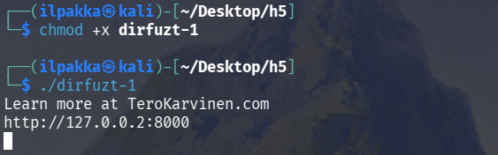

2. Sivu näyttää olevan ylhäällä, eli hyvin toimii.

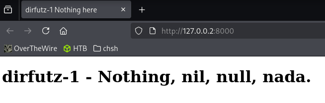

3. Pitäisi löytää `Admin page` ja `Version control related page`. Nuo ovat todennäköisimmin ihan `admin` ja tyyliin `.git/HEAD`.

4. Fuzzataan ajamalla `ffuf -u http://127.0.0.2:8000/FUZZ -w /usr/share/wordlists/dirb/common.txt`:

```
┌──(ilpakka㉿kali)-[~/Desktop/h5]
└─$ ffuf -u http://127.0.0.2:8000/FUZZ -w /usr/share/wordlists/dirb/common.txt 

        /'___\  /'___\           /'___\       
       /\ \__/ /\ \__/  __  __  /\ \__/       
       \ \ ,__\\ \ ,__\/\ \/\ \ \ \ ,__\      
        \ \ \_/ \ \ \_/\ \ \_\ \ \ \ \_/      
         \ \_\   \ \_\  \ \____/  \ \_\       
          \/_/    \/_/   \/___/    \/_/       

       v2.1.0-dev
________________________________________________

 :: Method           : GET
 :: URL              : http://127.0.0.2:8000/FUZZ
 :: Wordlist         : FUZZ: /usr/share/wordlists/dirb/common.txt
 :: Follow redirects : false
 :: Calibration      : false
 :: Timeout          : 10
 :: Threads          : 40
 :: Matcher          : Response status: 200-299,301,302,307,401,403,405,500
________________________________________________

.cvsignore              [Status: 200, Size: 154, Words: 9, Lines: 10, Duration: 0ms]
.git/HEAD               [Status: 200, Size: 178, Words: 6, Lines: 11, Duration: 0ms]        # Tervehdys!
.bash_history           [Status: 200, Size: 154, Words: 9, Lines: 10, Duration: 0ms]
.swf                    [Status: 200, Size: 154, Words: 9, Lines: 10, Duration: 0ms]
...
```

5. Aikamoisen listan se sylkäisi ulos, mutta heti alkuun löytyykin tuo `.git/HEAD`. Näyttää siltä, että koon 154 sivut ovat roskaa, joten filtteröidään ne pois ajamalla sama, mutta `-fs 154`:

```
┌──(ilpakka㉿kali)-[~/Desktop/h5]
└─$ ffuf -u http://127.0.0.2:8000/FUZZ -w /usr/share/wordlists/dirb/common.txt -fs 154

        /'___\  /'___\           /'___\       
       /\ \__/ /\ \__/  __  __  /\ \__/       
       \ \ ,__\\ \ ,__\/\ \/\ \ \ \ ,__\      
        \ \ \_/ \ \ \_/\ \ \_\ \ \ \ \_/      
         \ \_\   \ \_\  \ \____/  \ \_\       
          \/_/    \/_/   \/___/    \/_/       

       v2.1.0-dev
________________________________________________

 :: Method           : GET
 :: URL              : http://127.0.0.2:8000/FUZZ
 :: Wordlist         : FUZZ: /usr/share/wordlists/dirb/common.txt
 :: Follow redirects : false
 :: Calibration      : false
 :: Timeout          : 10
 :: Threads          : 40
 :: Matcher          : Response status: 200-299,301,302,307,401,403,405,500
 :: Filter           : Response size: 154
________________________________________________

.git/HEAD               [Status: 200, Size: 178, Words: 6, Lines: 11, Duration: 1ms]        # Vanha tuttu
wp-admin                [Status: 200, Size: 182, Words: 6, Lines: 11, Duration: 0ms]        # Se oikea admin
:: Progress: [4614/4614] :: Job [1/1] :: 0 req/sec :: Duration: [0:00:00] :: Errors: 0 ::
```

6. Varmistetaan nyt vielä, että molemmat varmasti ovat oikein.

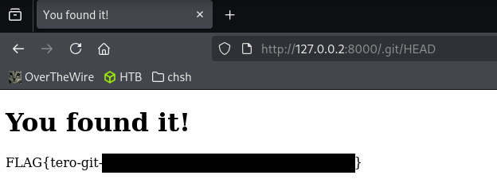

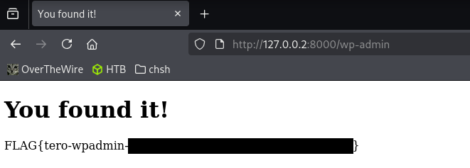


## b) Fuff me. Asenna FuffMe-harjoitusmaali. Karvinen 2023: Fuffme - Install Web Fuzzing Target on Debian

1. Tässä pääseekin ensin seuraamaan Teron sivujen ohjeita. Dockeri pystyyn ja localhostin pitäisi olla kunnossa.

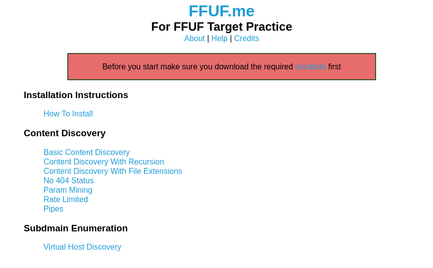

2. Veikkaisin, että kaikki tehtävät saa ratkaistua ihan seclistin seteillä, mutta käydään nyt nappaamassa nuo ohjeiden mukaiset listat kuitenkin.

## c) Basic Content Discovery

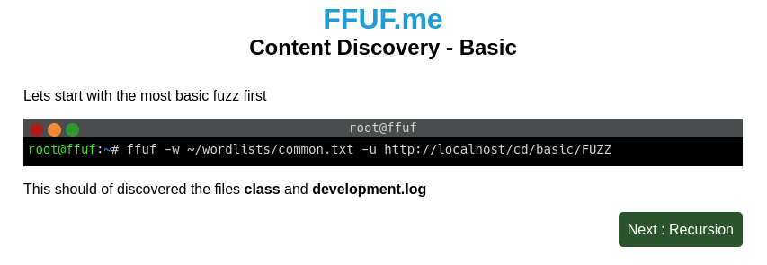

1. Aika simppeli, ajetaan tuo näkyvä komento omaan muotoon:

```
┌──(ilpakka㉿kali)-[~/Desktop/h5/ffufme]
└─$ ffuf -w ~/Desktop/h5/ffufme/wordlists/common.txt -u http://localhost/cd/basic/FUZZ

        /'___\  /'___\           /'___\       
       /\ \__/ /\ \__/  __  __  /\ \__/       
       \ \ ,__\\ \ ,__\/\ \/\ \ \ \ ,__\      
        \ \ \_/ \ \ \_/\ \ \_\ \ \ \ \_/      
         \ \_\   \ \_\  \ \____/  \ \_\       
          \/_/    \/_/   \/___/    \/_/       

       v2.1.0-dev
________________________________________________

 :: Method           : GET
 :: URL              : http://localhost/cd/basic/FUZZ
 :: Wordlist         : FUZZ: /home/ilpakka/Desktop/h5/ffufme/wordlists/common.txt
 :: Follow redirects : false
 :: Calibration      : false
 :: Timeout          : 10
 :: Threads          : 40
 :: Matcher          : Response status: 200-299,301,302,307,401,403,405,500
________________________________________________

class                   [Status: 200, Size: 19, Words: 4, Lines: 1, Duration: 4ms]
development.log         [Status: 200, Size: 19, Words: 4, Lines: 1, Duration: 3ms]
:: Progress: [4686/4686] :: Job [1/1] :: 0 req/sec :: Duration: [0:00:00] :: Errors: 0 ::
```

## d) Content Discovery With Recursion

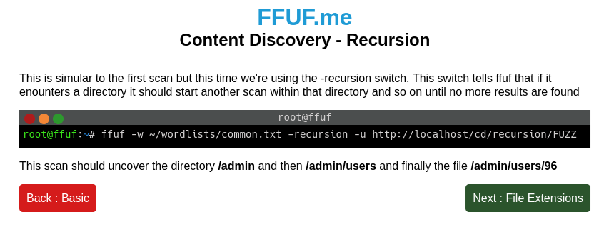

1. Seurataan vaan ohjeita niin oikein menee.

```
┌──(ilpakka㉿kali)-[~/Desktop/h5/ffufme]
└─$ ffuf -w ~/Desktop/h5/ffufme/wordlists/common.txt -recursion -u http://localhost/cd/recursion/FUZZ

        /'___\  /'___\           /'___\       
       /\ \__/ /\ \__/  __  __  /\ \__/       
       \ \ ,__\\ \ ,__\/\ \/\ \ \ \ ,__\      
        \ \ \_/ \ \ \_/\ \ \_\ \ \ \ \_/      
         \ \_\   \ \_\  \ \____/  \ \_\       
          \/_/    \/_/   \/___/    \/_/       

       v2.1.0-dev
________________________________________________

 :: Method           : GET
 :: URL              : http://localhost/cd/recursion/FUZZ
 :: Wordlist         : FUZZ: /home/ilpakka/Desktop/h5/ffufme/wordlists/common.txt
 :: Follow redirects : false
 :: Calibration      : false
 :: Timeout          : 10
 :: Threads          : 40
 :: Matcher          : Response status: 200-299,301,302,307,401,403,405,500
________________________________________________

admin                   [Status: 301, Size: 0, Words: 1, Lines: 1, Duration: 3ms]
[INFO] Adding a new job to the queue: http://localhost/cd/recursion/admin/FUZZ

[INFO] Starting queued job on target: http://localhost/cd/recursion/admin/FUZZ

users                   [Status: 301, Size: 0, Words: 1, Lines: 1, Duration: 2ms]
[INFO] Adding a new job to the queue: http://localhost/cd/recursion/admin/users/FUZZ

[INFO] Starting queued job on target: http://localhost/cd/recursion/admin/users/FUZZ

96                      [Status: 200, Size: 19, Words: 4, Lines: 1, Duration: 3ms]
:: Progress: [4686/4686] :: Job [3/3] :: 0 req/sec :: Duration: [0:00:00] :: Errors: 0 ::
```

## e) Content Discovery With File Extensions

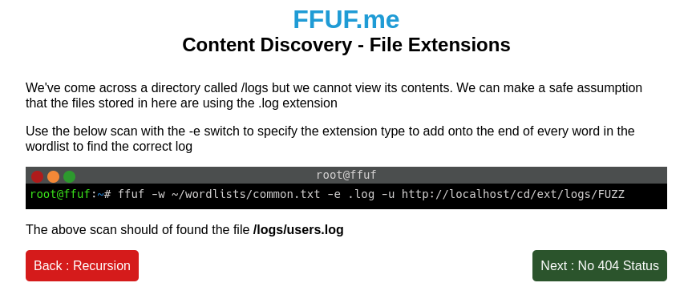

1. Sama juttu tässäkin, ohjeiden mukaan hyvä tulee.

```
┌──(ilpakka㉿kali)-[~/Desktop/h5/ffufme]
└─$ ffuf -w ~/Desktop/h5/ffufme/wordlists/common.txt -e .log -u http://localhost/cd/ext/logs/FUZZ

        /'___\  /'___\           /'___\       
       /\ \__/ /\ \__/  __  __  /\ \__/       
       \ \ ,__\\ \ ,__\/\ \/\ \ \ \ ,__\      
        \ \ \_/ \ \ \_/\ \ \_\ \ \ \ \_/      
         \ \_\   \ \_\  \ \____/  \ \_\       
          \/_/    \/_/   \/___/    \/_/       

       v2.1.0-dev
________________________________________________

 :: Method           : GET
 :: URL              : http://localhost/cd/ext/logs/FUZZ
 :: Wordlist         : FUZZ: /home/ilpakka/Desktop/h5/ffufme/wordlists/common.txt
 :: Extensions       : .log 
 :: Follow redirects : false
 :: Calibration      : false
 :: Timeout          : 10
 :: Threads          : 40
 :: Matcher          : Response status: 200-299,301,302,307,401,403,405,500
________________________________________________

users.log               [Status: 200, Size: 19, Words: 4, Lines: 1, Duration: 3ms]
:: Progress: [9372/9372] :: Job [1/1] :: 11764 req/sec :: Duration: [0:00:01] :: Errors: 0 ::
```

## f) No 404 Status

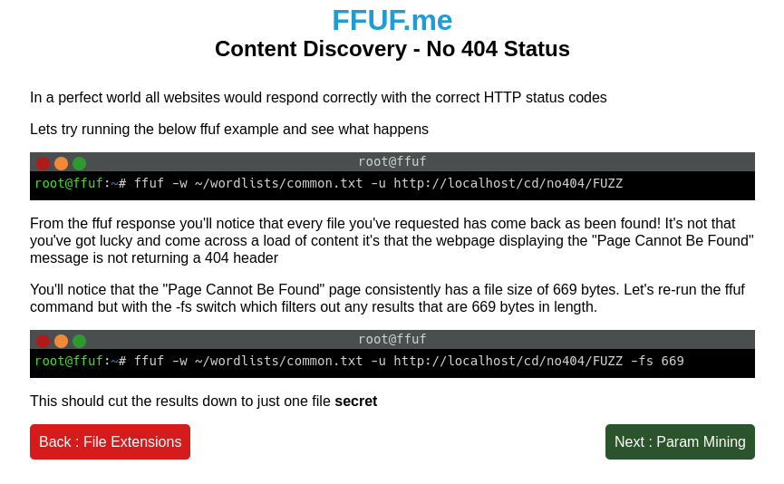

1. Tämä näyttääkin olevan aika sama, mitä tuossa `dirfuz-1` kohdalla tehtiin. Noh, uudestaan vaan.

```
┌──(ilpakka㉿kali)-[~/Desktop/h5/ffufme]
└─$ ffuf -w ~/Desktop/h5/ffufme/wordlists/common.txt -u http://localhost/cd/no404/FUZZ -fs 669

        /'___\  /'___\           /'___\       
       /\ \__/ /\ \__/  __  __  /\ \__/       
       \ \ ,__\\ \ ,__\/\ \/\ \ \ \ ,__\      
        \ \ \_/ \ \ \_/\ \ \_\ \ \ \ \_/      
         \ \_\   \ \_\  \ \____/  \ \_\       
          \/_/    \/_/   \/___/    \/_/       

       v2.1.0-dev
________________________________________________

 :: Method           : GET
 :: URL              : http://localhost/cd/no404/FUZZ
 :: Wordlist         : FUZZ: /home/ilpakka/Desktop/h5/ffufme/wordlists/common.txt
 :: Follow redirects : false
 :: Calibration      : false
 :: Timeout          : 10
 :: Threads          : 40
 :: Matcher          : Response status: 200-299,301,302,307,401,403,405,500
 :: Filter           : Response size: 669
________________________________________________

secret                  [Status: 200, Size: 25, Words: 4, Lines: 1, Duration: 3ms]
:: Progress: [4686/4686] :: Job [1/1] :: 0 req/sec :: Duration: [0:00:00] :: Errors: 0 ::
```

## g) Param Mining

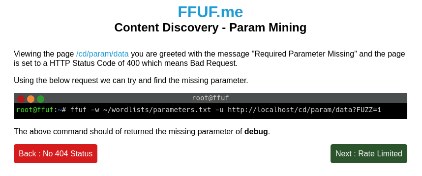

1. Vähän jo jännempi fuzzaus.

```
┌──(ilpakka㉿kali)-[~/Desktop/h5/ffufme]
└─$ ffuf -w ~/Desktop/h5/ffufme/wordlists/parameters.txt -u http://localhost/cd/param/data?FUZZ=1

        /'___\  /'___\           /'___\       
       /\ \__/ /\ \__/  __  __  /\ \__/       
       \ \ ,__\\ \ ,__\/\ \/\ \ \ \ ,__\      
        \ \ \_/ \ \ \_/\ \ \_\ \ \ \ \_/      
         \ \_\   \ \_\  \ \____/  \ \_\       
          \/_/    \/_/   \/___/    \/_/       

       v2.1.0-dev
________________________________________________

 :: Method           : GET
 :: URL              : http://localhost/cd/param/data?FUZZ=1
 :: Wordlist         : FUZZ: /home/ilpakka/Desktop/h5/ffufme/wordlists/parameters.txt
 :: Follow redirects : false
 :: Calibration      : false
 :: Timeout          : 10
 :: Threads          : 40
 :: Matcher          : Response status: 200-299,301,302,307,401,403,405,500
________________________________________________

debug                   [Status: 200, Size: 24, Words: 3, Lines: 1, Duration: 2ms]
:: Progress: [2588/2588] :: Job [1/1] :: 0 req/sec :: Duration: [0:00:00] :: Errors: 0 ::
```

## h) Rate Limited

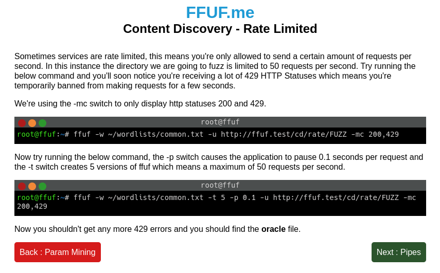

1. Tällä kertaa tehdään molemmat osat. Aloitetaan ensimmäisellä.

```
...
xslt                    [Status: 429, Size: 178, Words: 8, Lines: 8, Duration: 0ms]
yonetici                [Status: 429, Size: 178, Words: 8, Lines: 8, Duration: 0ms]
zencart                 [Status: 429, Size: 178, Words: 8, Lines: 8, Duration: 0ms]
:: Progress: [4686/4686] :: Job [1/1] :: 0 req/sec :: Duration: [0:00:00] :: Errors: 0 ::
```

2. Aivan niin. Sitten toisella perään ja pitäisi onnistua. Hieman tuossa kestää, kun pyyntöä liikkuu vain 50 sekuntissa.

```
┌──(ilpakka㉿kali)-[~/Desktop/h5/ffufme]
└─$ ffuf -w ~/Desktop/h5/ffufme/wordlists/common.txt -t 5 -p 0.1 -u http://localhost/cd/rate/FUZZ -mc 200,429

        /'___\  /'___\           /'___\       
       /\ \__/ /\ \__/  __  __  /\ \__/       
       \ \ ,__\\ \ ,__\/\ \/\ \ \ \ ,__\      
        \ \ \_/ \ \ \_/\ \ \_\ \ \ \ \_/      
         \ \_\   \ \_\  \ \____/  \ \_\       
          \/_/    \/_/   \/___/    \/_/       

       v2.1.0-dev
________________________________________________

 :: Method           : GET
 :: URL              : http://localhost/cd/rate/FUZZ
 :: Wordlist         : FUZZ: /home/ilpakka/Desktop/h5/ffufme/wordlists/common.txt
 :: Follow redirects : false
 :: Calibration      : false
 :: Timeout          : 10
 :: Threads          : 5
 :: Delay            : 0.10 seconds
 :: Matcher          : Response status: 200,429
________________________________________________

oracle                  [Status: 200, Size: 19, Words: 4, Lines: 1, Duration: 0ms]
:: Progress: [4686/4686] :: Job [1/1] :: 57 req/sec :: Duration: [0:01:38] :: Errors: 0 ::
```

## i) Subdomains - Virtual Host Enumeration

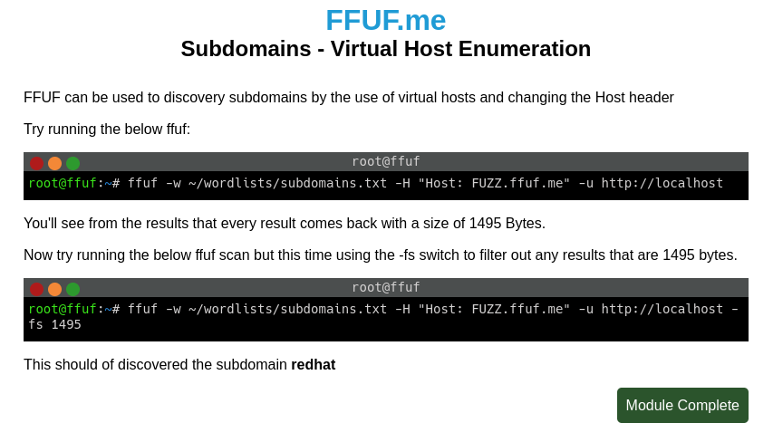

1. Viimeisiä testejä, aloitetaan ensimmäisellä.

```
...
zera                    [Status: 200, Size: 1495, Words: 230, Lines: 40, Duration: 3ms]
zeus                    [Status: 200, Size: 1495, Words: 230, Lines: 40, Duration: 3ms]
zw                      [Status: 200, Size: 1495, Words: 230, Lines: 40, Duration: 3ms]
zm                      [Status: 200, Size: 1495, Words: 230, Lines: 40, Duration: 3ms]
zlog                    [Status: 200, Size: 1495, Words: 230, Lines: 40, Duration: 3ms]
zulu                    [Status: 200, Size: 1495, Words: 230, Lines: 40, Duration: 4ms]
:: Progress: [1907/1907] :: Job [1/1] :: 0 req/sec :: Duration: [0:00:00] :: Errors: 0 ::
```

2. Ja perään viimeinen pala.

```
┌──(ilpakka㉿kali)-[~/Desktop/h5/ffufme]
└─$ ffuf -w ~/Desktop/h5/ffufme/wordlists/subdomains.txt -H "Host: FUZZ.ffuf.me" -u http://localhost -fs 1495

        /'___\  /'___\           /'___\       
       /\ \__/ /\ \__/  __  __  /\ \__/       
       \ \ ,__\\ \ ,__\/\ \/\ \ \ \ ,__\      
        \ \ \_/ \ \ \_/\ \ \_\ \ \ \ \_/      
         \ \_\   \ \_\  \ \____/  \ \_\       
          \/_/    \/_/   \/___/    \/_/       

       v2.1.0-dev
________________________________________________

 :: Method           : GET
 :: URL              : http://localhost
 :: Wordlist         : FUZZ: /home/ilpakka/Desktop/h5/ffufme/wordlists/subdomains.txt
 :: Header           : Host: FUZZ.ffuf.me
 :: Follow redirects : false
 :: Calibration      : false
 :: Timeout          : 10
 :: Threads          : 40
 :: Matcher          : Response status: 200-299,301,302,307,401,403,405,500
 :: Filter           : Response size: 1495
________________________________________________

redhat                  [Status: 200, Size: 15, Words: 2, Lines: 1, Duration: 0ms]
:: Progress: [1907/1907] :: Job [1/1] :: 0 req/sec :: Duration: [0:00:00] :: Errors: 0 ::
```

## Lähteet
- Tero Karvinen 2026. Tunkeutumistestaus. Luettavissa: https://terokarvinen.com/tunkeutumistestaus/. Luettu: 25.4.2026.
- Tero Karvinen 2023. Find Hidden Web Directories - Fuzz URLs with ffuf. Luettavissa: https://terokarvinen.com/2023/fuzz-urls-find-hidden-directories/. Luettu: 25.4.2026.
- ffuf. GitHub 2026. ffuf - Fuzz Faster U Fool. Luettavissa: https://github.com/ffuf/ffuf/blob/master/README.md. Luettu: 25.4.2026.
- Tero Karvinen 2023. Fuffme - Install Web Fuzzing Target on Debian. Luettavissa: https://terokarvinen.com/2023/fuffme-web-fuzzing-target-debian/. Luettu: 26.4.2026.
