# Break & Unbreak

## x) Tiivistys

- ffuf / Fuzz Faster U Fool:
    - Kätevä työkalu fuzzaukseen, eli hakemistojen yms. bruteforcemaiseen haravointiin.
    - Hyödyntää valmiiksi rakennettuja sekä erikseen räätälöytyjä sanalistoja testaamiseen.
- OWASP Top 10: Broken Access Control
    - Tällä hetkellä kaikista yleisin haavoittuvuus web-sovelluksissa.
    - Haavoittuvuudet perustuvat pääsynhallinnan heikkouteen sekä oikeuspuutteisiin, joita hyödyntämällä pääsee käsiksi luvattomaan tietoon.
- IDOR
    - Yksi Broken Access Controllin muodoista, jossa käyttäjä voi liikkua luvattoman tiedon pariin muuttamalla sivuston parametreja.
    - user?id=1 (käyttäjä näkee omat tiedot) -> user?id=2 (käyttäjälle tulee nyt vieraan tiedot).

## a) 010-staff-only | Murtautuminen

### Testiympäristö
| Nimi | Versio | Lisätietoja |
| :--- | ------ | :---------: |
| OS | Kali Linux 2025.2 | - |
| RAM | 8192 MB | - |
| Selain | Firefox 128.14.0esr | - |

Tavoite: *Reveal admin password. It contains the string "SUPERADMIN". Find the vulnerability trough the web interface, without looking at the source code.*

1. Toimitaan ensin nettisivuilla esitettyjen ohjeiden mukaan ja pistetään haaste pyörimään kotona. Flask olikin jo asennettu, joten python pääsikin heti ajoon.

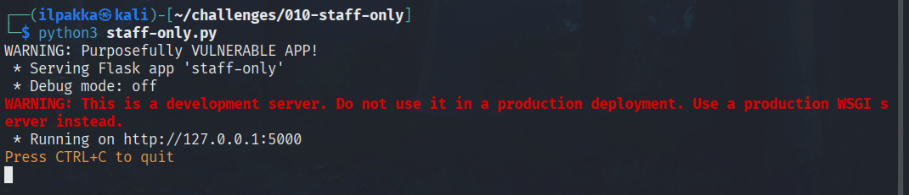

2. Eteen tulee Super Secure Password Recover -sivu, jossa käyttäjä voi hakea oman salasanan syöttämällä PIN koodin kenttään.<br>
Sivu myös paljastaa, että oma PIN on 123. Jostain syystä alabörsässä on myös spoilerin makua, mikä on vähän kumma homma.

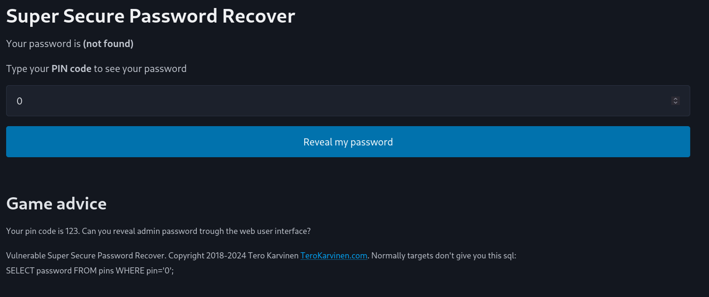

3. PIN 123 paljastaa salasanaksi *Somedude*. Haasteessa pitää toisin sanoen löytää jokin tapa, jolla saadaan salasanakenttään näkyviin *SUPERADMIN*in sisältävä merkkijono.<br>

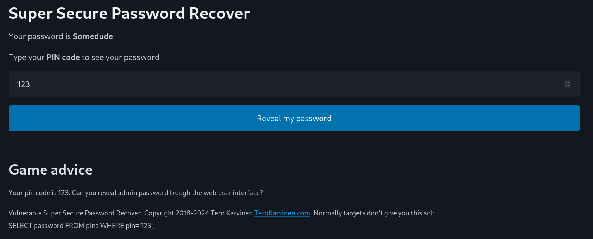

4. Kokeillaan, että miten kenttä toimii. Musiikin innoittama testi osoittaa, että kenttä odottaa vain numeroita. Tämä voidaan varmistaa vielä tarkemmin avaamalla Developer Tools ja kurkkaamalla sen kenttää Inspectorissa.

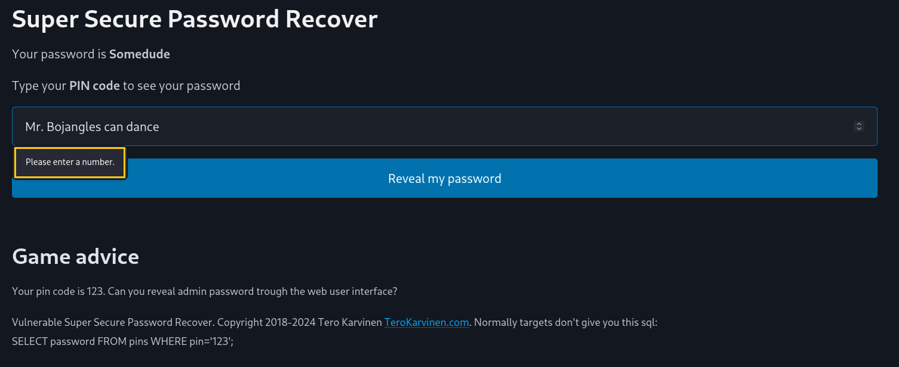<br>
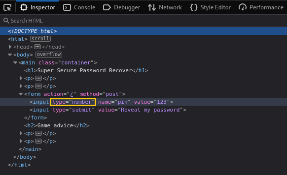

5. Muokataan kenttää hyväksymään tekstiä, joka onnistuu kätevästi suoraan Inspectorin sisällä. Tämän jälkeen palataan itse sivulle ja syötetään kenttään merkkijono testiksi.<br>
Tästä selviää, että muutoksen syöte menee läpi vaikka muoto palautuukin takaisin numeroksi. Seuraavaksi yrittäänkin sitten SQL injektointia.

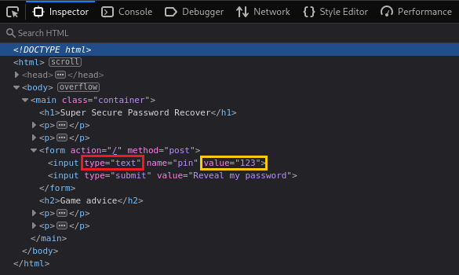<br>
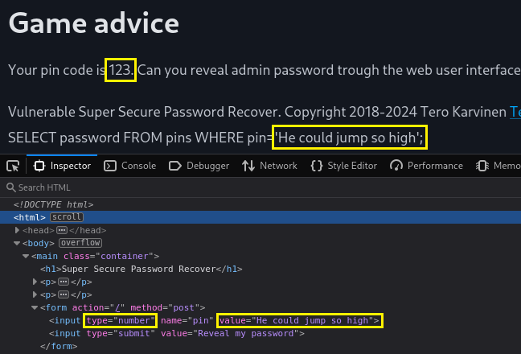

6. Otetaan käyttöön klassinen *OR 1=1* joka tässä tapauksessa lähettää pyynnön *SELECT password FROM pins WHERE pin='OR 1=1';*. Tuollainen kuitenkin palauttaa todennäköisesti vain yhden kerrallaan, joten lisätään mukaan *LIMIT*.<br>
Muutaman alkutestin jälkeen *'OR 1=1 LIMIT 2,1--* palautti juuri sen mitä tässä etsittiinkin.

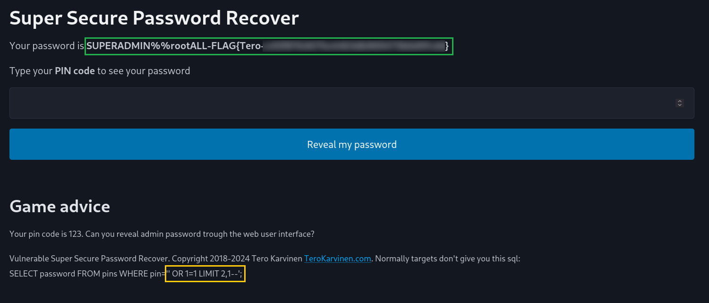

## b) 010-staff-only | Korjaus ja Pohdinta

Käyttäjän syöte liitetään suoraan SQL-hakuun ilman puhdistusta tai parametrisointia. Tässä herää silloin suuri uhka injektioille, joilla salasanoja sekä muuta tietoa voidaan suoraan hakea tietokannasta.
Salasanat pitää olla hashattu ja suolattu, eikä niidä pidä säilyttää selkokielellä. Lisäyksenä vielä, että salasanan palautuksen olisi fiksumpaa tapahtua vaikka sähköpostin kautta.

1. Korjaus pythoniin<br>
```python
def hello():
    pin = request.form.get("pin", "").strip()

    if pin and (not pin.isdigit() or len(pin) > 2**8):
        return render_template("index.html", password="Ei muista ei", pin=pin, sql="piilossa")

    row = None
    if pin:
        stmt = text("SELECT password FROM pins WHERE pin = :pin")
        with app.app_context():
            row = db.session.execute(stmt, {"pin": pin}).fetchone()  # loppu se committailu

    password = row[0] if row else "ei löydy ei"
    return render_template("index.html", password=password, pin=pin, sql="suojattu")
```
<br>
2. Näyttää siltä, että hello-funktionin korjaus onnistui eikä sivu enää palauta salasanaa.

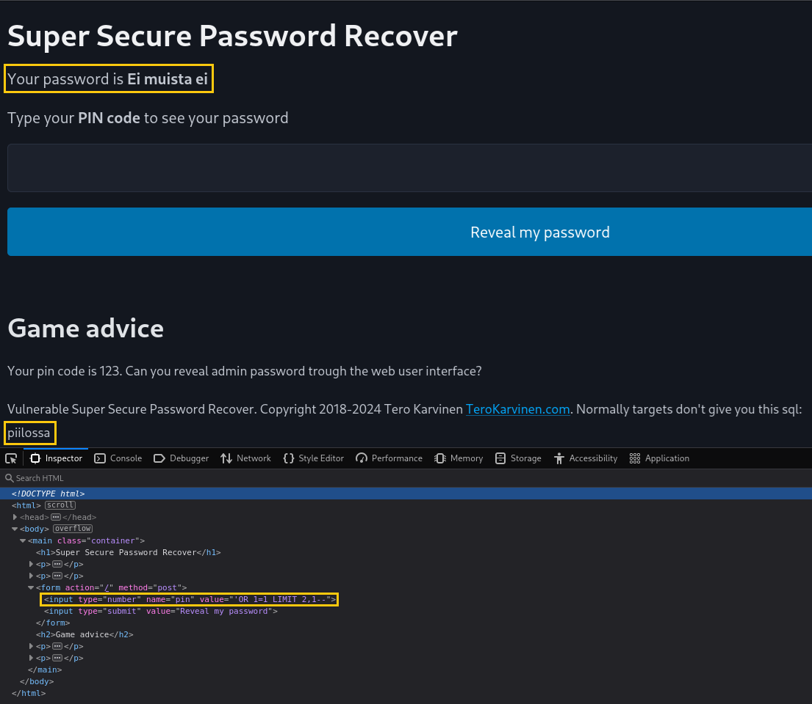

SQL injektiot ovat edelleen todella yleisiä, joille aikalailla mikä tahansa käyttäjän syötettä kyselymuotoon siirtävä sovellus tai palvelu on haavoittuvainen.<br>
Suunnitteluvaiheessa onkin siis tärkeää ottaa mukaan tarvittavat toimenpiteet, kuten edellämainitsemani parametrisointi ja vaikka regressiotestit.

## c) dirfuzt-1 | Ratkaisu

### Testiympäristö
| Nimi | Versio | Lisätietoja |
| :--- | ------ | :---------: |
| OS | Kali Linux 2025.2 | - |
| RAM | 8192 MB | - |
| Selain | Firefox 128.14.0esr | - |

Tavoite: *Can you find two URLs: Admin page, Version control related page*

1. Ladataan *dirfuzt-1* ja laitetaan tehtävän ympäristö kuntoon.

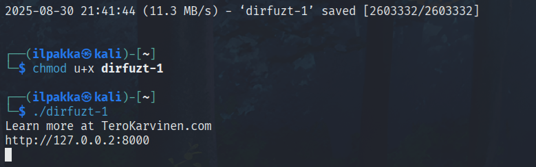

2. Tehtävänä on löytää admin- ja versionhallinnan sivut. Aloitetaan ensin sillä, että selvitetään tyhjältä näyttävän etusivun tavukoko komennolla:

```bash
curl -s -o /dev/null -w 'SIZE:%{size_download}\n' http://127.0.0.2:8000
```

<br>

Tämän jälkeen pistetään suuren sanalistan fuzzeri pyörimään kohteeseen. Rajataan ja suodatetaan tuloksia siinä määrin, että keskitytään ainoastaan tiettyihin HTTP-koodeihin ( *-mc* ), seurataan uudelleenohjauksia ( *-r* ), ei kurkita tyhjän etusivun tavukopioita ( *-fs* ) ja syödään kunnolla ( *-t* ).

```bash
ffuf -u "http://127.0.0.2:8000/FUZZ" -w /usr/share/seclists/Discovery/Web-Content/directory-list-2.3-big.txt -mc 200,301,302,401,403 -r -fs 154 -t 200
```

<br>

Vastaukseksi saadaankin jo heti jotain mielenkiintoista.

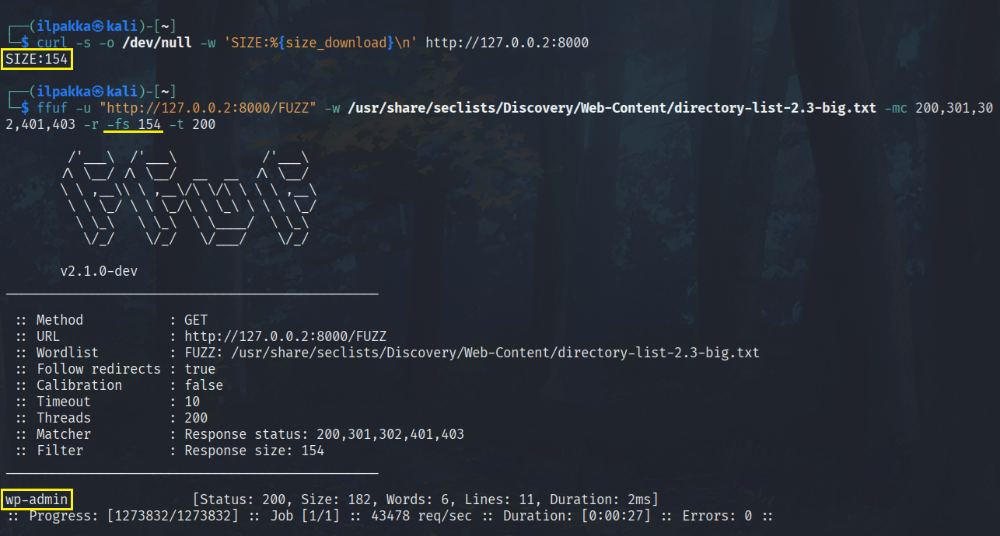

3. Kurkataan mitä fuzzerin löytämästä osoitteesta paljastuu ja näyttää siltä, että ensimmäinen osa on valmis.

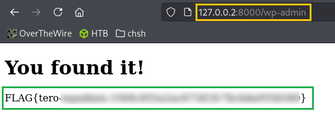

4. Seuraavaksi meillä on vielä versionhallintasivu etsinnässä. Tehdään nopea testi kohteeseen */.git/HEAD*, koska se löytyy jokaisesta gittireposta.<br>
Tällä kertaa kävi tuuri, sillä heti ensimmäinen testi tuotti välittömän tuloksen ja toinen haaste on näin ollen valmis.

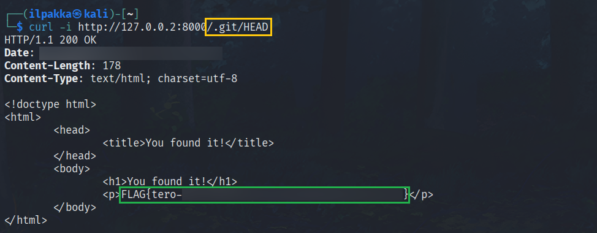


## d) 020-your-eyes-only | Murtautuminen

### Testiympäristö
| Nimi | Versio | Lisätietoja |
| :--- | ------ | :---------: |
| OS | Kali Linux 2025.2 | - |
| RAM | 8192 MB | - |
| Selain | Firefox 128.14.0esr | - |

Tavoite: *Access adminstrative console. The page contains text "you've found the secret page" the vulnerability through the web interface, without looking at the source code.*

1. Pistettiin taas tehtävä pyörimään ohjeiden mukaan ja varmistettiin että kaikki on kunnossa.

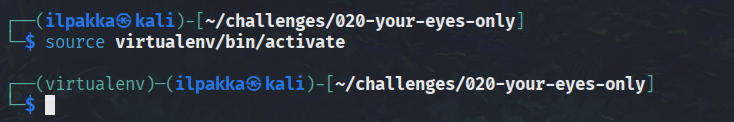<br>
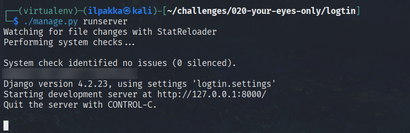

2. Käydään ottamassa yleissilmäys sivusta, josta löytyykin nyt jo paljon enemmän tavaraa.

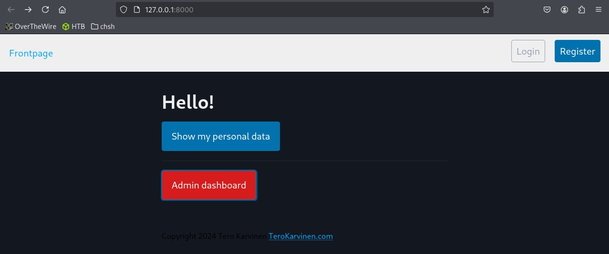

3. Sivustolla navigointi ei oikein tuota tulosta. Kirjautumisessa ei voi enää käyttää samoja menetelmiä joita aikaisemmin löydettiin.<br>
Nopeat ideat loppuvat, joten päätetään siirtyä fuzzin pariin. Useammat sanalistat eivät tuota tulosta ja fuzzaillessa tulee pähkäiltyä pitkään, kunnes yksinkertainen common.txt paljastaa uuden testikohteen.

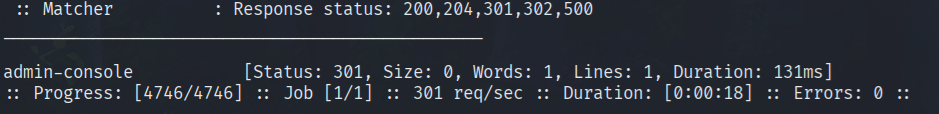

4. Syötetään */admin-console* palkkiin, mutta näkymä palauttaa meidät kirjautumiseen. 

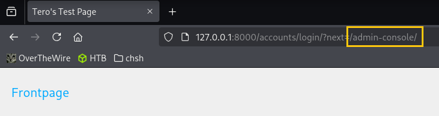

5. Kokeillaan seuraavaksi tehdä ihan uusi käyttäjä, koska aikaisemmat kirjautumisyritykset eivät tuottaneet tulosta. Valitaan mahtava nimi ja roteva salasana.

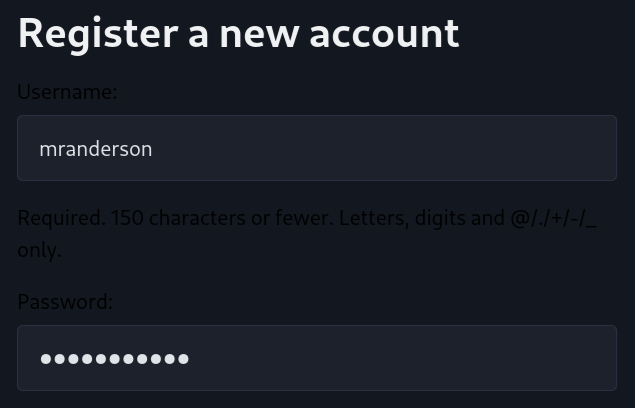

6. Tutkiessa uuden, kirjautuneen käyttäjän näkymää, pääsemme vihdoin katsomaan tarkemmin sivun ominaisuuksia. Omista tiedoista löytyy vaikka mitä satunnaista ja generoitua, mutta mielenkiintoisempi löytö on */admin-dashboardilla* näkyvä **403 Forbidden**.

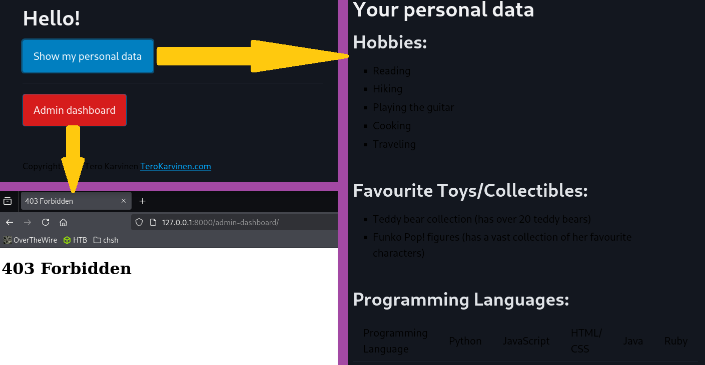

7. Kokeilin mielenkiinnosta aikaisempaa */admin-consolea*, sillä viime kerralla eteneminen tyssäsi kirjautumiseen. Tälläkin kertaa kävin luultavasti tuuri, sillä uskonut pääseväni vielä ihan näin helpolla sisään.<br>
Sivu on nyt kuitenkin löydetty ja haaste on näin ollen suoritettu.

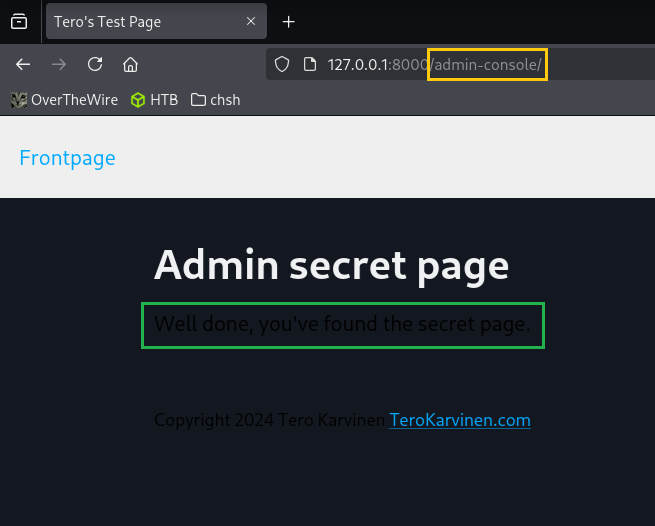

## e) 020-your-eyes-only | Korjaus

1. Seuraavaksi onkin sitten korjauksen paikka. Aluksi sitä ei tiennyt mistä aloittaa, koska äsköinen lopputulos oli niin yllättävä, mutta hyökättiin lähdekoodin kimppuun tästä huolimatta.

2. Selailemalla lähdekoodia löytyi lopulta oikea paikka, jossa tämä virhe pääsee tapahtumaan. Viimeisessä osiossa ei varmisteta käyttäjän kuuluvan *staffiin*.

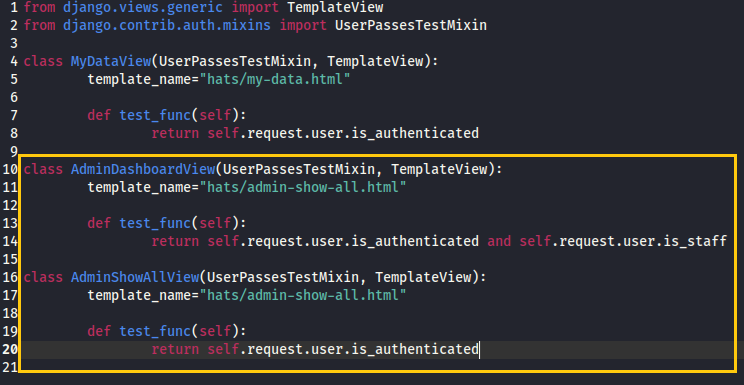

3. Korjataan tämä huolimattomuus täsmentämällä koodia:

```python
class AdminShowAllView(UserPassesTestMixin, TemplateView):
	template_name="hats/admin-show-all.html"

	def test_func(self):
		return self.request.user.is_authenticated and self.request.user.is_staff
```
Nyt molemmista kohdista löytyy *self.request.user.is_staff*, joten lähdetään testailemaan.

4. Pyöräytetään sivu taas aikaisempien ohjeiden mukaan pystyyn. Luodaan taas kerran sopiva käyttäjä.

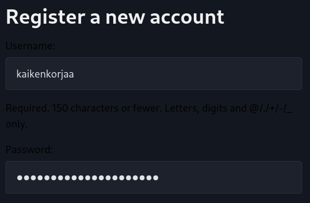

5. Yritetään kirjautumisen jälkeen päästä katsomaan */admin-console* näkymää, mutta näyttäisi tällä kertaa olevan pääsy kielletty.
Kaikki meni niin kuin piti ja tehtävä on valmis.

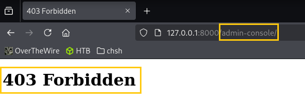

## f) Ei tämmöstä tehtävää vissiin olekaan

## g) PortSwigger Part 1

Tehtävä: *To solve the lab, perform a SQL injection attack that causes the application to display one or more unreleased products.*

1. Heti alussa saamme vihjeen, että SQL-haaste perustuu muotoon

```sql
SELECT * FROM products WHERE category = 'Gifts' AND released = 1
```

2. Kiinnitetään erityistä huomiota kohtaan *released = 1*, sillä tarkoitus on juurikin tuoda esille yksi tai useampi julkaisematon tuote.<br>
Siirtymällä eri valikkoihin, sivun osoite antaa meille heti osoitteen injektiotestille.

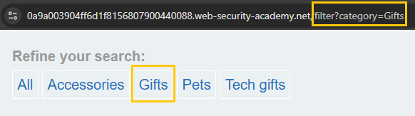

3. Syötetään testinä *Gifts'+OR1=1--* ja lopputuloksena avautuu kaikki julkaisemattomat tuotteet. Testi meni näin kerralla läpi.

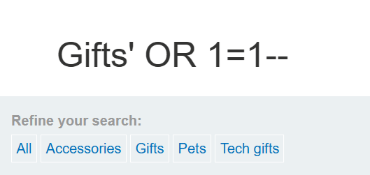<br>
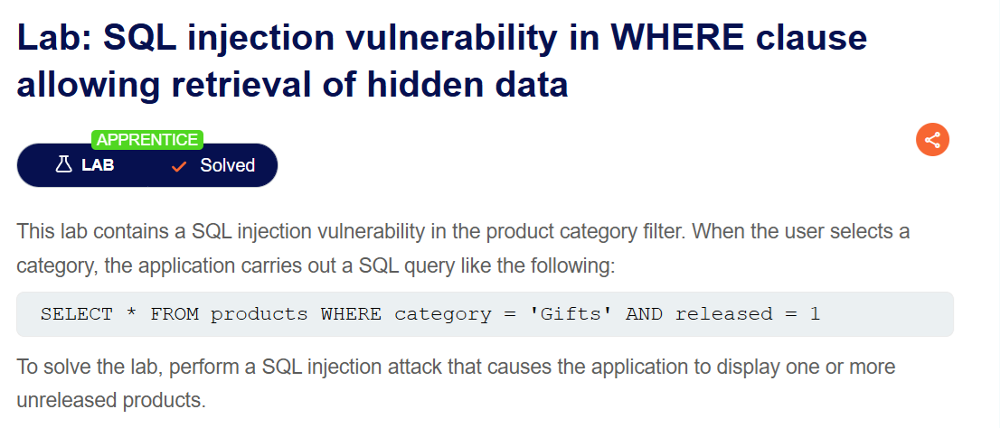


## h) PortSwigger Part 2

Tehtävä: *To solve the lab, perform a SQL injection attack that logs in to the application as the administrator user.*

1. Sivulla pitäisi päästä kirjautumaan ja pääsemme testaamaan tunnuksia navigoimalla ensin *My accountin* läpi.

2. Nähtävästi sivu hakee kirjautumistiedot muodossa

```sql
&username=nimi&password=salainen
```

Salasanan tarkistamisen ohittamista voimme testata yksinkertaisesti syöttämällä nimikenttään *administrator'--*, joka asettaa jatkon kommentiksi.<br>
Tämä toimi ja sivu onnittelee onnistumisia.

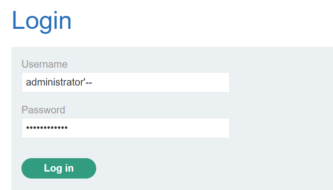<br>
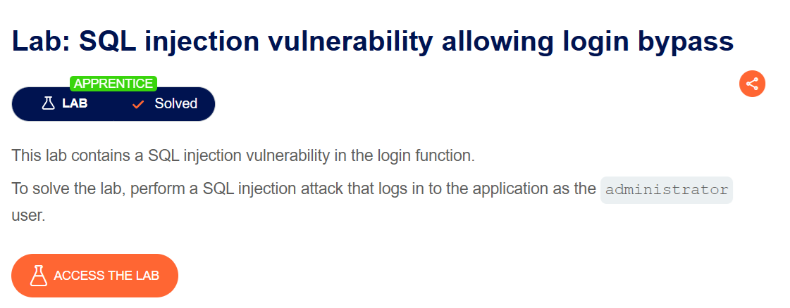


## Lähteet
- Tero Karvinen. https://terokarvinen.com/hack-n-fix/
- OWASP A03:2021 - Injection. https://owasp.org/Top10/A03_2021-Injection/
- PortSwigger Web Security Academy - SQL injection. https://portswigger.net/web-security/sql-injection
- ffuf. https://github.com/ffuf/ffuf
