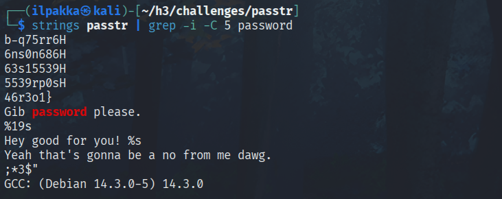

# No Strings Attached

## a) Return of the Strings

Tavoite: *Lataa ezbin-challenges.zip Aja 'passtr'. Selvitä oikea salasana 'strings' avulla. Selvitä myös lippu. (Ensisijaisesti katsomatta sorsia, jos osaat.)*

1. Ladataan paketti, liikutaan kohteeseen ja ajetaan ohjelma komennolla *./passtr*. Meitä pyydetään syöttämään salasana, mutta klassinen meni tällä kertaa väärin.


2. Seurataan tehtävänantoa ja kokeillaan selvittää ohjelman sisältöä komennolla *strings passtr | grep -i -C 5 password*. Greppailu auttaa meitä etsimään "passwordiin" liittyvää merkkijonoa ja *-C 5* antaa vähän enemmän liikkumavaraa. Tulostuksesta selviää, että salasana on tallennettu selkona ja samalla saatiin näkyviin Teron lippu.


3. Ihan muodollinen sanity test ja käydään varmistamassa nyt tiedossa oleva salasana ajamalla ohjelma uudestaan. Salasana on oikein ja lippu tulee näkyviin tuostakin.


## b) passtr.c

Tavoite: *Tee passtr.c -ohjelmasta uusi versio, jossa salasana ei näy suoraan sellaisenaan binääristä. Osoita testillä, että salasana ei näy. (Obfuskointi riittää.)*

1. Käydään kurkkaamassa mitä passtr.c sisältää. Kovakoodatut salasana ja lippu näkyvät, joten lähdetään lisäämään vähän esteitä.


2. Kun kerta obfuskointi riittää niin siirrellään vähän merkkien paikkoja. Vanha kunnon ROT13 on mahdollisesti ihan käypä ratkaisu, koska tässä ei haettu vielä mitään maagisia bittixorreja. Rakennetaan lähdekoodiin uusi funktio ja vähän myös muokataan muutakin sisältöä vastaamaan toimivuutta.


3. Maketaan ohjelman uusi versio ja kokeillaan aikaisempaa *strings* komentoa uudestaan. Salasana ei löydykään enää selkona ja lippukin näyttää kadonneen. Jos otetaan filtterit pois ja ajetaan *strings* täysin puhtaana niin salasana sekä lippu näkyvät, mutta obfuskoituina. Joku saattaisi pikaisesti katsoa, että siitä löytyy vain sotkua ja jatkaa matkaansa.



> ROT13 salasana : lippu = fnyn-unxxrev-321 : SYNT{Greb-q75rr66ns0n68663s15539rp0s46r3o1}


4. Ajetaan uusi, turvallisempi ohjelma ja kokeillaan sekä väärää että oikeaa salasanaa.


## c) MTV Pack'd

Tavoite: *Aja 'packd' paketista ezbin-challenges.zip. Mikä on salasana? Mikä on lippu?*

1. Aloitetaan ihan samalla tavalla kuin aikaisemmassa tehtävässä, eli ajetaan ohjelma ja katsotaan mitä käy.


2. Näyttää aika samalta! Fiksuin tapa on käydä samat *strings* komennot läpi kuin aikaisemmin. Ainakin osa salasanasta ja lipusta näyttää olevan esillä, joten testataan sitä myös!


3. Ei sopinut ei. Kurkataan vähän lisää, että millanen tiedosto meillä on edessä, eli *file packd* menemään. Tuo **no section header** on aika mielenkiintoinen, koska se viittaa vahvasti pakkaukseen. Käydään vielä kerran katsomassa tuota ohjelman sisältöä, mutta tällä laitetaan *xxd* hexdumppaamaan meille infoa esiin.


4. Siellähän se signature näkyy, pakkauksessa on käytetty UPXia ja intuitioon kannatti luottaa! Vahvistetaan tämä vielä itse *upxilla* komennolla *upx -l ./packd*


5. Tuloksen seurauksena saa nyt olla jo aika varma, eli seuraavaksi puretaan koko homma komennolla *upx -d ./packd*.


6. Nyt meillä on purettu *packd*, joten kokeillaan taas kerran kurkata sen sisään komennolla *strings packd | grep -i -C 5 password*. Salasana ja lippu näkyy nyt ihan selvästi!


7. Testataan näkyvä salasana ja hyvin toimii!


## d) Vapaaehtoinen Cryptopals

Tavoite: *Ratkaise ne kohdat jotka voit.*

### 1. Convert hex to base64

Sääntö: *Always operate on raw bytes, never on encoded strings. Only use hex and base64 for pretty-printing.*

1. Tehtävänä on kirjoittaa ohjelma, joka muuttaa hex-merkkijonon *49276d206b696c6c696e6720796f757220627261696e206c696b65206120706f69736f6e6f7573206d757368726f6f6d* base64-muotoon *SSdtIGtpbGxpbmcgeW91ciBicmFpbiBsaWtlIGEgcG9pc29ub3VzIG11c2hyb29t*. Tähän soveltuu kätevimmin python. Kovakoodataan myös tehtävän merkkijonot, jotta voidaan ajaa yksinkertainen vertailu vielä loppuun niin ei mene mahdolliset virheet niin helposti huolimattomuuden piikkiin.


```python
import base64

challenge_hex = "49276d206b696c6c696e6720796f757220627261696e206c696b65206120706f69736f6e6f7573206d757368726f6f6d"
challenge_base64 = "SSdtIGtpbGxpbmcgeW91ciBicmFpbiBsaWtlIGEgcG9pc29ub3VzIG11c2hyb29t"

hex = input("Hex pls: ")
base64 = base64.b64encode(bytes.fromhex(hex)).decode('utf-8')
print("Base64: ", base64)

print("\n-- Tarkistus --")
if hex == challenge_hex and base64 == challenge_base64:
    print("Oikein!")
else:
    print("Väärin!")
```

2. Ajetaan skripti ja näyttäisi olevan ihan toimiva!


### 2. Fixed XOR

1. Tehtävänä on kirjoittaa funktio, joka tuottaa kahden yhtä pitkän bufferin XOR-yhdistelmän.


2. Otetaan aikaisempi pythonkoodi ja muokataan sitä hieman vastaamaan tehtävänannon tavoitetta.

```python
challenge_hex_1 = "1c0111001f010100061a024b53535009181c"
challenge_hex_2 = "686974207468652062756c6c277320657965"
challenge_result = "746865206b696420646f6e277420706c6179"

hex_1 = input("Hex 1 pls: ")
hex_2 = input("Hex 2 pls: ")

def xor(buffer_1, buffer_2):
    return bytes(a ^ b for a, b in zip(buffer_1, buffer_2))

bytes_1 = bytes.fromhex(hex_1)
bytes_2 = bytes.fromhex(hex_2)
result = xor(bytes_1, bytes_2).hex()

print("XOR: ", result)

print("\n-- Kovakoodin Tarkistus --")
if hex_1 == challenge_hex_1 and hex_2 == challenge_hex_2 and result == challenge_result:
    print("Oikein!")
else:
    print("Väärin!")
```

3. Ajetaan skipti ja syötetään tehtävänannon esimerkit. Tulostus on sama ja tämä on taas kerran vahvistettu kovakoodatulla testillä.


### 3. Single-byte XOR cipher

Tavoite: *Löydä avain joka purkaa viestin. Älä tee käsin vaan kirjoita skripti!*


1. Ihan mielenkiinnosta ja itseni haastamisen vuoksi haluan lähteä ratkomaan seuraavia tehtäviä puhtaasti C:llä. Tämä vaatii vähän tutkimista ja harjoittelua, joten palataan pienen tauon jälkeen!


2. Vuorokauden pähkäilyn ja koodilainaamisen jälkeen saatiin sellainen koodi kasaan, joka näyttäisi toimivan. Sitä olisi varmasti voinut muovata vähän fiksumpaankin suuntaan, mutta itselleni riittää tähän hätään tuon merkkijonon tulostuminen.


### 4. Detect single-character XOR

Tavoite: *Löydä annetusta tiedostosta 60-merkin pituinen merkkijono, joka on salattu yhden merkin xorrilla.*


1. Kurkataan, että mitä tiedoston sisältä oikein löytyy. Siellä on useampi rivi merkkijonoja, joten seuraavaksi pitää löytää keino hyödyntää tuota aikaisempaa c-koodia tämän ratkaisemisessa.


2. Oli muuten hyvä valinta tuo C kun nyt päästään taas katsomaan ja oppimaan, että mitä kautta tuo onnistuu parhaiten. Halutaan todennäköisesti lukea rivit suoraan tiedostosta ja pisteyttää ne erikseen.

### 5. Implement repeating-key XOR

### 6. Break repeating-key XOR

### 7. AES in ECB mode

### 8. Detect AEC in ECB mode


## Lähteet
- Tero Karvinen. https://terokarvinen.com/sovellusten-hakkerointi/
- upx. https://github.com/upx/upx
- The Cryptopals Crypto Challenges. https://www.cryptopals.com/sets/1