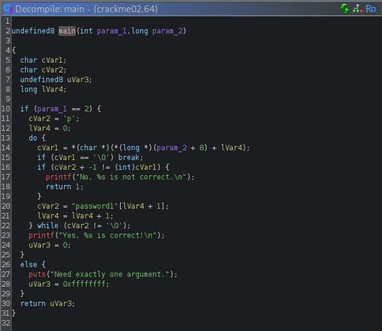

# Kääntöpaikka

## x) Tiivistä

John Hammond kävi videollaan läpi vuoden 2022 PicoCTF-kilpailun haasteen nimeltä "Bbbbloat", joka on videon otsikossa nimetty virheellisesti "bbbloat". Kyseinen tehtävä löytyy edelleen PicoGymin puolelta, josta löytyy myös paljon muita todella hyviä harjoituksia. Videolla käytiin läpi ensin "matalalla roikkuvia hedelmiä", eli ensin varsinaista Ghidran käyttöä tehtiin staattista kurkkaamista komennoilla *file*, *ltrace*, *strace* sekä *objdump*. Binääritehtävän salasana löytyi kovakoodattuna Ghidran analyysin löytämän main-funktion sisältä.

| Komento | Esimerkki | Selitys |
| :------ | :-------- | :------ |
| file | file bloat | Kertoo tiedoston tyypistä ja tunnisteista |
| ltrace | ltrace bloat | Seuraa kirjastokutsuja |
| strace | strace bloat | Seuraa järjestelmäkutsuja |
| objdump | objdump -d bloat | Purkaa binäärin ja näyttää sisältöä |

## a) Asenna Ghidra

Tavoite: *Asenna Ghidra.*

Ghidra onkin ollut asennettuna jo jonkin aikaa, joten varmistetaan sen olevan ajan tasalla. Viimeisin versio on 11.4.2.


## b) rever-C

Tavoite: *Käänteismallinna packd-binääri C-kielelle Ghidralla. Etsi pääohjelma. Anna muuttujielle kuvaavat nimet. Selitä ohjelman toiminta. Ratkaise tehtävä binääristä, ilman alkuperäistä lähdekoodia.*

1. Käydään hakemassa Teron lootasta tuo *ezbin-challenges.zip* ja ryhdytään hommiin. Avataan Ghidra, luodaan uusi projekti *File -> New Project*, yksinpeliin valitaan vaihtoehdoista *Non-Shared Project* ja täytetään vielä loput tarvittavat tiedot.

2. Seuraavaksi importataan *packd* tuonne projektiin sisään ja hyväksytään automaattiset ehdotukset.


3. Laitetaan Ghidran CodeBrowser päälle joko tuplaklikkaamalla tiedostoa tai painamalla ensimmäistä, vihreän hirviön kuvaketta. Saadaan ilmoitus, että *packd* on vielä analysoimatta, joten siirrytään sen pariin jatkamalla *YES*. Analysointia varten voimme valita halutessamme erilaisia variantteja päälle, mutta oletusasetukset toimivat useimmiten oikein riittävästi.


4. Kun analysointi on valmis niin näkyville putkahtaa aika paljon tavaraa. Jos Ghidran käyttö on ihan uusi juttu niin tämä voi näyttää aika pelottavalta, mutta ajallaan tämäkin muuttuu selkeämmäksi.


5. Tavoitteena on käänteismallintaa tämä *packd*-binääri, joten aloitamme ensin etsimällä *main*-funktion paikkaa. Tällä kertaa Ghidra onkin automaattisesti lähettänyt meidät ensitöikseen *entry*-funktion näkymään, samalla tallentamalla löytämänsä mahdolliset muutkin funktiot *Symbol Tree*-ikkunan *Functions* osioon. Mainia meillä ei ole vielä kirjattuna, mutta *entry* on kuitenkin hyvä paikka aloittaa, sillä voimme seurata tämän aloitusfunktion kutsuketjua ja lopulta päätyä mainiin. Nopea katsauksella kuitenkin myös näyttäisi siltä, että *FUN_001054d0* on oikea paikka, mutta ei ole haittaa olla varma.


### Yleissilmäyksen havaintoja
| Funktio | Sisältö |
| :--- | ------- |
| entry | Aloituspiste / Loaderi |
| FUN_001053a7 | Kutsuu funktiopointteria |
| FUN_001053b7 | Kutsuu funktiopointteria |
| FUN_001053c7 | Kutsuu funktiopointteria |
| FUN_001054d0 | Todennäköisesti main(), koska sopii muotoon |
| FUN_0010574f | Paljon alustamista |
| FUN_0010578d | Paljon alustamista ja kutsuja |
| FUN_0010590c | Paljon alustamista |
| FUN_00105988 | Kutsuu funktiota ja mahdollisesti virhekäsittelyä |

6. Kurkataan tässä vaiheessa vielä, että millaisia merkkijonoja Ghidra on meille löytänyt. Tämä onnistuu kohdasta *Search -> For Strings -> Search*, joka palauttaa kaikenlaista jännää. Tämä binääri on pakattu UPXilla, joka hieman muuttaa tätä meidän aikaisempaa lähestymistapaa. Tehtävän tavoitteissa olikin jo hieman spoilausta puhuttaessa pääohjelmasta ja vaikka tämä *packd* oli ollut jo osallisena aikaisempaa purkutehtävää, niin raportin realismin kannalta oli fiksuinta aloittaa "nollatiedoilla". Muita mielenkiintoisia (katkenneita) merkkijonoja ovat *"c99\"canf"* (scanf ?), *"(rcmp"* (strcmp ?) ja *"proc/self/exe"* (verifikaatio / pakkauspurku).


7. Nyt kun tiedämme UPXin sekoittavan pakkaa, niin tuon *entry*-funktion kuten koko binäärin merkitys myös selkenee. Tämän *entryn*, tai tästä lähtien *upx_loaderin* tarkoitus on tarkistaa binäärin eheys ja tarvittaessa kutsua erilaisia virhetoimia, kuten *FUN_00105988* sisältä löytyvä *halt_baddata()*. UPX huolehtii myös erilaisista alustamisista, kunnes purettuaan antaa tilaa pääohjelman käynnistykselle. Kurkataan siis hieman, että miltä meidän *upx_loaderin* toimintamalli käytännössä näyttää. Pyöräytetään graafi auki *Window -> Function Call Graph* niin saadaan ihan järkevä näkymä hierarkiasta.


8. Kuten kuvasta näemme, niin *upx_loader* kutsuu funktioita *FUN_0010578d* sekä *FUN_00105988*, jotka puolestaan kutsuvat vielä funktiota *FUN_0010574f* sekä *FUN_0010590c*. Voimme näin ollen lopun tehtävän ajan jättää nämä osiot pois ja keskittyä pääohjelmaan ja *mainiin*. Meillä on jäljellä 4 funktiota, joista vain yhdessä on mitään *mainin* muotoon viittaavaa. Muutetaan siis tämän jo ensinäkemällä kiinnostuksen herättäneen funktion *FUN_001054d0* nimi muotoon *int main(void)*.


9. Seuraavaksi päästäänkin analysoimaan *mainia* tarkemmin. Siinä varataan muistia tyypittömälle *local_28*, haetaan kovakoodauksia, talletetaan tulos muuttujaan *iVar1* ja suoritetaan lopussa myös yksinkertainen if-else tämän perusteella. Voimme binääriin tallennetuista merkkijonoista päätellä, että esittää käyttäjälle merkkijonoja sekä mahdollisesti pyytää syötettä, jota myöhemmin verrataan keskenään kovakoodiin. Vertailun tulos määrittää ohjelman lopetuskohdat.


```c
int main(void)

{
  int iVar1;
  undefined1 local_28 [32]; // char salasana[32] ?
  
  FUN_001053a7(0x10637f); // Merkkijono "What's the password?" osoitteesta 00105560 ?
  FUN_001053c7(0x106394,local_28); // Syötteen pyyntö scanf("%s", salasana) ?
  iVar1 = FUN_001053b7(local_28,0x106399); // Syötteen ja salasanan vertaus esm strcmp, josta merkkiero nostaa kokonaisluvun arvoa
  if (iVar1 == 0) { // Jos strcpm tulos 0
    FUN_001053a7(0x1063a7); // 00105589 "Yes!" + flagi ?
  }
  else { // Jos tulos != 0
    FUN_001053a7(0x1063ed); // 001055c5 "Sry, no bonus" ? 
  }
  return 0;
}
```

10. Muutetaan *mainin* muotoa niin, että meillä on järkevää ja ohjelman toiminnan kannalta täsmäävää koodia. Ghidran nimeämät funktiot *mainin* sisällä on määritelty epäsuoriksi/pointtereiksi, koska ne ohjelma viittaa näihin rekisterin kautta. Tämä johtuu siitä, että *UPXin* pakkauksen läsnäollessa meillä ei ole vielä saatavilla todellisia osoitteita. Muutetaan tämän tehtävän kannalta nuo funktiot kuitenkin perusnimimuotoonsa, koska lopputulos on kuitenkin sama. Nyt meillä näyttäisi olevan selkeä käsitys siitä mitä ohjelmassa tapahtuu. Käyttäjältä pyydetään salasanaa, sitä verrataan *strcmpilla* sisäisesti tallennettuun salasanaan ja jos merkkijonot ovat samat (ei eroa -> 0) niin ohjelma tulostaa *"Yes.."* ja muussa tapauksessa *"Sry.."*.


## c) Jos väärinpäin

Tavoite: *Muokkaa passtr-ohjelman binääriä (ilman alkuperäistä lähdekoodia) niin, että se hyväksyy kaikki salasanat paitsi oikean. Osoita testein, että ohjelma toimii.*

1. Yksinkertainen tapa tälle muokkaukselle on löytää missä vertailu tapahtuu ja kääntää se ympäri. Tunnistettiin jo aikaisemmin tuo *strcmp* joten kurkataan mitä siinä vielä tarkemmin tapahtuu.


2. *JNZ* (Jump if Not Zero) on se kohta missä vertailun jakaus tapahtuu, sillä jos vertailun tulos ei ole 0 niin siirrymme virheellisen salasanan näkymään *LAB_0010552d*. Muussa tapauksessa pääsemme jatkamaan oikean salasanan näkymään. Jos haluamme kääntää tämän toiminnon niin meidän pitää muuttaa *JNZ* muotoon *JZ* (Jump if Zero). Valitaan *JNZ* ja joko näppäinyhdistelmällä *Ctrl+Shift+G* tai klikkaamalla oikeaa hiiripainiketta ja valitsemalla *Patch Instruction* pääsemme korvaamaan sen muoroon *JZ*. Hyväksytään muutos *entterillä* ja nyt meillä on toivottavasti käänteisesti toimiva binääri.


3. Exportataan "patchattu" versio *File -> Export Program* ja muistetaan valita formaatiksi *Original File*.


4. Navigoidaan hakemistoon, varmistetaan oikeudet komennolla *chmod +x ./packd_reverse* ja ajetaan binääri. Nyt se näyttäisi hyväksyvän väärän salasanan joten onnistuttiin!


## d) Nora CrackMe

Tavoite: *Käänteismallinna Tindall 2023: NoraCodes / crackmes. Lue README.md. Älä katso lähdekoodeja tai muokkaa binäärejä.*

1. README.md antaa ohjeet kuinka binäärit maketaan, joten kopioidaan ensin koko repo komennolla *git clone https://github.com/NoraCodes/crackmes.git* ja siirrytään sitten yksittäisten tehtävien pariin.


2. Maketaan tehtävät siinä järjestyksessä kuin ne tehdään ja ensimmäisenä meillä on tulossa *crackme01*.


## e1) Nora crackme01

Tavoite: *Ratkaise binääri.*

1. Laitetaan uusi Ghidraproggis käyntiin näitä NoraCodesin tehtäviä varten ja lähdetään katsomaan mitä *crackme01* sisältä löytyy.


2. Analyysi löytää meille tuon *mainin* heti ja purkaa koodia aika selkeään muotoon. Näyttää siltä, että tämä binääri toimii lähes identtisesti aikaisemman *packdin* kanssa, mutta tällä kertaa salasana *password1* näyttäisi olevan kovakoodattuna vertailufunktion sisään.


3. Nimetään kaikki uudelleen vielä selkeämpään muotoon, eli *mainille* annetaan klassiset parametrit ja muuttujat nimetään fiksusti. Nyt meillä näyttää olevan puhdasta ceetä ja binääri on ratkaistu. Laitetaan loppuun vielä varmistava testi.


Huomiona myös, että ohjelma odottaa mainiin 2 parametriä:

| Komento | argc | argv[0] | argv[1] | Palautus |
| :------ | :--- | :------ | :------ | :------- |
| ./crackme01 | 1 | ./crackme01 | - | "Need exactly one argument" |
| ./crackme01 password1 | 2 | ./crackme01 | password1 | "Yes, password1 is correct!" |

## e2) Nora crackme01e

Tavoite: *Ratkaise binääri.*

1. Maketaan *crackme01e* ja kurkataan Ghidralla sen sisään. Analyysi löysi *mainin* jälleen kerran ja koodi näyttää lähes identtiseltä aikaisemman kanssa. Kovakoodattu *slm!paas.k* näyttää pelottavan paljon halutulta salasanalta, mutta puhdistetaan tuota koodia ihan mielenrauhan vuoksi.


2. Kokeillaan kovakoodattua salasanaa ajamalla binääri. Laitetaan *slm!paas.k* yksittäisten heittomerkkien sisään, koska muuten huutomerkki voi aiheuttaa virheen. Salasana meni läpi ja binääri on ratkaistu!


## f) Nora crackme02

Tavoite: *Nimeä pääohjelman muuttujat käänteismallinnetusta binääristä ja selitä ohjelman toiminta. Ratkaise binääri.*

1. Sama vanha juttu eli maketus ja importit Ghidraan. Analyysi löytää *mainin* joten lähdetään tutkimaan ohjelmaa. Kovakoodattua salasanaa/merkkijonoa *password1* ei näköjään luetakaan enää samoin tavoin vaan ohjelma toimii hieman eri tavalla. Muutetaan niitten muuttujien nimet jotka me tunnemme varmuudella niin saadaan vielä vähän selkeämpi käsitys koko hommasta.




2. Nyt meillä on luettavampaa koodia, jonka toimintaa voimme tarkastella ilman jatkuvaa turhaa muuttujien miettimistä. Käydään koodia läpi ja mietitään mitä kohdassa kuin kohdassa tapahtuu:

```c
int main(int argc,char **argv)
{
  char salasana; // tai jokin vertailupiste
  int palautus; // 0
  long i;
  
  if (argc == 2) {
    salasana = 'p'; // merkin alustus ? -> password1[0]
    i = 0; // indeksi
    do { // looppi
      if (argv[1][i] == '\0') break; // break jos argumentti[i] on tyhjä
      if (salasana + -1 != (int)argv[1][i]) { // jos merkki - 1 ei ole sama kuin argumentti[i]
        printf("No, %s is not correct.\n"); // ei voi olla oikea salasana
        return 1;
      }
      salasana = "password1"[i + 1]; // merkin päivitys
      i = i + 1; // seuraava indeksi
    } while (salasana != '\0'); // jos salasana ei ole tyhjä
    printf("Yes, %s is correct!\n"); // koko merkkijono oikein
    palautus = 0;
  }
  else {
    puts("Need exactly one argument.");
    palautus = -1;
  }
  return palautus;
}
```

3. Näyttää vahvasti siltä, että koodin looppi käy läpi käyttäjän antaman salasanan ja vertaa jokaista merkkiä. Ohjelma tarkistaa oikean salasanan vertaamalla merkkejä, joissa käyttäjän salasanan odotetaan olevan "yhden vähemmän" kuin kovakoodattu *password1*. Lukemalla lisää K&R2:sta selvisi, että ceessä char tosiaan myös vastaa "pientä kokonaislukutyyppiä", eli merkki 'p' luetaan myös arvona 112 (Kernighan & Ritchie 1988, Type Conversions). Tämä selittääkin jo paljon, koska siinä tapauksessa ohjelma odottaa meiltä sellaista salasanaa, jonka merkit ovat yhtä vaille *password1*.

4. Tehdään yksinkertainen c-ohjelma joka palauttaa meille nyt oletettavasti oikean salasanamuodon. Ajetaan ja katsotaan mitä se sanoo.

```c
#include <stdio.h>

int main()
{
    int merkki;

    while ((merkki = getchar()) != EOF) {
        if (merkki != '\n') merkki = (unsigned char)merkki - 1;
        putchar(merkki);
    }

    return 0;
}
```


5. Kokeillaan uutta salasanaa soolohapsujen sisällä ja sehän näytti menevän hyvin! Binääri on nyt ratkaistu.


## g) Vapaaehtoinen: Ja sen yli

Tavoite: *Crackme01 on useampia ratkaisuja. Montako löydät? Miksi?*

1. Ensimmäinen ratkaisu meillä olikin jo tuo kovakoodatun salasanan *password1* löytäminen ja testaaminen.

2. Toinen nopea ratkaisu on muuttaa vertailukohdan *JZ* muotoon *JNZ* niin ohjelma kääntyy ja hyväksyy nyt kaikki väärät salasanat. Tämä muutos päivittyy myös decompileriin näkyviin.


3. Kolmas ratkaisu on muuttaa kovakoodattu salasana haluttuun merkkijonoon ( *s_ghidra_0010201f* )ja päivittämällä odotetun merkkijonon pituutta ( *EDX, 0x6* ).


4. Seuraavaksi mieleen tulee argc-näpräilyä, jos vaikka koko syöttö ohitetaan muuttamalla *CMP argc, 0x2* jälkeinen hyppy *JZ*:ksi. Tuo ei kuitenkaan toiminut ihan halutulla tavalla...

## h) Vapaaehtoinen: Pyytämättäkin

Tavoite: *Crackme02 on kaksi ratkaisua. Löydätkö molemmat?*

1. Ensimmäinen ratkaisu on tuo aikaisempi yhtä vaille *password1* syöttö ohjelman mukana.

2. Käännetään vertailu taas kerran ylösalaisin. Nyt ohjelma hyväksyy kaikki syötteet joiden merkit eivät täsmää muutoksessa alkuperäistä *password1*.


## i) Vapaaehtoinen: A ray

Tavoite: *Ratkaise binääri.*

1. Maketaan crackme02e ja importataan se projektiin mukaan. Laitetaan Ghidra analysoimaan binääriä ja katsotaan mitä sieltä löytyy jälleen kerran.


2. Tutulta näyttää vaikka tuolla onkin vähän muutakin taustalla tapahtumassa. Nimetään kaikki taas ensin, jotta luettavuus on selkeämpää.


3. Heti paljon selkeämpi kaava ja ihan oikeassa oltiin, eli tuttua kamaa on. Ainoana erona on oikeastaa se, että "yhtä vaille" sijaan liikutaan kahdella ja merkkiin tallentuu aina *&DAT_00102038* kohteen indeksi. Käydään kurkkaamassa, että mitä tuolla oikein tapahtuu.


4. Jännää löytyy, nimittäin merkkiin asetetaan 'y', *&DAT_00102038* kohdan hexi 75 vastaa *'u'* ja sitten loopissa se taas muuttuu merkkijonon *"vmnpoi"* indeksin mukaisesti. Voisiko siis olla, että meidän syötteen pitää siis olla kahta vaille *"yuvmnpoi"*? Kokeillaan!

5. Muokataan meidän valmista convertteriä niin, että se tulostaa meille tämän teorian mukaisen version.


6. Kokeillaan salasanaa, binääri rikki, salasana tiedossa ja gg!


## Lähteet:
- Hammond, J. Huhtikuu 2022. GHIDRA for Reverse Engineering (PicoCTF 2022 #42 'bbbloat'). Video. Katsottavissa: https://www.youtube.com/watch?v=oTD_ki86c9I
- National Security Agency. 2025. Ghidra: Software reverse engineering suite (11.4.2). GitHub. https://github.com/NationalSecurityAgency/ghidra
- Kernighan B. & Ritchie D. 1988. The C Programming Language. 2nd Edition. Prentice Hall. New Jersey.