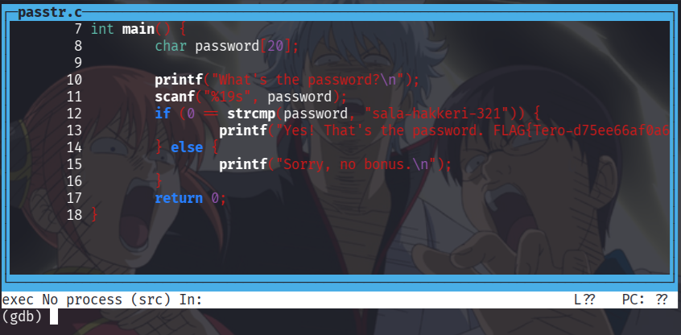

# Se elää!

Tehtävänantoja oli tällä kertaa kahdessa paikkaa vähän eri tavoittein, mutta käyn tässä raportissa nyt alustavasti ensin läpi Teron sivuille merkityt tehtävät ja myöhemmin vielä Moodlen hommia.

## a) Lab1

Tavoite: *Tutkiminen mikä on ohjelmassa vialla ja miten se korjataan. lab1.zip*

1. Kurkataas vähän, että miltä tuo zipistä löytyvä *gdb_example1* oikein näyttää. *File* paljastaa muutamat asiat jotka tekevät käänteismallintamisesta ja muutenkin debuggaamisesta helpompaa:

| Osa | Selitys |
| --- | ------- |
| dynamically linked | Ulkoisia kirjastoja |
| with debug_info | Funktiot, muuttujat yms ovat esillä ja nähtävillä |
| not stripped | Debuggauksen tietoja ei poistettu |


2. Aletaan hommiin ja pyöräytetään binääri *gdb:llä* auki. Laitetaan sorsanäkymä päälle pikanäppäimillä *Ctrl+X+A* niin nähdään luultavasti jo heti, että mitä odottaa.


3. Funktion *print_scrambled* toimivuus näyttää jo heti vähän pahalta, kun toinen funktioon työnnettävistä merkkijonoista on *NULL*. Mutta miten ja miksi? Otetaan pätkä koodia:

```c
void print_scrambled(char *message) // osoitin merkkijonoon
{
    register int i = 3; // aseta muuttujan i arvoksi 3.
    do {
        printf("%c", (*message)+i); // tulosta nykyisen merkin ASCII-arvo + 3.
    } while (*++message); // jatka kunnes merkkijono "loppuu"
    printf("\n");
}
```

Tuollainen osoittelu toimii ainoastaan silloin, kun merkkijono sisältää muistia. Jos yritetään sörkkiä "olematonta muistia" niin C ei tykkää ja ohjelma kaatuu.

| Merkkijono | Sisältö | (*message) + i |
| :--------- | ---- | ---------------- |
| bad_message | NULL | ¯\\_(ツ)_/¯ |
| good_message | "Hello, world." | H + i = 48 + 3 = 4B = K |

4. Onko näin? Kokeillaan! Laitetaan breakpoint *mainiin* ja ajetaan ohjelmaa askel kerrallaan. Komento *info locals* lukee pinoa ja *bad_messagen* muistiarvo on vielä tällä hetkellä roskaa. Kun otetaan askel eteenpäin *stepillä*, niin päästään *mainissa* merkkijonojen alustamiseen. Nyt *bad_messagen* arvo on *0x0 (NULL)* sekä *good_messagen* osoittaa merkkijonoon *"Hello, world."*.


5. Seuraavaksi *mainissa* edetään toiseen funktioon ja merkkijonon muokattuun tulostamiseen. Aikaisemmin jo näkemämme funktio *print_scrambled* nappaa ensin *good_messagen* merkkejä yksitellen ja palauttaa niistä eri versiot muokkaamatta kuitenkaan koskaan itse merkkijonoa. Merkkijonon *"Hello, world."* muistiarvot muuttuvat näin ollen muotoon *"Khoor/#zruog1"*, joka näkyy meillä tulostuksessakin.


6. Kun liikutaan eteenpäin niin veikkaus osoittautuu oikeaksi, sillä ohjelma kaatuu yrittäessään dereferoida pointteria *bad_message*. Tuo *SIGSEGV*, segfault, tai formaalimmin Segmentation fault tarkoittaa virhetilannetta, jossa yritetään käyttää varaamatonta/ulkopuolista muistia. Jos tuo kuulostaa omituiselta, niin sen voi ajatella esimerkiksi tilanteeksi, jossa Finnairin lennon boardingi avataan kutosille ja jonon kärkeen kiirehtii kolmosten ryhmä.


7. Miten tämä sitten korjataan? Muutetaan *bad_message* vaikka lukukelposeksi tai ehkä tehtävän kannalta mielummin tarkistetaan *print_scrambledin* sisällä erikseen, ettei kaatavat merkkijonot pääse looppiin.

```c
void print_scrambled(char *message)
{
    if (!message) { // jos merkkijonon osoitin on NULL
        printf("\n"); // uusi rivi valmiiksi tai joku fiksu ilmoitus
        return; // skipataan koko homma
    }
    register int i = 3;
    do {
        printf("%c", (*message)+i);
    } while (*++message);
    printf("\n");
}
```
8. Totuuden hetki, kokeillaan muutoksia luomalla oma, korjattu versio ohjelmasta. Hyvin näyttää pyörivän, ei kaadu eikä valita.


## b) Lab2

Tavoite: *Selvitä salasana ja lippu + kirjoita raportti siitä miten aukesi. lab2.zip*

1. Navigoidaan hakemistoon ja sieltä näyttää löytyvän kaksi binääriä yhden sijaan. Ensimmäinen näyttää sisältävän *debug_infon*, joten valkataan se.


2. Ajetaan *gdb passtr* ja combotetaan *Ctrl+X+A*.



3. Suljetaan *gdb* exitillä ja mietitään, että ehkä tää on nyt väärä.

4. Uusi yritys, ja tällä kertaa *passtr2o*. Ajetaan ohjelma normaalisti läpi ja testataan miltä se näyttää.


5. Ohjelma kysyy salasanaa ja todennäköisesti sitten vertaa sitä sisäiseen merkkijonoon. Lopuksi ohjelma näyttää kertovan, oliko salasana oikein vai väärin. Kurkataan binääriin uudelleen, mutta tällä kertaa *disassemblataan* ja laitetaan komennolla *layout asm* assemblerinäkymä päälle.


6. Puretaan tämä fiksusti eri osioihin. Laitetaan ohjelma läyntiin *startilla* ja katsotaan ensin, miten asm-näkymässä ilmeilevät *__isoc99_scanf@plt* sekä *printf@plt* toimivat. Breakit pystyyn ja menoks.


7. Katsotaan komennolla *x/s $rdi* että mikä on seuraavan scannin formaatti ja vastaus on *"%19s"*. Tallennetaan seuraavaksi odotettu syöte puskuriin, jotta voimme käyttää sitä myöhemmin.


8. Liikutaan nyt sisälle scanfiin komennolla *si* , palataan mainiin komennolla *finish* ja syötetään tässä vaiheessa meidän merkkijono. Tarkastetaan vielä, että se löytyy puskurista katsomalla *x/s $buf*.


9. Yläbörsään ilmestyi kuitenkin jotain mielenkiintoista, nimittäin funktiossa *mAsdf3a* vertaillaan syötettä johonkin. Liikutaan kaksi steppiitä tuon funktion luokse ja luetaan rekisteristä *$rdi* sekä *$rsi*. Ensimmäinen palauttaa potentiaalisen salasanan, joten kokeillaan sitä!


10. On kyllä yks työmaa kun ei salasana kelpaa. Pitää käydä siis uudestaan kurkkaamassa, että mitä binäärissä tapahtuu ennen tätä kaikkea. En ole myöskään löytänyt "onnistunutta" kohtaa vertailun tulostukselle, joka on vähän kumma juttu. Väärästä salasanasta kyllä ilmoitetaan, joten ehkä tässä olisikin fiksua palata takaisin tuon *mAsdf3a* luokse ja kurkataan sen sisäisiä raksutuksia. Aloitetaan kaikki uudestaan, breakpointti funktioon ja syötteen jälkeen päästään sisään.


11. Nyt selkenee jo huomattavasti. Tässä tapahtuu aika paljon jännää, joten selitetään kaikki auki.

- Paramitrit siirretään talteen, eli %rdi ("anLTj4u8") on nyt %rbp ja %rsi ("Ultraman") on nyt %rbx.
- strlen@plt asettaa merkkijonon pituudet rekistereihin %r12d, %esi ja %edx.
- xor %eax,%eax palauttaa eax arvoksi 0. Tämä on tulevan loopin indeksin alustus.
- cmp %eax,%esi on sama kuin "onko indeksi sama kuin merkkijonon pituus" ja jos on, niin jle heittää ulos.
- movsbl nappaa aina anLTj4u8 ja oman merkkijonon indeksit
- test $0x1, %al selvisi pienen etsinnän jälkeen tekevän AND-binäärioperaation $0x1 ja %al välillä.
- Jos testin tulos on 0 (parillinen) niin hypätään kohtaan, jossa arvoon lisätään 3.
- Jos testin tulos on 1 (pariton) niin arvosta vähennetään 7.

12. Nyt tiedetään, että mitä tuolle aikaisemmin yritetylle salasanalle oikein tapahtuu ja miksi se ei sitä hyväksynyt. Kirjoitetaan c-pätkä, jotka tekee nuo vastaavat muutokset salasanaan.

```c
#include <stdio.h>
#include <string.h>

int main()
{
    const char vanha[] = "anLTj4u8";
    char salasana[sizeof(vanha)];
    int c;

    for (int i = 0; i < strlen(vanha); i++) {
        c = (char)vanha[i];
        
        if (i % 2 == 0) {
            c = c + 3;
        }
        else {
            c = c - 7;
        }
        
        salasana[i] = (char)c;
    }
    
    puts(salasana);
    return 0;
}
```


13. Kokeillaan tuota tulostusta ja vihdoinkin mysteeri on ratkaistu!


## c) Lab3

Tavoite: *Kokeile Nora Crackmes harjoituksia tehtävä 3 ja 4 ja loput vapaaehtoisia.*

## d) Vapaaehtoinen: Lab4

Tavoite: *Crackmes.one harjoitus. Saatko salasanan selville?*

## Lähteet:
- Karvinen, T. https://terokarvinen.com/sovellusten-hakkerointi/#h5-se-elaa-lari
- Tindall, L. GitHub. https://github.com/NoraCodes/crackmes
- Cloutier, F. TEST Logical Compare. https://www.felixcloutier.com/x86/test

