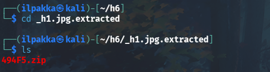

# Sulautetut järjestelmät

## Lab0

Tavoite: *Tutki tiedostoa h1.jpg jo opituilla työkaluilla. Mitä saat selville?*

1. Aloitetaan perinteisellä *filellä* ja etsitään kuvasta myös jotain merkkijonoja *stringsillä*. Ilman rajoja tulostus oli aikamoista soppaa, joten puhdistetaan sitä hieman.

2. Jännältä näyttää, joten kartoitetaan vähän laajemmin vielä *stringsillä*.

2. *Strings* paljasti mielenkiintoisia, muun muassa .xml-päätteisiä merkkijonoja. Näitten löytöjen perusteella tiedämme, että tämän tiedoston sisältä löytyy .docx-tiedosto. Mutta miten? Tuollainen .docx-tiedosto, tai tässä tapauksessa tarkennetummin OpenXML-tiedosto on yksinkertaisesti zipattu täyteen erilaisia .xml-tiedostoja, jotka vastaavat Wordin tekstin esittämisestä oikeassa muodossaan. Alla taulukossa selitettynä näitä tiedostoja hieman enemmän auki:

| Tiedosto | Selitys |
| -------- | ------- |
| [Content_Types].xml | Määrittelee koko paketin sisällön |
| word/document.xml | Tekstisisältö |
| word/_rels/document.xml.rels | Rels eli viittaukset: kuvat, hyperlinkit yms |
| word/theme/theme1.xml | Teema: värit ja fontit
| docProps/core.xml | Metatiedot: tekijä, päivämäärät yms |

3. Emme pelkästään näillä työkaluilla lähde yrittämään päästä sisältöön kiinni, joten jatketaan siis seuraavaan tehtävään!

## Lab1

Tavoite: *Tutki tiedostoa h1.jpg binwalk (Versio 2.x tai 3.x huom toimivat eri tavalla), mitä tietoja löydät nyt tiedostosta. Mitä työkalua käyttäisit tiedostojen erottamiseen?*

1. Käyttöön otetaan tällä kertaa Binwalk v2.4.3. Tämän kuten muidenkin 2.x versioiden EOL lähenee nyt joulukuussa 2025, mutta ei anneta sen haittaa. Kokeillaan, että mitä yksinkertainen *binwalk h1.jpg* näyttää meille.

2. Ulostulo kertookin meille jo saman, eli zipattua dataa näyttää olevan sisällä. Voimme napata nämä pakatut tiedostot komennolla *binwalk -e*, jossa *-e* tai *--extract* poimii automaattisesti kaikki tunnetut tyypit ulos. Voimme myös tällä kertaa jättää loppuun tulostetun varoituksen huomioimatta.

3. Meillä pitäisi nyt olla luotuna uusi hakemisto, jonne tiedostosta napattu zippi tallennettiin.

4. Lähetään purkaa zippia komennolla *unzip 494F5.zip*, mutta se herjaa puutteellista pakkausta. Varmistaan vielä *filellä*, että kyseessä on tosiaan Wordiä. Muodollisuuden vuoksi vaihetaan tuo tiedostopääte myös *.docxiin*.

5. Unzippi ei edelleenkään toimi, joten kokeillaan samaa toisella työkalulla nimeltä *7z*. Komento *7z l 494F5.docx* menee läpi ja se tulostaa meille listaa sisällöstä. Poimitaan ne ulos komennolla *7z x 494F5.docx -opoiminto*, jossa *poiminto* on nimi uudelle kohdehakemistolle. Miksi *7z* toimi, mutta *Unzip* ei? Tämä johtuu lähtökohtaisesti siitä, että *7z* osaa lukea otsakkeet vaikka pakkauksen EOCD (End-of-Central-Directory, tai ehkä selkeämmin "pakkauksen järjestyskartta") puuttuu tai olisi osittain vajaa.

6. Kurkataan tuonne uuteen hakemistoon ja näyttäisi siltä, että extracti onnistui. Liikutaan vielä *wordin* hakemistoon katsomaan, että mitä erilaisia tiedostoja sieltä löytyykään.

7. Kuten aikaisemmassa taulukossa kerroinkin, *document.xml* sisältää tekstiä. Miltä mahtaa tämän sisältö tällä hetkellä näyttää? Aika cool!

## Lab2

Tavoite: *Lataa listalta itsellesi mielenkiintoisin applikaatio ja käytä työkaluja tutustuaksesi miten APK:n voi avata.*

1. Listaa selaillessa huomion kiinnitti itselleni entuudestaan tuttu RetroArch, jolla on jo useammat Draculan linnat vyörytetty läpi. Git clone koko homma ja odotetaan, että lataus on valmis.

2. Tässä vaiheessa on hyvä muistaa, että APK ei tosiaan löydy näin vaan se pitää erikseen päästä lataamaan omasta valikostaan. GitHubissa ei ollut tuolle vaihtoehtoa, mutta onneksi RetroArchin omilta sivuilta voi tehtävään tarvittavan .apk-tiedoston ladata.

3. Mitäs työkaluja tämmöisen APK:n avaamiseen sitten oikein löytyy? Moodlessa oli mainittuna muun muassa JADX, joten käydään nappaamassa se meille myös tutustutaan sen toimintaan ajamalla graafinen versio komennolla *./jadx-gui*.

4. Laitetaan tuo RetroArchin tiedosto sisään ja näytölle pomppaa kaikkea uutta. JADX antaa meille mahdollisuuden selailla puhdasta XML:ää, joten otetaan täysin satunnaisesti esille vaikka *MainMenuActivity*. 

## Vapaaehtoinen Lab3

Tavoite: *Tutustu ESP32 projekteihin ja valitse niistä itsellesi mielenkiintoisin projekti ja tutki miten saat avattua ESP32 binäärin?*

## Lähteet
- What is OOXML? Office XML Open. 2012. http://officeopenxml.com
- ReFirmLabs. 2025. *binwalk*. https://github.com/ReFirmLabs/binwalk
- offa. 2025. *Android-foss*. https://github.com/offa/android-foss
- libretro. 2025. *RetroArch*. https://github.com/libretro/RetroArch
- skylot. 2025. *jadx*. https://github.com/skylot/jadx
- agucova. 2022. *awesome-esp*. https://github.com/agucova/awesome-esp