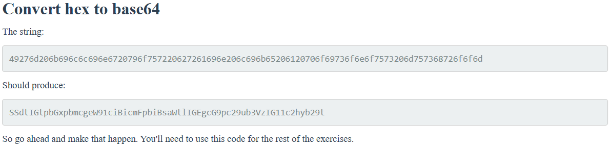
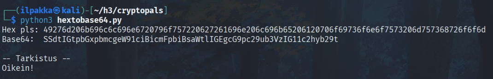
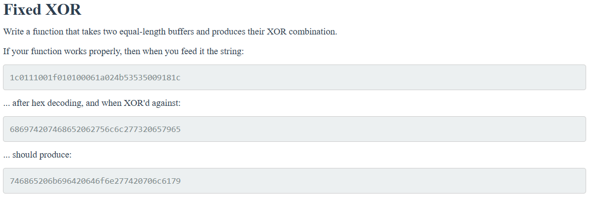
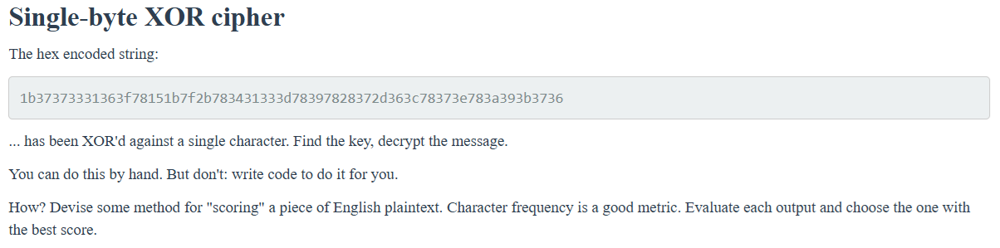
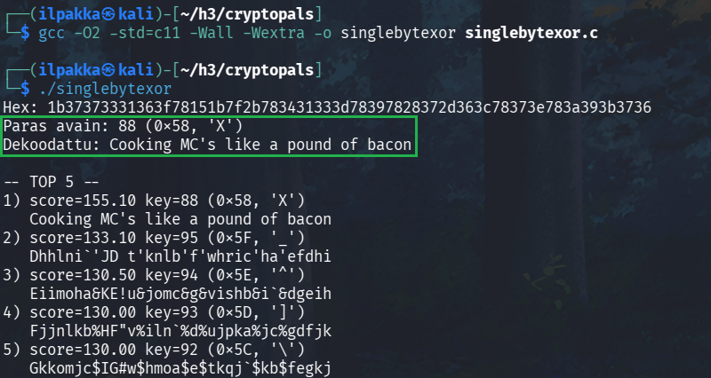
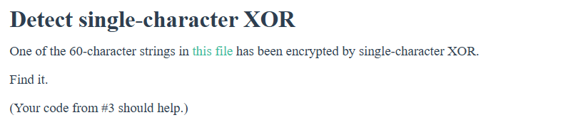
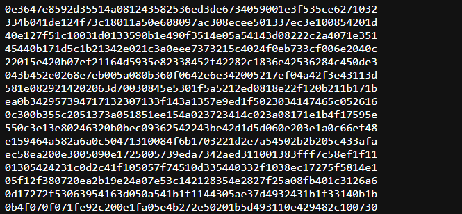
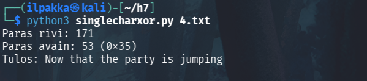

# Uhagre2

CryptoPals-tehtävät oli ratkaistu jo h3-kotiläksyissä, mutta olen ne laittanut tänne samassa muodossa mukaan.

## x) Tiivistä

Python on ihan kätevä työkalu, nimittäin sillä voi nopeuttaa omaa tehokkuutta erilaisissa tehtävissä. Karvinen ottaa monia hakkerointiin liittyviä esimerkkejä ja esittelee työkalujen monipuolisuutta. Salausten purkaminen, merkkijonojen käsittely ja hallinta, silmukat ja xorraus käy kätevästi käyttäessä pythonia. Cryptopalsin haasteita suositellaan ratkaistavaksi pythonilla ja osassa olin itsekin näin tehnyt.

Schneierin kirja löytyi maksuttomana ja se sisälsikin paljon kaikkea mielenkiintoista luettavaa, johon pitää itse vielä näiden tehtävien jälkeen palata takaisin. Simple XOR -osiossa puhutaan siitä, kuinka XOR-algoritmi mukailee Vigenèren salausta ja kuinka helposti ohjelmistojen pantentoidut, supernopeat algoritmit ovat vain variaatio kirjassa näytetystä esimerkistä. Suurien lukujen kohdalla on mielenkiintoinen taulukko erilaisista approksimaatioista muun muassa planeettamme atomien määrään tai vuosista seuraavaan jääkauteen, kuten myös todennäköisyydestä napata Yhdysvaltain lottovoitto.

## a) Convert hex to base64

Sääntö: *Always operate on raw bytes, never on encoded strings. Only use hex and base64 for pretty-printing.*

1. Tehtävänä on kirjoittaa ohjelma, joka muuttaa hex-merkkijonon *49276d206b696c6c696e6720796f757220627261696e206c696b65206120706f69736f6e6f7573206d757368726f6f6d* base64-muotoon *SSdtIGtpbGxpbmcgeW91ciBicmFpbiBsaWtlIGEgcG9pc29ub3VzIG11c2hyb29t*. Tähän soveltuu kätevimmin python. Kovakoodataan myös tehtävän merkkijonot, jotta voidaan ajaa yksinkertainen vertailu vielä loppuun niin ei mene mahdolliset virheet niin helposti huolimattomuuden piikkiin.



```python
import base64

challenge_hex = "49276d206b696c6c696e6720796f757220627261696e206c696b65206120706f69736f6e6f7573206d757368726f6f6d"
challenge_base64 = "SSdtIGtpbGxpbmcgeW91ciBicmFpbiBsaWtlIGEgcG9pc29ub3VzIG11c2hyb29t"

hex = input("Hex pls: ")
base64 = base64.b64encode(bytes.fromhex(hex)).decode('utf-8')
print("Base64: ", base64)

print("\n-- Tarkistus --")
if hex == challenge_hex and base64 == challenge_base64:
    print("Oikein!")
else:
    print("Väärin!")
```

2. Ajetaan skripti ja näyttäisi olevan ihan toimiva!



## b) Fixed XOR

1. Tehtävänä on kirjoittaa funktio, joka tuottaa kahden yhtä pitkän bufferin XOR-yhdistelmän.



2. Otetaan aikaisempi pythonkoodi ja muokataan sitä hieman vastaamaan tehtävänannon tavoitetta.

```python
challenge_hex_1 = "1c0111001f010100061a024b53535009181c"
challenge_hex_2 = "686974207468652062756c6c277320657965"
challenge_result = "746865206b696420646f6e277420706c6179"

hex_1 = input("Hex 1 pls: ")
hex_2 = input("Hex 2 pls: ")

def xor(buffer_1, buffer_2):
    return bytes(a ^ b for a, b in zip(buffer_1, buffer_2))

bytes_1 = bytes.fromhex(hex_1)
bytes_2 = bytes.fromhex(hex_2)
result = xor(bytes_1, bytes_2).hex()

print("XOR: ", result)

print("\n-- Kovakoodin Tarkistus --")
if hex_1 == challenge_hex_1 and hex_2 == challenge_hex_2 and result == challenge_result:
    print("Oikein!")
else:
    print("Väärin!")
```

3. Ajetaan skipti ja syötetään tehtävänannon esimerkit. Tulostus on sama ja tämä on taas kerran vahvistettu kovakoodatulla testillä.


## c) Single-byte XOR cipher

Tavoite: *Löydä avain joka purkaa viestin. Älä tee käsin vaan kirjoita skripti!*



1. Ihan mielenkiinnosta ja itseni haastamisen vuoksi haluan lähteä ratkomaan seuraavia tehtäviä puhtaasti C:llä. Tämä vaatii vähän tutkimista ja harjoittelua, joten palataan pienen tauon jälkeen!

2. Vuorokauden pähkäilyn ja koodilainaamisen jälkeen saatiin sellainen koodi kasaan, joka näyttäisi toimivan. Sitä olisi varmasti voinut muovata vähän fiksumpaankin suuntaan, mutta itselleni riittää tähän hätään tuon merkkijonon tulostuminen.



## d) Detect single-character XOR

Tavoite: *Löydä annetusta tiedostosta 60-merkin pituinen merkkijono, joka on salattu yhden merkin xorrilla.*



1. Muokataan aikaisempaa c-koodia viemällä se vähän yksinkertaisempaan pythoniin. Tarkoitus on lukea tiedoston merkkijonoja, arvioida niitä ja lopulta tulostaa paras vaihtoehto. Tehtävä on ratkaistu todennäköisesti sitten, kun löydetään tarpeeksi selkeää englantia sisältävä merkkijono.



2. Pienten muutosten jälkeen pythoni lukee ja rankkaa merkkijonoja oikein. Katsotaan löytääkö se tuosta ladattavasta tiedostosta oikeaa vastausta? No näyttäisi siltä, että kyllä!



## Lähteet
- Schneier 2015: Applied Cryptography, 20ed. https://agorism.dev/book/crypto/Schneier%2C%20Bruce%20-%20Applied%20Cryptography_%20Protocols%2C%20Algorithms%20and%20Source%20Code%20in%20C%20%282015%2C%20Wiley%29.pdf
- Tero Karvinen. Sovellusten hakkerointi. https://terokarvinen.com/sovellusten-hakkerointi/
- Tero Karvinen. Python Basics for Hackers. https://terokarvinen.com/python-for-hackers/
- The Cryptopals Crypto Challenges. https://www.cryptopals.com/sets/1
