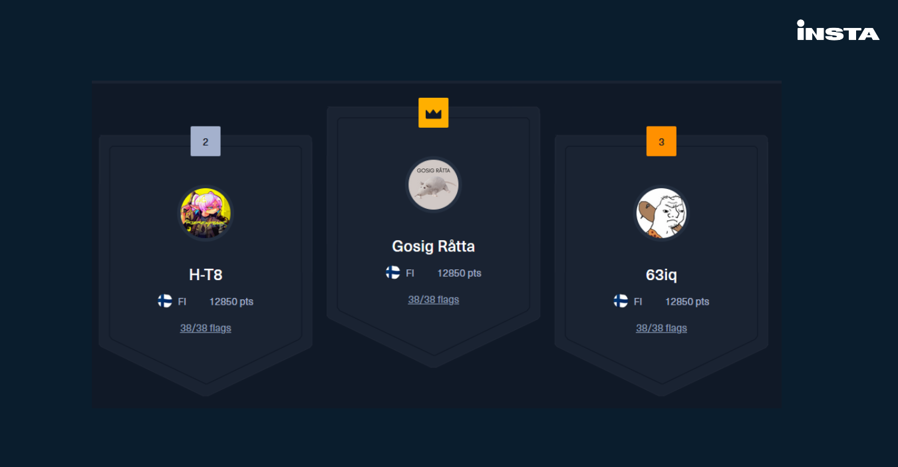
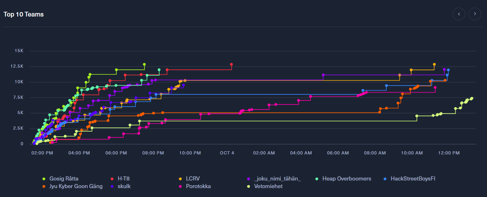

# Bonus

## a) Vapaaehtoiset tehtävät

Taulukosta löytyvät kaikki tämän kurssin aikana tehdyt vapaaehtoiset tehtävät:

| Osio | Tehtävä | Linkki |
| ---- | -------- | ------ |
| h2 | g | [linkki](https://github.com/ilpakka/linuxlax/blob/main/sovellushax/h2/h2raportti.md#g-portswigger-part-1) |
| h2 | h | [linkki](https://github.com/ilpakka/linuxlax/blob/main/sovellushax/h2/h2raportti.md#h-portswigger-part-2) |
| h3 | d1 | [linkki](https://github.com/ilpakka/linuxlax/blob/main/sovellushax/h3/h3.md#1-convert-hex-to-base64) |
| h3 | d1 | [linkki](https://github.com/ilpakka/linuxlax/blob/main/sovellushax/h3/h3.md#2-fixed-xor) |
| h3 | d1 | [linkki](https://github.com/ilpakka/linuxlax/blob/main/sovellushax/h3/h3.md#3-single-byte-xor-cipher) |
| h4 | g | [linkki](https://github.com/ilpakka/linuxlax/blob/main/sovellushax/h4/ghidra.md#g-vapaaehtoinen-ja-sen-yli) |
| h4 | h | [linkki](https://github.com/ilpakka/linuxlax/blob/main/sovellushax/h4/ghidra.md#h-vapaaehtoinen-pyyt%C3%A4m%C3%A4tt%C3%A4kin) |
| h4 | i | [linkki](https://github.com/ilpakka/linuxlax/blob/main/sovellushax/h4/ghidra.md#i-vapaaehtoinen-a-ray) |

## b) Parannetut tehtävät

Tehtävissä on saatettu korjata kieliopillisiä virheitä tai formatoinnin selkeyttä. Ristiinarvioinnissa esitetyt ehtoukset on otettu myös huomioon, mutta tehtävät ovat lähtökohtaisesti jätetty koskemattomiksi palautuksen jälkeen.

## c) Kurssin ulkopuolinen menestys

Osallistuttiin kutsusta muutama päivä sitten Insta Intrudersin järjestämään CTF-kisaan johtamallani H-T8:n kisatiimillä. Sijoituimme ansaitulle hopealle ja kolmanneksi tulikin toinen H-T8:n edustama joukkue. Erityisen kovaa saimme taistella viimeiseksi jääneestä RFID-tehtävän ratkaisusta, jonka itse lopulta aamuyön tunneilla palautin niin pääsimme kaikki vihdoin nukkumaan. H-T8 on menestynyt myös muissa kisoissa erinomaisin tuloksin, mutta minulta löytyy myös tuloksia yksinkisoista.

