# h1 Sniff

## x) Lue ja tiivistä

1. Wiresharkin perusteet ja verkkoliittymien nimet käydään aika pikaisesti läpi, mutta niistä saa tarpeeksi pohjatietoa kotitehtävien haasteiden kohtaamiseen. Linuxin peruskomentojen tulee toki olla jo hallussa.

2. Verkkoliittymät voivat olla fyysisiä tai virtuaalisia.

3. Esimerkki *enp1s0* rakenteesta:

| Tunniste | Nimitys | Selitys |
| :------- | ------- | ------- |
| en | Ethernet | Perinteinen kaapeliverkko |
| p1 | PCI-väylän portti | Portti (1), eli missä laite on kiinni |
| s0 | Sub-portti | Portti (0), eli missä kohti PCI-väylää on tarkalleen pysäköity |

## a) Linux
Tavoite: *Asenna Debian tai Kali Linux virtuaalikoneeseen.*

1. Kali Linux löytyykin jo asennettuna, joten varmistetaan vielä, että kaikki toimii!

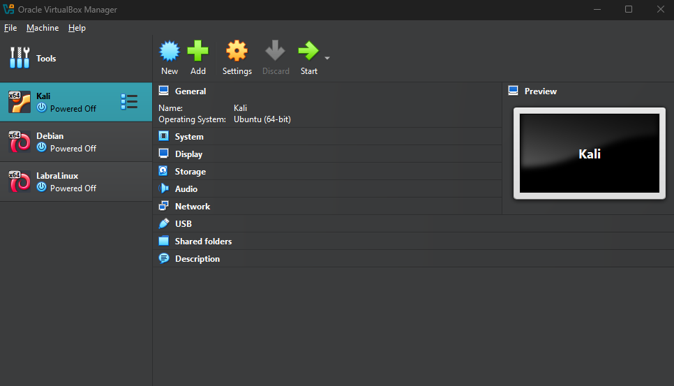

2. Tulostus toimii ja virtuaalikone näyttää pyörivän. Mennään seuraaviin tehtäviin.

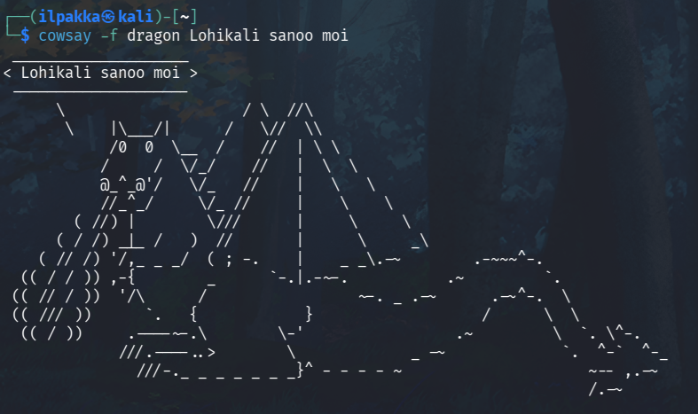

## b) Ei voi kalastaa
Tavoite: *Osoita, että pystyt katkaisemaan ja palauttamaan virtuaalikoneen Internet-yhteyden.*

1. Testataan ensin yhteyttä kaivamalla Teron kotisivuja. Kysely palauttaa IP-osoitteen, joten yhteys pelaa.

2. Virtuaalikoneen Internet-yhteyden voi sulkea monella eri tapaa, mutta yksinkertaisin vaihtoehto (Kalilla) on viedä hiiri Ethernet-kuvakkeen luokse ja napauttaa yhteys katki.

3. Tämän jälkeen aikaisempi kaivamiskomento ei tuotakaan enää muuta tulosta kuin virheilmoituksia.

4. Internet-yhteyden saa takaisin päälle samasta kohtaa kuin se suljettiin. Testataan ja onneksi näyttää toimivan!

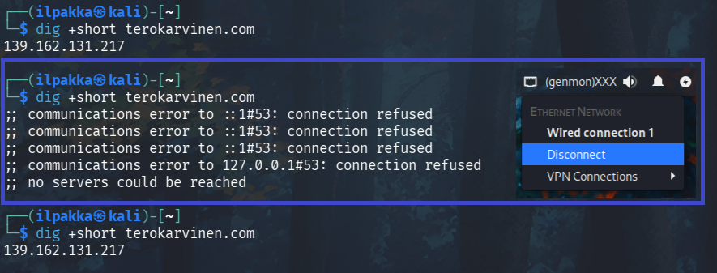

## c) Wireshark
Tavoite: *Asenna Wireshark. Sieppaa liikennettä Wiresharkilla.*

1. Useimmissa Kali Linuxin asennuksissa tulee Wireshark jo valmiiksi mukana, mutta käydään tämä osio läpi ihan muodollisuuden vuoksi. Wireshark löytyy valmiiksi asennetuissa Kaleissa navigoimalla sovelluslistassa *09 - Discovery -> Wireshark*. Kyllä, sen saa auki myös suoraan komentorivillä.

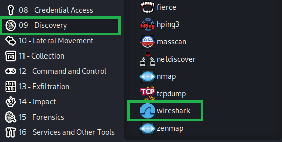

2. Liikenteen sieppaamisen voi aloittaa klikkaamalla joko sinistä evää tai näppäinyhdistelmällä *Ctrl+E*.

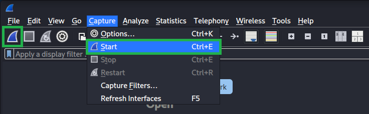

3. Liikennettä näyttää olevan runsaasti vaikka mitään ei tekisikään. Surffataan Tero Karvisen kotisivuille ja tarkastellaan siepattua liikennettä sen jälkeen uudestaan.

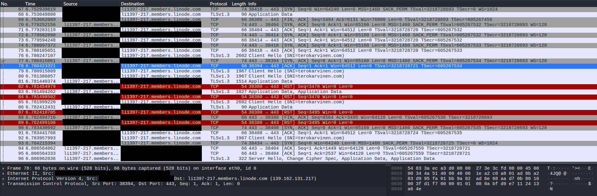

## d) Oikeesti TCP/IP
Tavoite: *Osoita TCP/IP-mallin neljä kerrosta yhdestä siepatusta paketista.*

1. Äsken siepatusta liikenteestä kannattaa valita sellainen paketti, joka sisältää myös sovelluskerroksen tietoja. Otetaan omaan esimerkkiin paketti nro. 79.

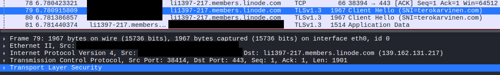

2. Tarkastellaan seuraavaksi TCP/IP-mallin neljä kerrosta:

**Peruskerros / Link Layer**

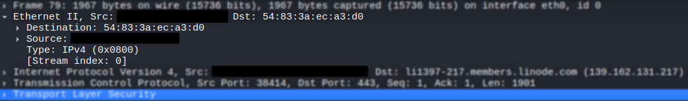

- Verkkoarkkitehtuurin kellari, jossa paketit liikkuvat saman lähiverkon laitteiden välillä.
- Fyysisessä verkossa kehykset ohjautuvat MAC-osoitteiden perusteella.

**Verkkokerros / Internet Layer**

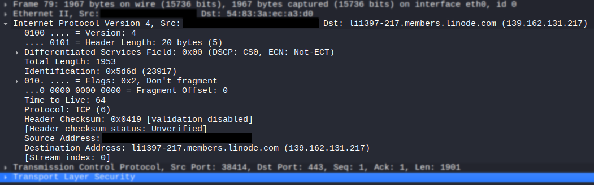

- Liikenne kulkee reitittimien kautta eri laitteille IP-osoitteiden avulla.
- Vastuussa paketin pääsemisestä perille.

**Kuljetuskerros / Transport Layer**

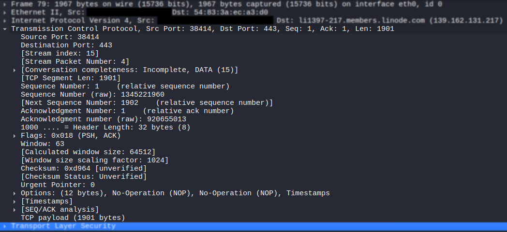

- Liikenne ohjautuu oikealle sovellukselle TCP- tai UDP-porttien kautta.
- Varsinainen tiedonsiirto luodun yhteyden välillä.

**Sovelluskerros / Application Layer**

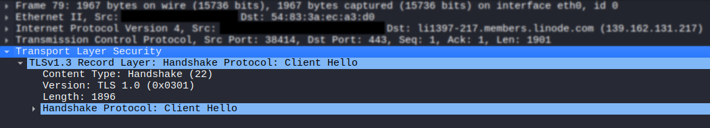

- Määrittelee miten tieto tulee esittää kunkin sovelluksen kanssa.
- Esitykseen käytettäviä protokollia ovat muun muassa HTTPS, IRC ja SSH.

## e) Mitäs tuli surffattua? 
Tavoite: *Avaa surfing-secure.pcap. Tutustu siihen pintapuolisesti ja kuvaile, millainen kaappaus on kyseessä.*

1. Hyvä tapa saada pintapuolinen käsitys kaappauksesta on kurkata mitä tiedoston ominaisuuksista löytyy. *Statistics -> File Capture Properties* tai näppäinyhdistelmällä *Ctrl+Alt+Shift+C* tulee esiin paljon infoa.

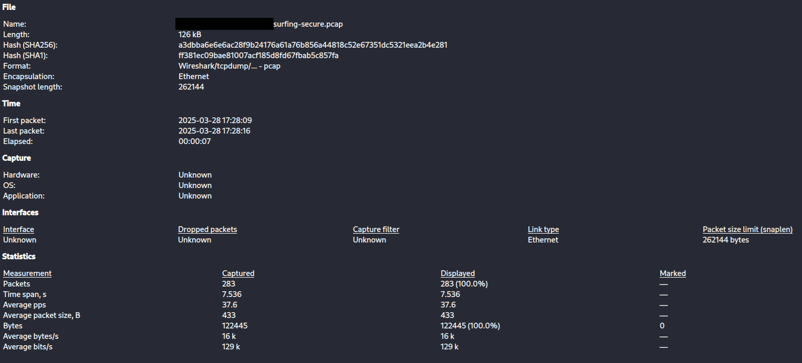

2. Näyttäisi olevan aika lyhyt istunto. Yhteensä kaappaus sisältää 283 pakettia ja sen kesto on 7,536 sekuntia. Mitäs seuraavaksi?

3. Protokolleja on useampi: ARP, DNS, QUIC, TCP, TLSv1.2 ja TLSv1.3.

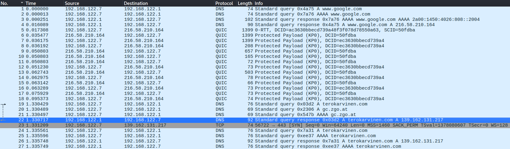

4. Nopeasti tämä ainakin näyttää siltä, että käyttäjän aloittaessa istuntoa on selaimen aloitussivuna avautunut Googlen hakukenttä (QUIC), jonka jälkeen DNS-kysely Tero Karvisen kotisivuille viittaa varsinaiseen selailun aloittamiseen.

## f) Selain (Vapaaehtoinen)
Tavoite: *Mitä selainta käyttäjä käyttää?*

1. Tiedoston sisältämä liikenne on salattua, joten selaimen löytäminen ei olekaan ihan niin yksinkertaista. Normaalisti selaimen tiedot näkyy *User-Agent* -kohdassa osana viestintää.

2. Tässä tehtävässä on todennäköisesti tarkoitus löytää sellainen paketti tai toiminto, joka sisältää tarpeeksi tietoa selaimen selvittämikseksi. Yksi mahdollinen tapa on nimeltään **TLS-fingerprinting**.

3. Käydään kurkkaamassa, että mitä tietoja esimerkiksi liikenteen ensimmäinen TLS:n *Client Hello* -paketti sisältää.

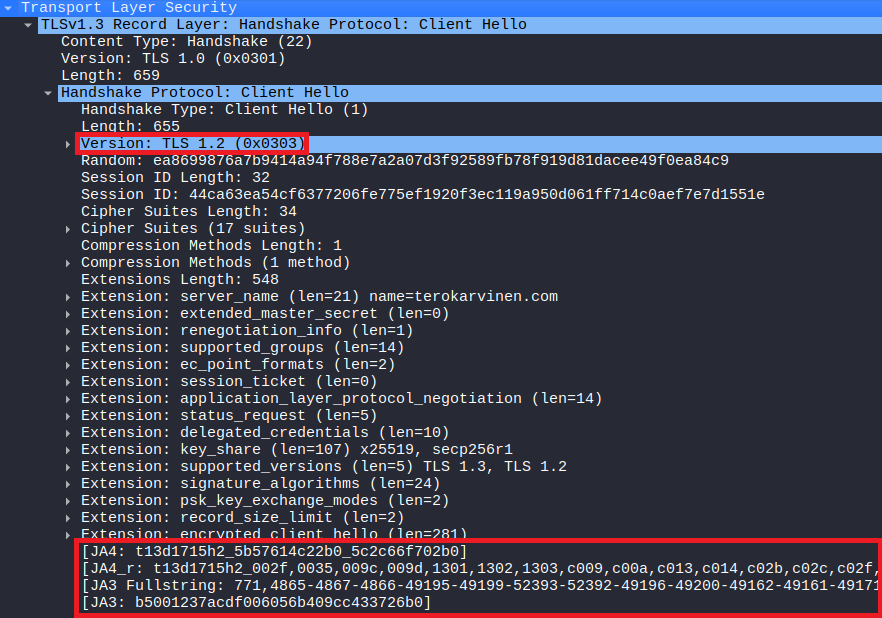

4. TLS-fingerprinting, tai "sormenjälkitunnistus" on tapahtumaketju, jota seuraamalla ja hyödyntämällä voimme selvittää salaisen TLS-liikenteen viestintään käytettyjä laitteita. Yksi näistä laitteista on esimerkiksi yhdistävän käyttäjän selain.

5. Yllä oleva kuva sisältääkin runsaasti perinteiseen TLS-fingerprintingiin tarvittavia tietoja, kuten tuettujen salausmenetelmien (Cipher Suites) ja laajennusten (Extensions) lähetysjärjestystä. Myös alimpana näkyvät JA3 sekä myös modernimpi JA4 antavat mahdollisuuden tunnistaa käyttäjän selaimen välittömästi. Mietitään kuitenkin ensin, että mitä voimme päätellä salausmenetelmistä sekä laajennuksista.

6. Cipher Suites on lista, joka sisältää kaikki kyseiselle TLS-yhteydelle tarjotut salausmenetelmät. Jokainen selain käyttää ja lähettää (lue: listaa) näitä salausmenetelmiä hieman erilaisin tavoin.

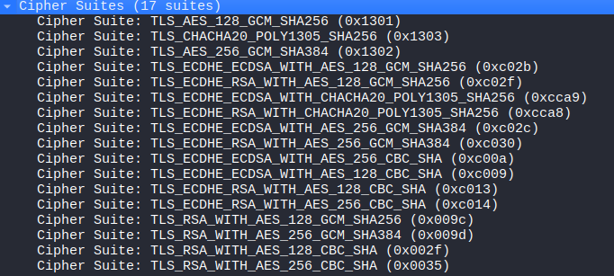

7. Kuvassa näkyykin 17 erilaisen salausmenetelmän lista, jota vertailemalla esimerkiksi Chromium -pohjaisten selainten tyypilliseen järjestykseen huomaa *GREASE*-arvojen puutteen. GREASE, eli Generate Random Extension And Sustain Extensibility, on Googlen kehittämä tapa lisätä satunnaisia arvoja TLS-salaukseen. Tässä tapauksessa se kuitenkin viittaa vahvasti siihen, että käytössä on ollut muu kuin Chromium-selain, mutta mikä?

8. Paketista löytyvä JA3-arvo kiteyttää TLS-tietoja yhteen. Modernimpi JA4 sisältää vielä enemmän TLS-tietoja, jonka ansiosta satunnaiset tiedot eivät enää voineet tuottaa samaa hashia, joka oli JA3:n suurin heikkous.

9. Näistä JA3-arvoista on ehditty kerätä aika laajaa tietokantaa ja niitä voi käydä testailemassa esimerkiksi ja3.zone -sivuilla:

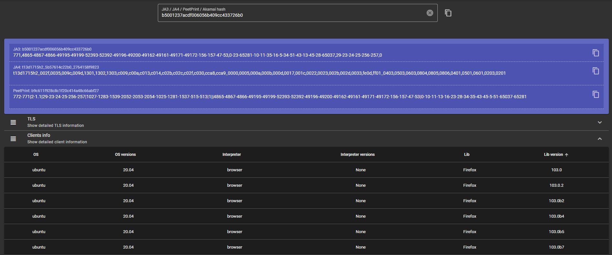

10. Tietokannan tuloksien perusteella kyseessä on todennäköisimmin Ubuntulla ajettu Firefox eri versioineen. Tuloksista löytyi myös muutama poikkeus, mutta ne ovat näillä tiedoin luultavasti vain virheitä. Eiköhän tämä tehtävä ole siis tältä osin selvitettynä.

## g) Verkkokortti
Tavoite: *Minkä merkkinen verkkokortti käyttäjällä on?*

1. Verkkokortin tiedot piilevät tässäkin tapauksessa peruskerroksen sisällä, joten käydään kurkkaamassa Ethernet II-osion tietoja.

2. Valitaan käyttäjän frame ja hyvällä tuurilla Wireshark osaa suoraan kertoa valmistajan nimen MAC-osoitteen OUI:n (Organizationally unique identifier, eli valmistajatunniste) perusteella .

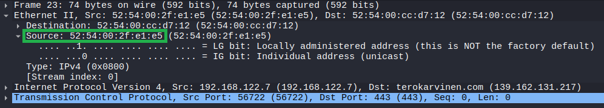

3. Näyttää tällä kertaa siltä, että Wireshark ei automaattisesti tunnista verkkokortin valmistajaa tai mallia. Tähän on muutama yksinkertainen ratkaisu, joista yksi on kurkata yleistä OUI-listaa ja etsiä tunnistetta sitä kautta.

4. Wiresharkin ja DNS Checkerin webbityökalut näyttivät molemmat tyhjää *52:54:00* -alkuiselle tunnisteelle. Myös IEEE:n oma "virallisempi" lista ei uskalla luvata mitään.

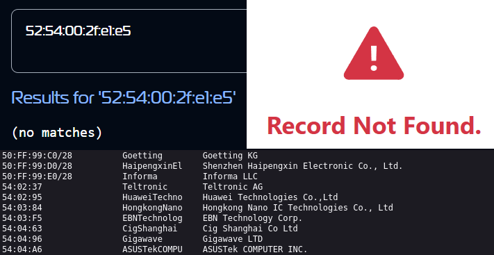

5. Mitäs nyt, luovutetaanko ja siirrytään seuraavaan tehtävään? Liian helppoa, joten muutetaan vain tulokulmaa! Koska tunnistetta ei löydy listoista, niin se on todennäköisesti joko tarkoituksella piilossa tai se on osa virtuaaliympäristöä.

6. Lyhyt sukellus tuotti tulosta, sillä tunniste löytyi osana QEMU/KVM -virtuaaliympäristöä. Kyseessä on siis fyysisen verkkokortin sijaan virtuaalinen verkkokortti.

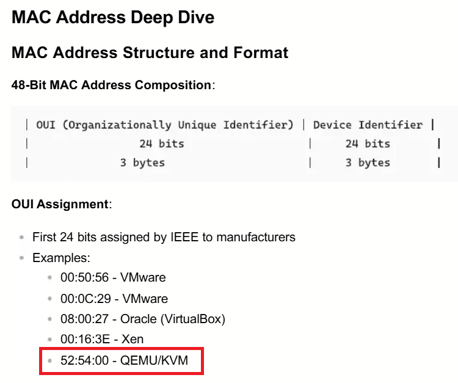

7. Pikainen avointen tietolähteiden hyödyntäminen osoitti myös todennäköisimmäksi vaihtoehdoksi **virt-managerin kautta pyörivän QEMU:n**.

## h) Weppipalvelin
Tavoite: *Millä weppipalvelimella käyttäjä on surffaillut?*

1. Tämä onnistuu kätevästi filtteröimällä liikennettä *dns* mukaan.

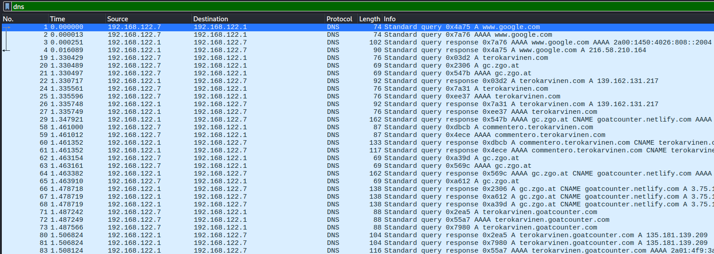

2. Weppipalvelimiksi paljastuivat DNS-kyselyistä google.com, terokarvinen.com ja goatcounter.netlify.com. Kaksi ensimmäistä ovat selkeämpiä ja goatcounter lähinnä vain pitää kirjaa Tero Karvisen kotisivun kävijämääristä.

## i) Analyysi
Tavoite: *Sieppaa pieni määrä omaa liikennettäsi. Analysoi se, eli selitä mahdollisimman perusteellisesti, mitä tapahtuu.*

1. Kävin sieppaamassa vähän tuoreempaa liikennettä. Rajasin tämän esimerkin pakettien 14 sekä 23 välille.

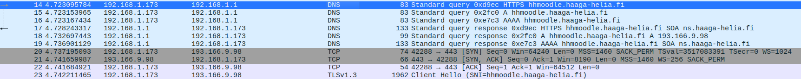

2. Meillä näkyy heti ensimmäisenä 6 DNS-viestiä, joista tietenkin 3 on kyselyä ja 3 vastauksia. Ensimmäinen DNS-pari muodostuu pakettien 14 ja 17 välille, jossa siirtymällä Haaga-Helian Moodleen liikenne näyttää HTTPS-kyselyn sekä HTTPS-vastauksen.

3. Loput parit käyvät läpi muut sieppauksen DNS-tyypit, kuten A (15,18) ja AAAA (16,19).

4. Seuraavaksi paketista 20 alkava TCP-yhteys merkitsee kättelyn aloittamista. Kolmitiekättelynä tunnettu seuraava osio koostuu kolmesta paketista:

| Paketti | Sisältö | Selitys |
| :------ | :------ | ------- |
| 20 | 42288 -> 443 \[SYN\] | Laite pyytää yhteyttä palvelimen porttiin 443 |
| 21 | 443 -> 42288 \[SYN, ACK\] | Palvelin vastaa yhteyteen myönteisesti |
| 22 | 42288 -> 443 \[ACK\] | Laite ilmoittaa palvelimelle, että on saanut paketin vastaan |

5. Lopulta paketin 23 kohdalla alkaa HTTPS-yhteys TLS-salauksella, eli varsinainen surffaus Haaga-Helian Moodlessa on nyt alkanut.

## Lähteet
- Tero Karvinen 2025. Verkkoon tunkeutuminen ja tiedustelu. Luettavissa: https://terokarvinen.com/verkkoon-tunkeutuminen-ja-tiedustelu
- Tero Karvinen 2025. Wireshark - Getting Started. Luettavissa: https://terokarvinen.com/wireshark-getting-started/
- Tero Karvinen 2025. Network Interface Names on Linux. Luettavissa: https://terokarvinen.com/network-interface-linux/
- ScrapFly 2025. How TLS Fingerprint is Used to Block Web Scrapers? Luettavissa: https://scrapfly.io/blog/posts/how-to-avoid-web-scraping-blocking-tls
- JA3.ZONE. TLS Fingerprint Database. https://ja3.zone/
- Scribd 2025. Complete OSI Model Protocol Classification Course - Deep Dive Edition. Luettavissa: https://www.scribd.com/document/922724995/Complete-OSI-Model-Protocol-Classification-Course-Deep-Dive-Edition