# h2 Halloween Special

## x) Lue ja vastaa.
Tavoite: *Selitä tuskan pyramidin idea 1-2 virkkeellä.*
Tavoite: *Selitä timanttimallin (Diamond Model) idea 1-2 virkkeellä.*

1. Biancon artikkelista löytyvä Pyramid of Pain kuvaa erilaisia hyökkäysindikaattoreita. Ne luokitellaan pyramidin asteille sen mukaan, kuinka paljon niiden tunnistaminen puolustajana aiheuttaa haittaa hyökkääjälle.

2. Timanttimallille antaa itse kirjoittaja yksinkertaisimmaksi selitykseksi sen kuvastavan *hyökkääjän* *kyvykkyyttä* iskeä *uhriin* jonkin tietyn *infrastruktuurin* kautta. Näistä hyökkäystapahtumista on mahdollista sitten luoda ketju, joka luo paremman kuvan tarvittavasta puolustusstrategiasta. Timanttimallin nimi perustuu näiden neljän osion (hyökkääjä, uhri, infrastruktuuri ja kyvykkyys) vuorovaikutusten kuvioon.

## a) Apache log. 
Tavoite: *Asenna Apache-weppipalvelin paikalliselle virtuaalikoneellesi. Surffaa palvelimellesi salaamattomalla HTTP-yhteydellä, http://localhost . Etsi omaa sivulataustasi vastaava lokirivi. Analysoi yksi tällainen lokirivi, eli selitä sen kaikki kohdat.*

1. Apache pitäisi ennestään löytyä, mutta tarkistetaan vielä.

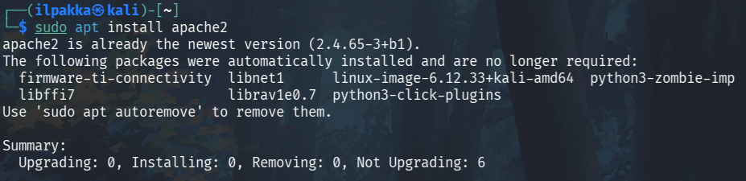

2. Surffailu ei heti alkuun onnistunutkaan kun Apachen tila oli kytketty pois päältä. Käynnistettiin se komennolla *sudo systemctl restart apache2* ja kurkattiin vielä varmistamaan, että aikaisemmat konffaukset ei aiheuta tässä tehtävässä mitään ongelmia.

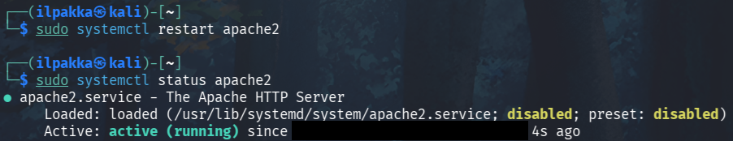

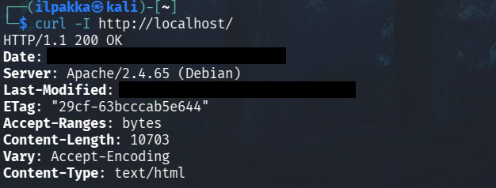

3. Nyt homma pyörii ja Apachen oletussivut aukeaa selaimellakin normaalisti.

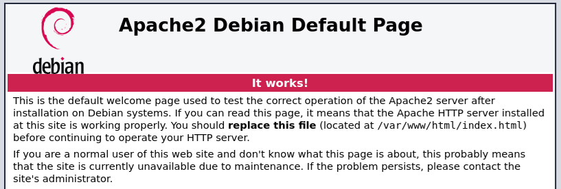

4. Apachen lokeja saa näkyviin esimerkiksi komennolla *cat /var/log/apache2/access.log*. Komento palauttaa tässä tilanteessa muutamia rivejä ja valitaan niistä tarkempaan analysointiin tuo toiseksi viimeinen.

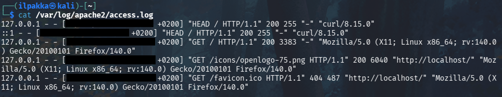

| Kenttä | Selitys |
| :------| --------|
| 127.0.0.1 | Pyynnön lähettäjän IP-osoite.
| - | Puuttuva ident-osa, joka ei enää ole oikein käytössäkään. |
| - | Puuttuva autentikaatio-osa, eli yhteys ei odottanut tunnuksia.
| [- +0200] | Aikaleima |
| "GET /icons/openlogo-75.png HTTP/1.1" | GET-pyyntö Apachen logosta |
| 200 | Tiedosto löytyi ja pyyntöön vastataan hyväksyvästi |
| 6040 | Vastauksen koko tavuina |
| "http://localhost/" | Referer-kenttä, eli mistä sivulta pyyntö on lähtenyt |
| "Mozilla/5.0 (X11; Linux x86_64; rv:140.0) Gecko/20100101 Firefox/140.0" | User-Agent, eli selaimen ja käyttöjärjestelmän tiedot |

## b) Nmapped. 
Tavoite: *Porttiskanaa oma weppipalvelimesi käyttäen localhost-osoitetta ja 'nmap -A' päällä. Selitä tulokset. (Pelkkä http-portti 80/tcp riittää)*

1. Syötetään komento *sudo nmap -A localhost* ja tutkaillaan tuloksia.

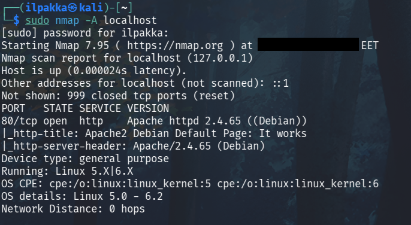

2. Skannaus oli melko nopeaa kun se tehtiin paikallisesti. Portti 80/tcp on ainoa joka on auki, kuten muistan konffanneenikin. Nmap tunnisti Apachen palvelimen ja version (2.4.65 Debian).

## c) Skriptit. 
Tavoite: *Mitkä skriptit olivat automaattisesti päällä, kun käytit "-A" parametria?*

1. Skriptien nimet löytyvät avointen porttituloksien osiosta omilta riveiltään:

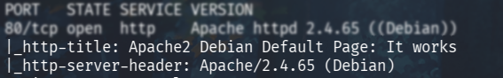

| Skripti | Selitys |
| ------- | ------- |
| http-title | Otsikko tunnistetaan Apachen oletussivuksi |
| http-server-header | Server-otsakkeen haku, josta usein voi päätellä palvelimen ja sen version |

## d) Jäljet lokissa. 
Tavoite: *Etsi weppipalvelimen lokeista jäljet porttiskannauksesta. Löydätkö sanan "nmap" isolla tai pienellä? Selitä osumat. Millaisilla hauilla tai säännöillä voisit tunnistaa porttiskannauksen jostain muusta lokista, jos se on niin laaja, että et pysty lukemaan itse kaikkia rivejä?*

1. Aloitetaan komennolla *sudo grep -i 'nmap' /var/log/apache2/access.log 2>/dev/null*:

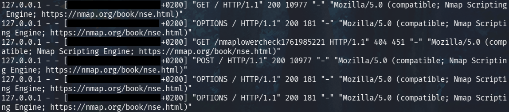

2. Tulostukseen tulee useampi rivi erilaisin sisällöin, mutta niitä yhdistää kuitenkin moni tärkeä asia: IP, aikaleimat ja muut HTTP-keskusteluun kuuluvat tiedot.

3. Nmap Scripting Engine ajaa valmiita skriptejä nmapin skannauksissa ja lokeja tutkimalla selviääkin sen olevan tuolla mukana. NSE:n User-Agentin arvoksi on merkitty *Mozilla/5.0 (compatible; Nmap Scripting Engine; https://nmap.org/book/nse.html).*

4. Jos loki sisältää älyttömät määrät rivejä ja tietoa, niin fiksuinta löytää porttiskannauksen merkkejä on esimerkiksi grepata yleisiä artifakteja kuten *nmaplowercheck* tai suoraan nimellään.

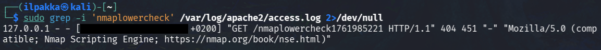

5. Huomioitavaa on myös se, että laajemmalta pääsee etsimään kun ei rajaa hakea ainoastaan *access.log* sisään. 

## e) Wire sharking. 
Tavoite: *Sieppaa verkkoliikenne porttiskannatessa Wiresharkilla. Huomaa, että localhost käyttää "Loopback adapter" eli "lo". Tallenna pcap. Etsi kohdat, joilla on sana "nmap" ja kommentoi niitä. Jokaisen paketin jokaista kohtaa ei tarvitse analysoida, yleisempi tarkastelu riittää.*

1. Wireshark päälle ja käynnistetään *loopback* odottamaan liikennettä. Komennolla *nmap -A localhost* saadaan ensimmäistä tehtävää vastaava skannaus ja Wiresharkin GUI sylkee useampaa tulosta heti esille.

2. Tallennetaan sieppaus seuraavaa osiota varten navigoimalla *File->Save As...* tai pikanäppäinkombolla *Ctrl+Shift+S*.

3. Wiresharkissa voi suoraan etsiä merkkijonoja paketeista tai niiden tiedoista. Suurennuslasi käyttöön ja *nmap* näyttäisi olevan ainakin yhdessä kohtaa esillä. Jos haemme nimenomaan pakettien sisältöä niin *nmap* esiintyy osana jokaista HTTP-viestintää.

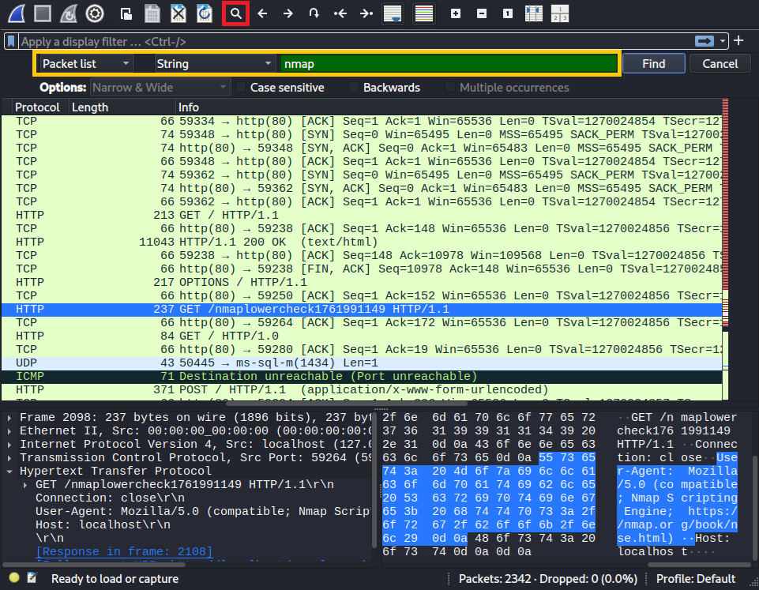

4. Toinen esimerkki tulee vaikka seuraamalla liikenteestä löytyvää striimiä, jossa *Nmap Scripting Engine* löytyy HNAP1-polun HTTP GET-pyynnön User-Agent -kentästä. Tuo HNAP1 on näemmä sitten ollut osana oletusskriptiä, esm *http-hnap* tai vastaavaa.

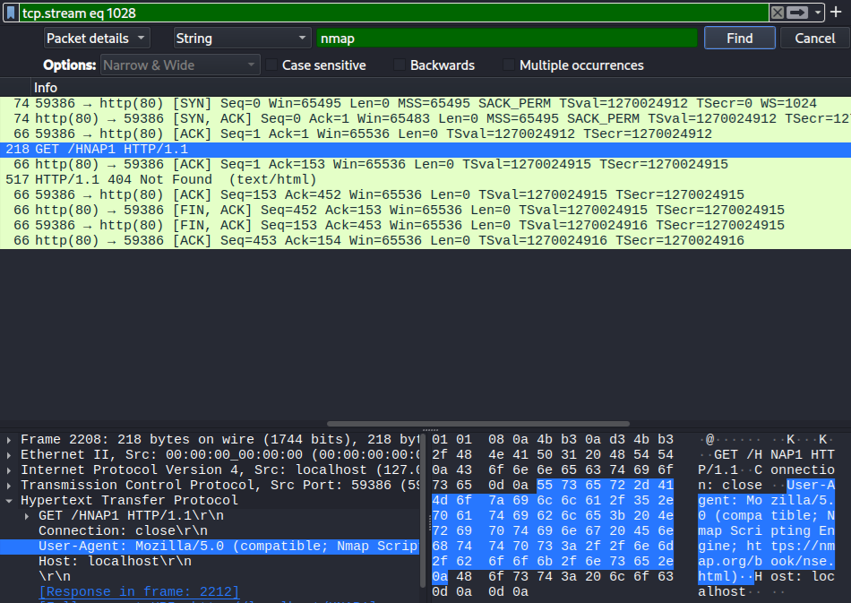

5. Tämäntyyppiset merkkijonoetsinnät onnistuu myös vähän likaisemmin, esimerkiksi:

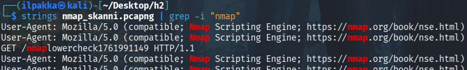

## f) Net grep. 
Tavoite: *Sieppaa verkkoliikenne 'ngrep' komennolla ja näytä kohdat, joissa on sana "nmap".*

1. Ngrep kuuntelee oletuksena ethiä, joten tässä kohti on hyvä muistaa muuttaa se loopbackiksi (-d lo) kun komentoa lähdetään puskemaan.

2. Kaksi terminaalia auki, joissa toisessa ajetaan *sudo ngrep -d lo -i 'nmap'* ja toisessa pistetään nmap skannaamaan localhostia *nmap -A localhost*.

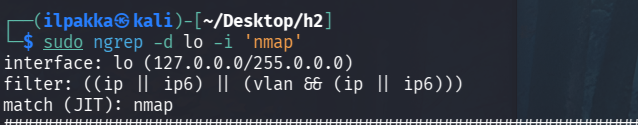

3. Tulostusta tulee aika runsaasti!

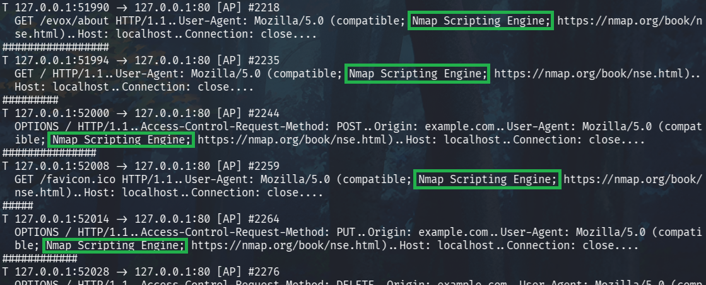

## g) Agentti. 
Tavoite: *Vaihda nmap:n user-agent niin, että se näyttää tavalliselta weppiselaimelta.*

1. User-agentin vaihtaminen onnistuu antamalla skannauksen skripteille uutta sisältöä: lisäämällä *--script-args http.useragent=* ja kirjoittamalla oman vaihtoehtomme pääsemme eroon NSE-oletusarvosta. Hyvä huomioida, että skannauskohde tulee vasta loppuun tai skanni menee sekaisin.

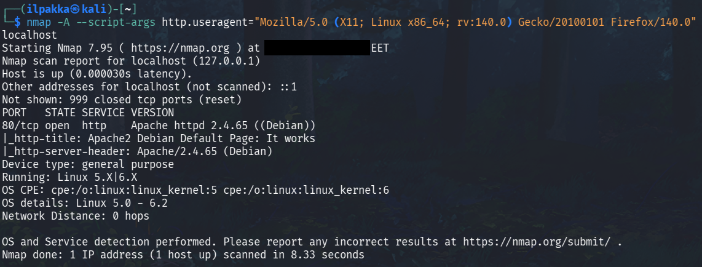

## h) Pienemmät jäljet. 
Tavoite: *Porttiskannaa weppipalvelimesi uudelleen localhost-osoitteella. Tarkastele sekä Apachen lokia että siepattua verkkoliikennettä. Mikä on muuttunut, kun vaihdoit user-agent:n? Löytyykö lokista edelleen tekstijono "nmap"?*

1. Jos kaikki meni edellisessä osiossa oikein niin ngreppin ei pitäisi löytää NSE:tä enää tulostukseen ja se on korvattu tavallisella weppiselaimella.

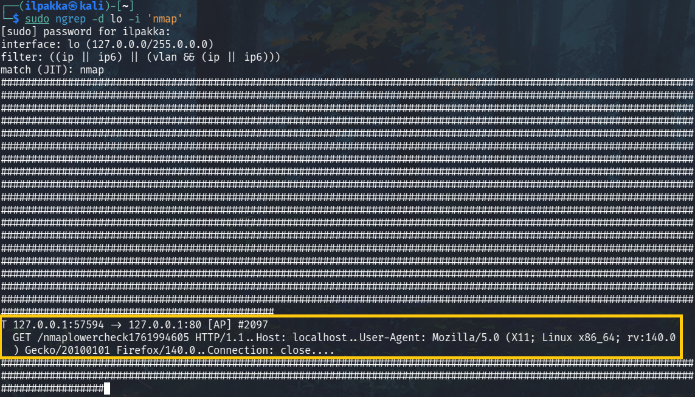

2. Hyvältä näyttää, mutta *nmap* löytyy vielä User-Agentin ulkopuolelta.

3. Kurkkaamalla Apachen lokeja löydetään samat tulokset, eli NSE on korvattu ihan onnistuneesti, mutta *nmaplowercheck* jää kummittelemaan.

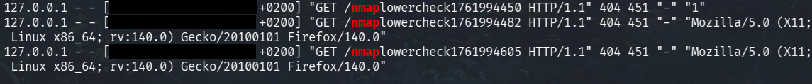

## i) LoWeR ChEcK. 
Tavoite: *Poista skri(p)tiskannauksesta viimeinenkin "nmap" -teksti. Etsi löytämääsi tekstiä /usr/share/nmap -hakemistosta ja korvaa se toisella. Tee porttiskannaus ja tarkista, että "nmap" ei näy isolla eikä pienellä kirjoitettuna Apachen lokissa eikä siepatussa verkkoliikenteessä.*

1. Ohjeistuksessa näkyykin jo, että mistä pitää etsiä. Tuo *nmaplowercheck* näyttäisi löytyvän tiedostosta *http-lua*.

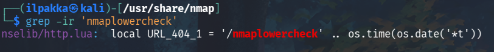

2. Muokkaamalla ensimmäistä kohtaa pääsemme vihdoin eroon tuosta viimeisestä *nmap*-tuloksesta skannia suorittaessa (Ei oikeasti, mutta nyt tämän kotitehtävän osalta tarpeeksi paikkaansapitävää).

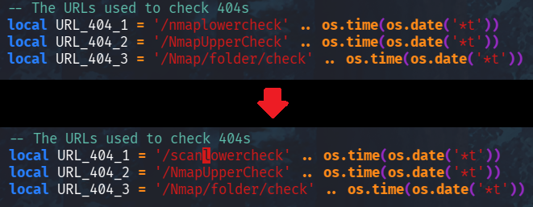

3. Testataan skannia uudestaan ja tällä kertaa ngrep etsii ja etsii, mutta ei löydä mitään. Skannaus loppuu ja ollaan onnistuneesti väistelty tulostusta.

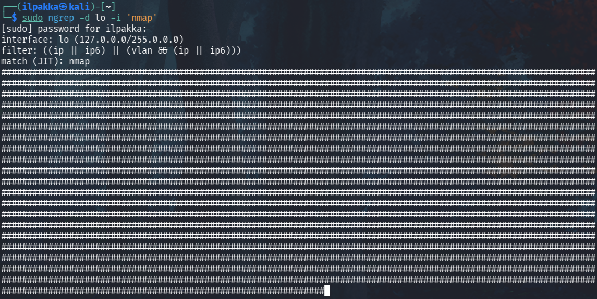

4. Apachen lokit näyttää samaa kuin ennenkin, eli mitään tietoa *nmapista* ei ole enää näkyvillä. Kuvassa näkyy ensin *nmap*-greppauksen tulosta vanhemmasta skannista ja uusi komento tuokin esiin muokatun version.

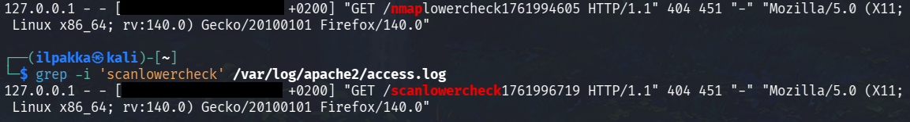

## j) Vapaaehtoinen, vaikea: Invisible, invincible. 
Tavoite: *Etsi jokin toinen nmap:n skripti, jonka verkkoliikenteessä esiintyy merkkijono "nmap" isolla tai pienellä. Muuta nmap:n koodia niin, että tuo merkkijono ei enää näy verkkoliikenteessä.*

1. En ole varma, että lähdinkö heti alussa ihan väärään suuntaan kun pistin ngrepin kuuntelemaan intrusive-argilla ajettua skannausta. Tuo ei nimittäin oikein halunnut löytää mitään "uusia" tuloksia.

2. Jatkan tätä vapaaehtoista osiota kun tulee vastaan uusia ideoita!

## Lähteet
- Tero Karvinen 2025. Verkkoon tunkeutuminen ja tiedustelu. Luettavissa: https://terokarvinen.com/verkkoon-tunkeutuminen-ja-tiedustelu
- Bianco 2013. Enterprise Detection & Response. Luettavissa: https://detect-respond.blogspot.com/2013/03/the-pyramid-of-pain.html
- Caltagirone et al 2013. The Diamond Model of Intrusion Analysis. Luettavissa: https://www.threatintel.academy/wp-content/uploads/2020/07/diamond-model.pdf
- Nmap 2025. Chapter 9. Nmap Scripting Engine. Luettavissa: https://nmap.org/book/nse.html