# h5 Laboratorio- ja simulaatioympäristöt hyökkäyksissä

## a) Evilginx2
Tavoite: *Tutustu https://github.com/kgretzky/evilginx2.*<br>
Vastaa seuraaviin kysymyksiin:<br>*Asensitko työkalun, jos asensit niin kirjoita miten sen teit. Mitä teit työkalun kanssa? Onnistuitko huijaamaan liikennettä?*

1. Asensin työkalun lataamalla viimeisimmän 3.3.0 sorsan ja makettamalla, kuten Evilginxin omissa ohjeissa oli kerrottu.

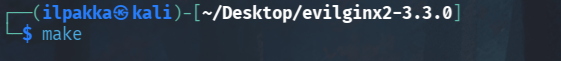

2. Seuraavaksi tämä piti saada localilla ylös. Toimitaan taas kerran ohjeiden mukaan.

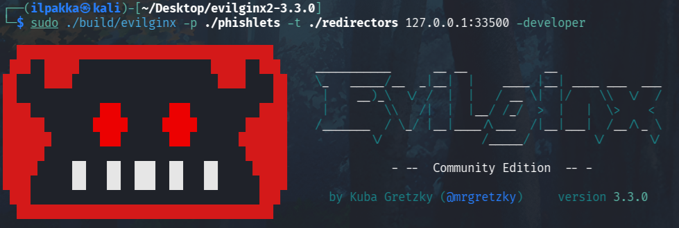

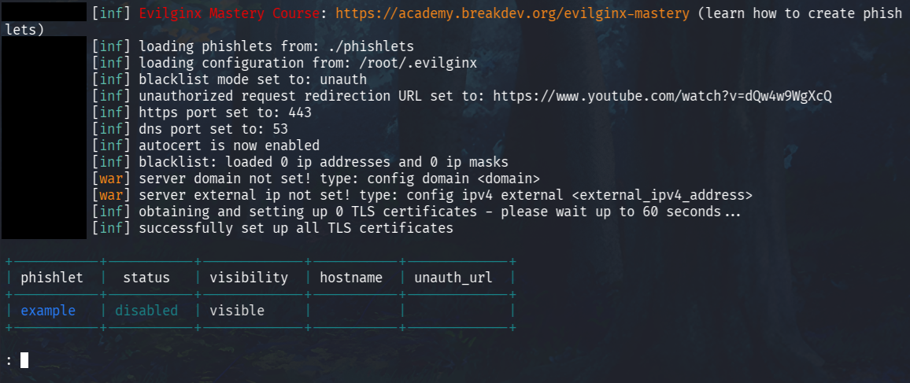

3. Kuten ylempää näkyy, työkalulta puuttuu vielä domain sekä IPv4 -tiedot. Voimme valita domainin vapaasti kunhan muistamme asettaa IPv4-osoitteen localiksi. Otan tällä kertaa esimerkkiin mukaan omain domainini ja ipv4-arvoon lyödään 127.0.0.1.

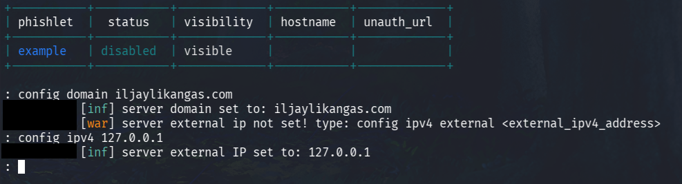

4. Phislettien vuoro, mutta mitä ne oikein ovat? Evilginxin materiaalien mukaan ne ovat YAML-formaatin konffaustiedostoja, joiden pääasiallinen tavoite on suorittaa phishing-hyökkäyksiä. Komennolla *phishlets* näemme kaikki saatavilla olevat tiedostot, mutta niitä ei tällä hetkellä vielä ole.

5. Luodaan oma phishlet! Voimme käyttää mallitiedostoa luodaksemme oman version. Tallennetaan se oikeaan osoitteeseen, eli */phishlets/*-hakemistoon.

```yaml
min_ver: '3.0.0'
proxy_hosts:
  - {phish_sub: 'tosiaito', orig_sub: 'tosiaito', domain: 'iljaylikangas.com', session: true, is_landing: true, auto_filter: true}
sub_filters:
  - {triggers_on: 'iljaylikangas.com', orig_sub: 'tosiaito', domain: 'iljaylikangas.com', search: 'voitto', replace: 'korvaus', mimes: ['text/html']}
auth_tokens:
  - domain: '.tosiaito.iljaylikangas.com'
    keys: ['superkeksi']
credentials:
  username:
    key: 'email'
    search: '(.*)'
    type: 'post'
  password:
    key: 'password'
    search: '(.*)'
    type: 'post'
login:
  domain: 'tosiaito.iljaylikangas.com'
  path: '/huti-meni'
```

6. Käynnistetään evilginx2 uudelleen ja nyt meillä näkyykin tuo uusi phishlet valikoimassa.

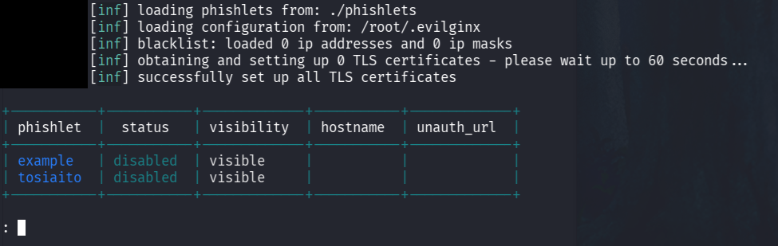

7. Jotta saamme tuon käyntiin, niin meidän pitää vielä asettaa sille hostnamen, tässä tapauksessa *tosiaito*. Lopuksi komennolla *phishlets enable tosiaito* laitamme sen käyntiin.

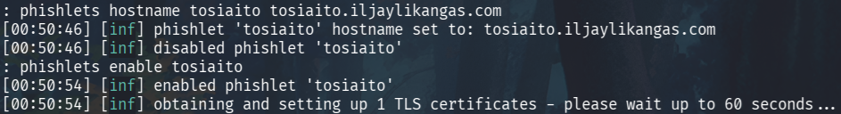

8. Normaalisti tässä kohtaa evilginx2 käy nappaamassa tarvittavat TLS-sertit ennen kuin varsinainen kalastelu alkaa, mutta en itse jatka tästä enää eteenpäin.

## b) Mininet
Tavoite: *Luo ympäristö, jossa voit tehdä TCP SYN-Flood hyökkäyksen. Kirjoita miten loit mininet ympäristön ja miten toteutit hyökkäyksen.*

1. Tuo mininet-virtuaalikone ei pitkään suostunut yhteistyöhön. Lopulta se kuitenkin näytti olevan korjattuna ja purkamisessa ei tullut ongelmia.

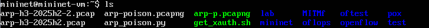

2. Seurataan Larin ohjeita, eli verkko-ohjain ja mininet päälle. Ensimmäiseen konsoliin syötetään ryu-manageria:

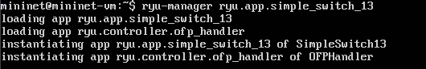

3. Toinen konsoli auki Ctrl+Alt+F2 ja mininet päälle sudolla:

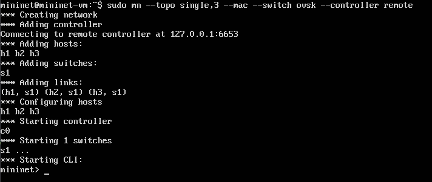

4. Testipingi kaikille osoittaa, että laitteet kuulee ja ympäristön pitäisi olla aika varmasti päällä oikein.

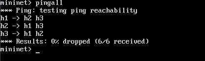

5. Eli, miten saadaan tuo TCP SYN-Flood toimimaan? Tuo onnistuu sellaisella komennolla kuin hping3 ja käyttämällä -S (SYN) sekä --flood (lähetä niin nopeasti kun voit, älä lue vastauksia).

6. Annetaan uhrin rooli h1:lle, joten avataan tämän näkymä. Ohjeissa kerrottu *xterm* aiheutti vähän liikaa ongelmia, joten tällä kertaa mentiin sisään bashilla. Pythonilla palvelin pystyyn:

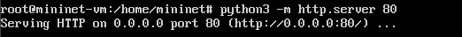

7. Seuraavaksi olisi pitänyt avata uusi konsoli jossa *tcpdumpilla* olisi voinut kurkata seuraavan vaiheen hyökkäyksen SYN-paketteja, mutta mininet päätti kaatua. Uudelleenkäynnistyksen jälkeen päästään kuitenkin kunnon hommiin.

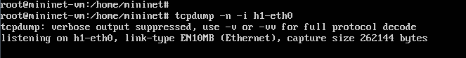

8. Nyt avataan hyökkääjän näkymä h2:lle ja ajetaan komento *hping3 -S --flood -p 80 10.0.0.1*.

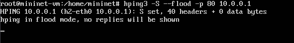

9. Nyt on vaikea sanoa sitten, että kaatuiko mininet tuosta ddosista vai päälaitteen määräämänä, mutta tätä itse tulosta ei koskaan päästy todistamaan. Jos aikaa riittää, niin pyrin toistamaan tämän saman setin mininetillä niin, että saadaan mukaan myös todisteita tcpdumpilla.

## Lähteet
- Tero Karvinen 2025. Verkkoon tunkeutuminen ja tiedustelu. Luettavissa: https://terokarvinen.com/verkkoon-tunkeutuminen-ja-tiedustelu/
- Lari Iso-Anttila 2025. Mininet. https://iso-anttila.dy.fi/download/mininet-lab.ova.xz
- Kuba Gretzky. evilginx2. https://github.com/kgretzky/evilginx2
- Evilginx. Getting Started (Community). Luettavissa: https://help.evilginx.com/community/getting-started/
- Kali. Tool Documentation: hpin3 Usage Example. Luettavissa: https://www.kali.org/tools/hping3/