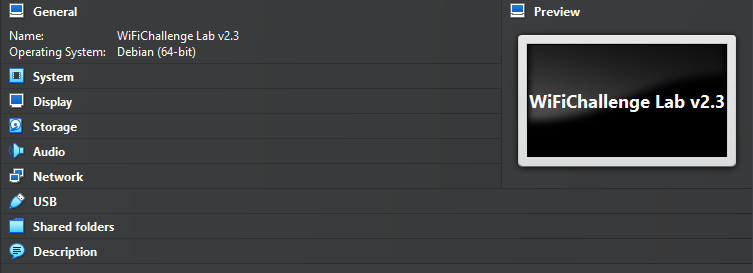
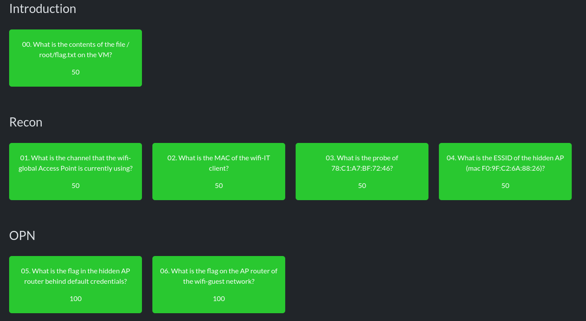

# h6 WiFi

> HUOM! Harjoitusympäristön toiveiden mukaisesti tehtävien ratkaisujaketjua ei ole esitetty tässä raportissa lainkaan. Ainoastaan tehtävänäkymän suoritukset on lisätty mukaan.

## a) WiFi Challenge lab 2.1 
Tavoite: *Tutustu harjoitusympäristöön.*

1. Erillisen virtuaaliympäristön pakollinen lataus tehtävien ratkaisemiseen vähensi huomattavasti pisteitä koko alustalta.

2. Näppäimistö oli rajoitettu enkkuun ja epsanjaan, joten erikoismerkkien käyttö oli välillä vähän säätöä. Hetken päästä se kuitenkin sujui jo huomattavasti paremmin.

3. Tehtävät olivat hyvin mielenkiintoisia ja niitä pitäisi ehdottomasti tehdä lisää! Tällä istunnolla tein nuo RECON ja OPN -haasteet läpi.

## b) Raportti.
Tavoite: *Mitä opit ja mitkä asia yllättivät sinut kun tutustuit harjoitukseen.*

1. Minut yllätti se, kuinka paljon tietoa verkkoliikenteestä voi halutessaan saada ilman erillisiä työkalua tai softia. Airodump-ng, parametrit ja muut käyttöflagit oli mukava saada käyttöön tehtäviä tehdessä ja opin niistä samalla todella paljon lisää. Päätin olla käyttämättä ympäristölle kirjoitettua walkthroughta, koska halusin tarvittaessa etsiä pulmien ratkaisuun tarvittavaa tietoa itse.

2. CTF-kisoissa ei ole itselleni tullut ihan hirvittävästi vastaavia tehtäviä eteen, mutta olen innoissani oppimaan niistä lisää. Olisi mahtavaa päästä soveltamaan näitä oppeja jossain kisassa, toki viimeistään kurssin omassa kilpailussa.

## c) WLAN
Tavoite: *Miten suhtautumisesi WLANin turvallisuuteen muuttui sen jälkeen kun teit harjoitukset?*

1. Harjoituksia pitäisi todennäköisesti tehdä vielä enemmän, jotta suhtautumiseni WLANin turvallisuuteen muuttuisi nykyisestään. Eiköhän niitä ehdi tässä alkavalla viikolla jatkamaan.

## Lähteet
- Tero Karvinen 2025. Verkkoon tunkeutuminen ja tiedustelu. Luettavissa: https://terokarvinen.com/verkkoon-tunkeutuminen-ja-tiedustelu
- WiFiChallenge Lab v2. https://lab.wifichallenge.com/