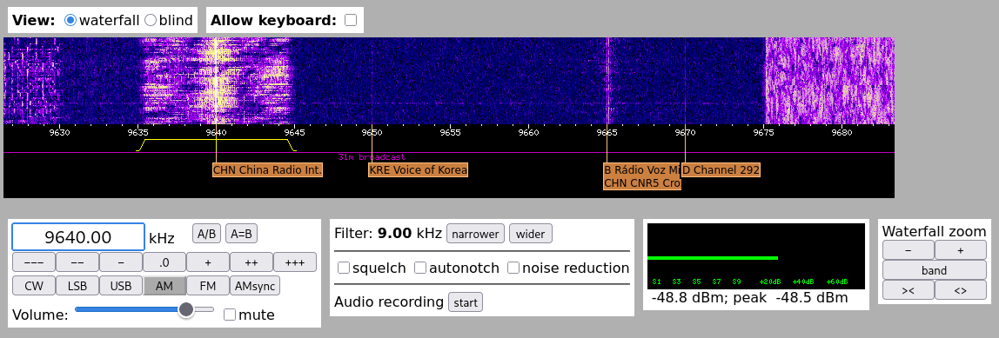
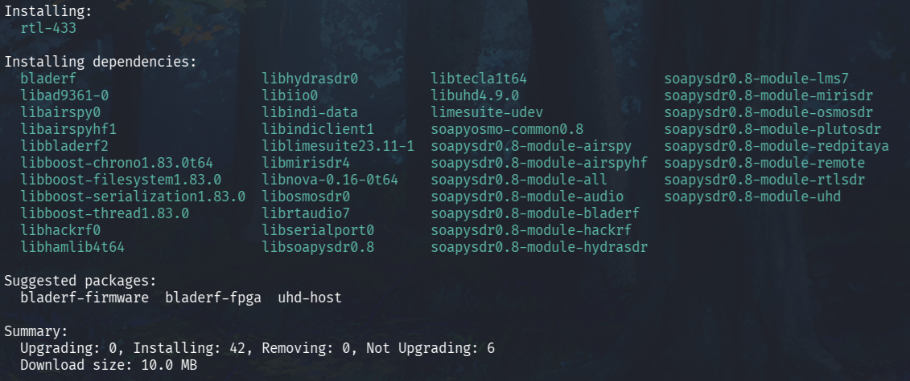
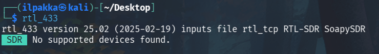
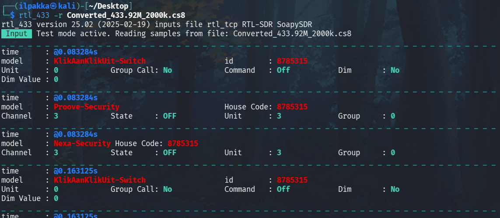
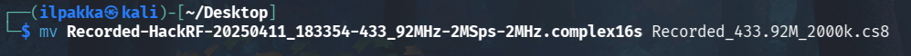
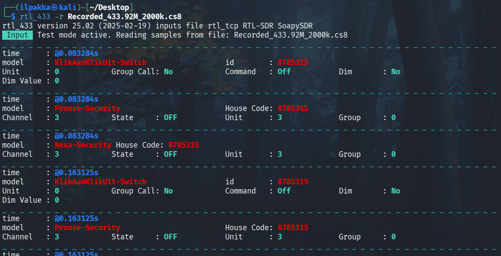
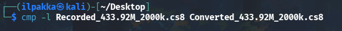
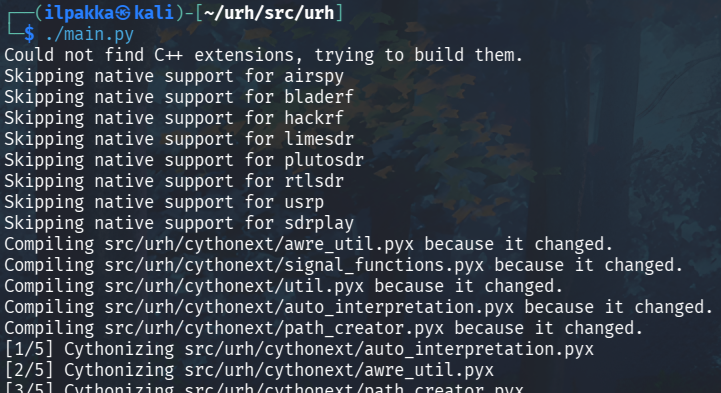
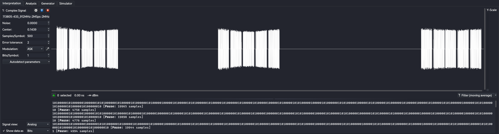
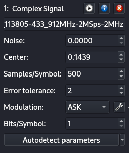

# h7 Aaltoja harjaamassa

## x) Lue ja tiivistä.

1. Hubáček näyttää videollaan URH:in toimintaa. Hän kaappaa työkalulla lyhyen pätkän kaukosäätimen lähetystä ja analysoi sitä silmämääräisesti sekä muuttamalla parametrien arvoja.

2. Cornelius analysoi Liidelistä hankkimansa Auriol -sääaseman radioliikennettä rtl_433:lla ja URH:lla. Modulaation, datarakenteen ja sensorien toiminnan selvittäminen käydään astettain läpi.

## a) WebSDR.
Tavoitteet:<br>
*Etäkäytä WebSDR-ohjelmaradiota, joka on kaukana sinusta ja kuuntele radioliikennettä.*<br>
*Radioliikenne tulee siepata niin, että radiovastaanotin on joko eri maassa tai vähintään 400 km paikasta, jossa teet tätä tehtävää.*<br>
*Käytä esimerkkinä julkista, suurelle yleisölle tarkoitettua viestiä, esimerkiksi yleisradiolähetystä.*<br>
*Kerro löytämäsi taajuus, aallonpituus ja modulaatio. Kuvaile askeleet ja ota ruutukaappaus.*

1. Valitsin tällä kertaa käyttöön Twenten yliopiston radiokerhon laitteet (WebSDR at the University of Twente, Enschede, NL). Tämä on tarpeeksi kaukana ja sillä pitäisi saada kaikkea jännää kuulumaan.

2. Muutin modulaation valmiiksi AM:ksi ja liikuttelin vesiputouksella. Lopulta 9640.00 kHz taajuuteen korjaten löytyi erittäin rauhoittavaa kansanmusiikkia, joten jäin kuuntelemaan tarkemmin. Filtteri olikin jo valmiiksi myös 9.00 kHz.



3. Zoomaamalla sai itse nimenkin esiin ja kyseessä oli tällä kertaa CHN China Radio International.

4. Aallonpituuden saa laskemalla tyhjiön valonnopeus jaettuna taajuus herzeinä:
$\lambda = \frac{299\ 792\ 458 \, \text{m/s}}{9\ 640\ 000 \,\text{Hz}}$, jolloin aallonpituus lambda on siis noin 31,1 metriä.

## b) rtl_433.
Tavoite: *Asenna rtl_433 automaattista analyysia varten. Kokeile, että voit ajaa sitä.*

1. Aloitetaan päivittämällä listat, jonka jälkeen asennetaan rlt_433 komennolla *sudo apt install rtl-433*.



2. Kun asennus on valmis, testataan ohjelman toimintoa ajamalla se konsolissa nimellään *rtl_433*.



3. Versio 25.02 ja hyvin toimii! Ei ole vain mitään SDR:ää kytkettynä kiinni.

## c) Automaattinen analyysi. 
Tavoite: *Mitä tässä näytteessä tapahtuu? Mitä tunnisteita (id yms) löydät?. Analysoi näyte 'rtl_433' ohjelmalla.*

1. Kurkataan näytteen sisään komennolla *rtl_433 -r Converted_433.92M_2000k.cs8*.



2. Ohjelma tulosti näkyville yhteensä 12 kohtaa, jotka kaikki kuitenkin näyttävän jakavan saman id:n 8785315. Nimiä löytyy 3 kappaletta: KlikAanKlikUit-Switch, Proove-Security ja Nexa-Security.

3. Nuo näyttivät jo silmämääräisesti hyvin epäilyttävästi kuuluvan vähän vielä pohjoiseen Flanderista. Näin se myös lopulta oli, koska nopea nimien googletus selvensi, että kyseessä on langaton älylaite valaisuun.

4. Id:n tunnus esitetään myös muodossa House Code. Dim ja Dim Value viittaavat tosiaan todennäköisimmin valaistuksen himmennykseen. Komento OFF viittaa siihen, että kytkin laitetaan pois päältä.

## d) Too compex 16?
Tavoite: *Olet nauhoittanut näytteen 'urh' -ohjelmalla .complex16s-muodossa. Muunna näyte rtl_433-yhteensopivaan muotoon ja analysoi se.*

1. Kuten Tero jo läksysivulla oli kirjoittanut, niin näytteen muuttaminen rtl_433-yhteensopivaan muotoon vaatii sen, että tiedoston nimi ja taajuudet ovat oikein.

2. Muutetaan tiedostonimi siis muotoon *Recorded_433.92M_2000k.cs8*.



3. Kurkataan seuraavaksi näytteen sisään.



4. Tuo näyttää pitkälti samalta kuin aikaisempi näyte. Vertaillaan niitä vielä tarkemmin keskenään.



5. Sama tiedosto! Tuon analysointihan on jo sitten valmis.

## e) Ultimate.
Tavoite: *Asenna URH, the Ultimate Radio Hacker. Tarkastele näytettä. Siinä Nexan pistorasian kaukosäätimen valon 1 ON -nappia on painettu kolmesti. Käytä Ultimate Radio Hacker 'urh' -ohjelmaa.*

1. Käynnistetään URH ilman erillistä asennusta hakemalla se gitillä, koska apt ja pipx eivät näytä sitä tällä hetkellä kantavan.

```bash
git clone https://github.com/jopohl/urh/
cd urh/src/urh
./main.py
```



2. Avataan .complex16s-tiedosto *File -> Open* kautta ja eteen hyppää näkymää.



## f) Yleiskuva.
Tavoite: *Kuvaile näytettä yleisesti: kuinka pitkä, millä taajuudella, milloin nauhoitettu? Miltä näyte silmämääräisesti näyttää?*

1. Pelkästään tiedostonimestä voi päätellä erilaisia asioita, vaikka ne voisivatkin olla virheellisiä:

*1-on-on-on-HackRF-20250412_113805-433_912MHz-2MSps-2MHz.complex16s*

| Osa | Selitys |
| --- | ------- |
| 20250412_113805 | 12.4.2025 klo 11:38:05 |
| 433_912MHz | Keskitaajuus 433,912 MHz |
| 2MSps | Näytteenottotaajuus 2MS sekunnissa |
| 2MHz | Kaistaa 2 MHz |

2. Aikaisemman kuvakaappauksen näkymässä voimme myös kiinnittää huomiota muutamiin seikkoihin: Spektrissä näkyy kolme erillistä, suht tasaisesti jaoteltua ja viidestä pulssista koostuvaa lähetystä. Pulssit viittaavat tässä tapauksessa pistorasian kaukosäätimen ON -napin painallukseen.

## g) Bittistä.
Tavoite: *Demoduloi signaali niin, että saat raakabittejä. Mikä on oikea modulaatio? Miten pitkä yksi raakabitti on ajassa? Kuvaile tätä aikaa vertaamalla sitä johonkin.*

1. Tiedoston modulaatio on valmiiksi ASK ja URH näyttää jo valmiiksi demoduloineen tämän ykkösiksi ja nolliksi.



2. Asetuksista näkyy tällä hetkellä *Samples/Symbol: 500*, joka tarkoittaa yhden symbolin sisältävän 500 näytettä. Aikaisemmin tunnistamamme näytteenottotaajuuden 2MSps avulla voimme laskea yhden näytteen keston kaavalla $\frac{1}{2\ 000 \ 000 \,\text{s}}$ = 0,0000005 s tai mukavammin 0,5 µs.

3. Yhden raakabitin keston saamme kertomalla aikaisemman vastauksen yhden symbolin näytemäärällä, 500 * 0,5 µs = 250 µs tai 0,00025 s. Tämä on pienellä virhemarginaalilla samaa aikaa, kuin mitä Teostolla menee parturi-kampaamojen puuttuvien musiikkilupien selvittämiseen tai millä nopeudella eduskunnassa otetaan palkkioiden korottamiset hyväksyntään.


## Lähteet
- Tero Karvinen 2025. Verkkoon tunkeutuminen ja tiedustelu. Luettavissa: https://terokarvinen.com/verkkoon-tunkeutuminen-ja-tiedustelu
- Cornelius 2022. Decode 433.92 Mhz weather station data. https://www.onetransistor.eu/2022/01/decode-433mhz-ask-signal.html
- Martin Hubáček 2019. Universal Radio Hacker SDR Tutorial on 433 Mhz radio plugs. YouTube. Katsottavissa: https://www.youtube.com/watch?v=sbqMqb6FVMY
- Benjamin Larsson. rtl_433. GitHub. https://github.com/merbanan/rtl_433
- Johannes Pohl. URH. GitHub. https://github.com/jopohl/urh
